Anthropic 于 2025 年 9 月发布了 [Claude Agent SDK Python](https://github.com/anthropics/claude-agent-sdk-python)（原 Claude Code SDK），将驱动其旗舰产品的 Agent 基础设施开放给开发者。本文从架构视角系统剖析这套 SDK 的分层设计、接口哲学、控制协议、数据流模型与扩展机制，提炼其中值得借鉴的工程设计原则。

## 一、整体架构：四层分层设计

SDK 采用经典的分层架构，自上而下分为四层，每一层只与相邻层交互，职责边界清晰。

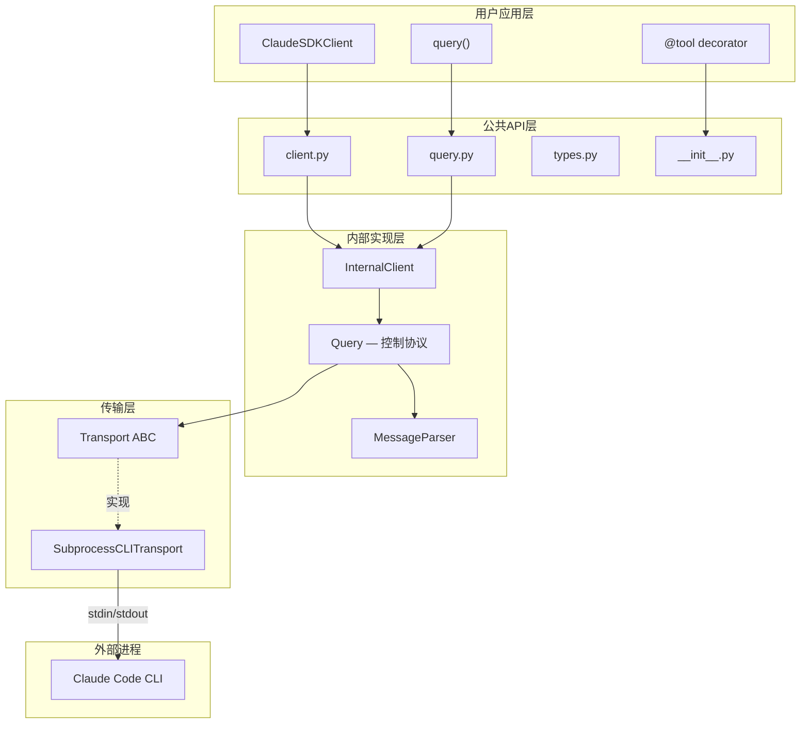
```mermaid
graph TB
    subgraph 用户应用层
        A1["query()"]
        A2["ClaudeSDKClient"]
        A3["@tool decorator"]
    end
    subgraph 公共API层
        B1["client.py"]
        B2["query.py"]
        B3["types.py"]
        B4["__init__.py"]
    end
    subgraph 内部实现层
        C1["InternalClient"]
        C2["Query — 控制协议"]
        C3["MessageParser"]
    end
    subgraph 传输层
        D1["Transport ABC"]
        D2["SubprocessCLITransport"]
    end
    subgraph 外部进程
        E1["Claude Code CLI"]
    end

    A1 --> B2
    A2 --> B1
    A3 --> B4
    B1 --> C1
    B2 --> C1
    C1 --> C2
    C2 --> C3
    C2 --> D1
    D1 -.->|实现| D2
    D2 -->|stdin/stdout| E1
```

上层不感知下层的实现细节，下层不依赖上层的业务逻辑。这种严格的分层带来了清晰的职责划分：

| 层次 | 核心模块 | 职责 |
|------|----------|------|
| 用户应用层 | `query()` / `ClaudeSDKClient` / `@tool` | 面向开发者的入口 |
| 公共 API 层 | `client.py` / `query.py` / `types.py` | 类型定义、API 导出、参数校验 |
| 内部实现层 | `InternalClient` / `Query` / `MessageParser` | 控制协议编排、消息解析 |
| 传输层 | `Transport` ABC / `SubprocessCLITransport` | 子进程生命周期、流式 I/O |

---

## 二、接口设计：双模式 API

SDK 提供两种截然不同的使用模式，覆盖从简单到复杂的全部场景。

### 模式 A：`query()` — 无状态单次查询

输入 prompt，输出异步消息流。每次调用独立，无会话概念，适合批处理、CI/CD 自动化、简单问答。设计上是"发射后不管"（fire-and-forget）的语义。

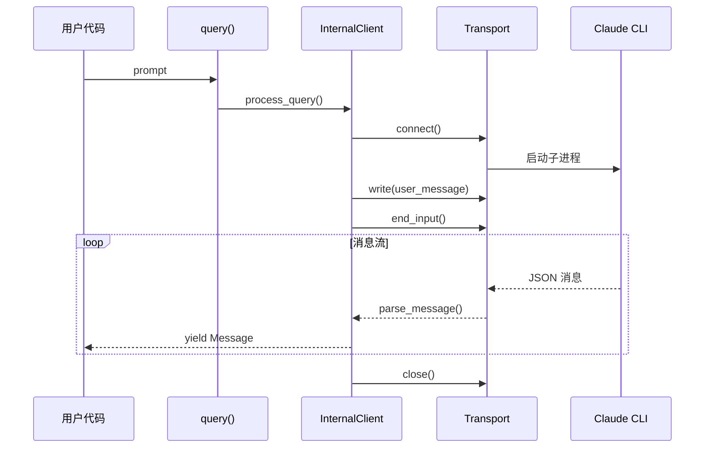
```mermaid
sequenceDiagram
    participant U as 用户代码
    participant Q as query()
    participant IC as InternalClient
    participant T as Transport
    participant CLI as Claude CLI

    U->>Q: prompt
    Q->>IC: process_query()
    IC->>T: connect()
    T->>CLI: 启动子进程
    IC->>T: write(user_message)
    IC->>T: end_input()
    loop 消息流
        CLI-->>T: JSON 消息
        T-->>IC: parse_message()
        IC-->>U: yield Message
    end
    IC->>T: close()
```

### 模式 B：`ClaudeSDKClient` — 有状态交互式会话

通过 `connect()` 建立持久连接，支持多轮 `query()`、中途打断（`interrupt()`）、动态切换模型（`set_model()`）、文件状态回退（`rewind_files()`）等操作。支持 `async with` 上下文管理器，确保资源自动释放。

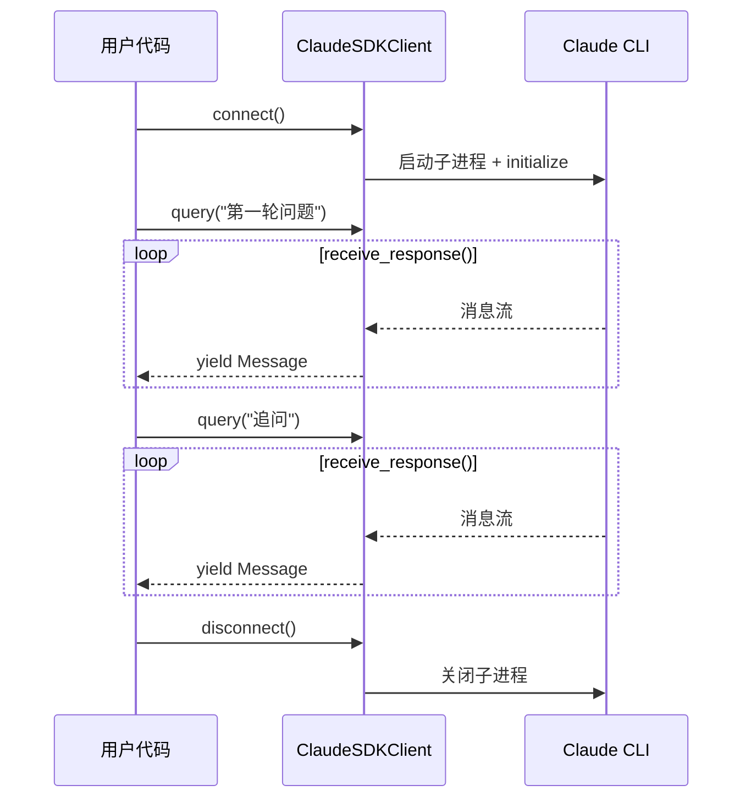
```mermaid
sequenceDiagram
    participant U as 用户代码
    participant C as ClaudeSDKClient
    participant CLI as Claude CLI

    U->>C: connect()
    C->>CLI: 启动子进程 + initialize

    U->>C: query("第一轮问题")
    loop receive_response()
        CLI-->>C: 消息流
        C-->>U: yield Message
    end

    U->>C: query("追问")
    loop receive_response()
        CLI-->>C: 消息流
        C-->>U: yield Message
    end

    U->>C: disconnect()
    C->>CLI: 关闭子进程
```

### 设计思想：渐进式复杂度

双模式设计的核心是**渐进式复杂度**——简单场景用简单 API，复杂场景才引入状态管理。开发者不需要为用不到的能力付出认知成本。这与 React 的 "hooks vs class components" 和 Python 的 "requests vs aiohttp" 异曲同工。

---

## 三、核心设计原则

### 3.1 依赖倒置 + 策略模式

上层 `Query` 类依赖抽象的 `Transport` 接口，而非具体的 `SubprocessCLITransport`。

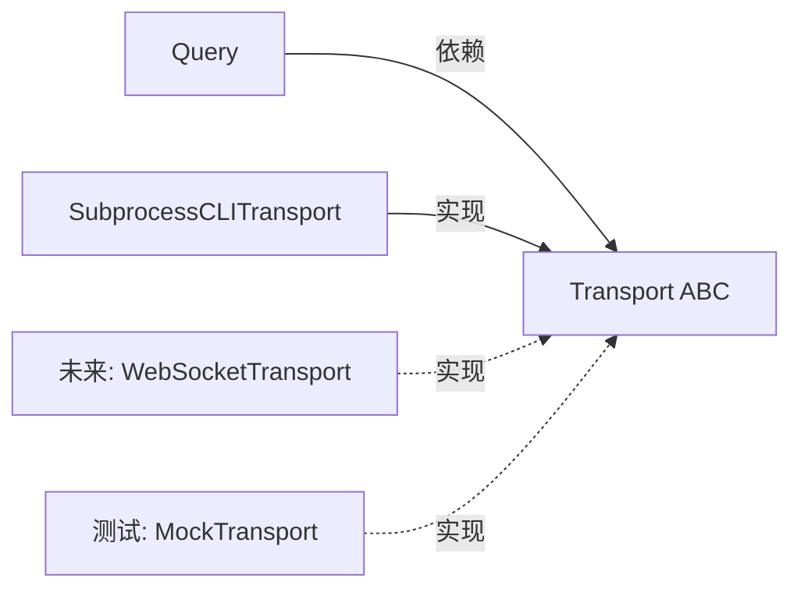
```mermaid
graph LR
    Q[Query] -->|依赖| T[Transport ABC]
    S[SubprocessCLITransport] -->|实现| T
    W[未来: WebSocketTransport] -.->|实现| T
    M[测试: MockTransport] -.->|实现| T
```

这意味着：扩展新传输方式（如 WebSocket、HTTP）只需实现 `Transport` 的 6 个方法，上层代码零修改；测试时可以注入 mock transport，无需启动真实子进程。高层模块和低层模块都依赖抽象，符合 SOLID 中的依赖倒置原则。

### 3.2 接口最小化（ISP）

`Transport` 抽象仅定义 6 个方法：

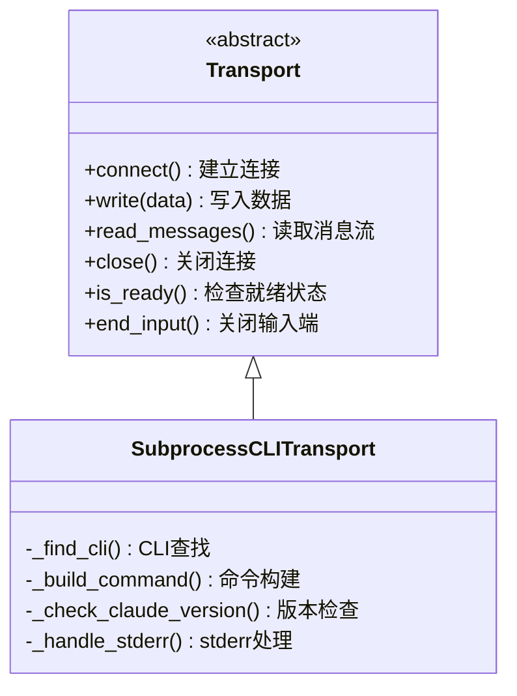
```mermaid
classDiagram
    class Transport {
        <<abstract>>
        +connect() 建立连接
        +write(data) 写入数据
        +read_messages() 读取消息流
        +close() 关闭连接
        +is_ready() 检查就绪状态
        +end_input() 关闭输入端
    }
    class SubprocessCLITransport {
        -_find_cli() CLI查找
        -_build_command() 命令构建
        -_check_claude_version() 版本检查
        -_handle_stderr() stderr处理
    }
    Transport <|-- SubprocessCLITransport
```

CLI 查找、命令构建、版本检查等子进程特有逻辑全部作为 `SubprocessCLITransport` 的私有方法，不污染抽象接口。未来的 WebSocket 实现无需处理与自身无关的方法。

### 3.3 异步优先 + 运行时无关

整个 SDK 基于 `async/await` 构建，但底层选择 `anyio` 而非直接使用 `asyncio`。`anyio` 是异步运行时的抽象层，同时兼容 `asyncio` 和 `trio`，SDK 使用者不被锁定在特定运行时。

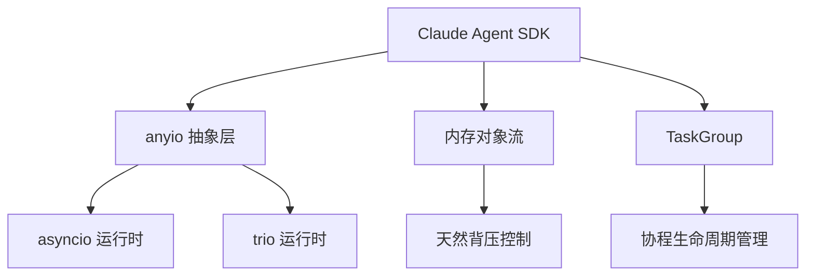
```mermaid
graph TB
    SDK["Claude Agent SDK"] --> anyio["anyio 抽象层"]
    anyio --> asyncio["asyncio 运行时"]
    anyio --> trio["trio 运行时"]

    SDK --> MOS["内存对象流"]
    MOS --> BP["天然背压控制"]

    SDK --> TG["TaskGroup"]
    TG --> LC["协程生命周期管理"]
```

消息流通过 `anyio` 的内存对象流（memory object stream）传递，天然支持背压控制。stderr 后台读取通过 `TaskGroup` 管理，生命周期跟随 transport，不会泄漏协程。

### 3.4 关注点分离

每个模块只做一件事：

| 模块 | 单一职责 |
|------|----------|
| `Transport` 抽象 | 定义通信契约 |
| `SubprocessCLITransport` | 子进程生命周期 + 流式 I/O |
| `Query` | 双向控制协议的路由和调度 |
| `MessageParser` | JSON 到强类型对象的转换 |
| `InternalClient` | 编排 Transport 和 Query 的协作 |

包结构本身也体现了这一原则：`transport/__init__.py` 定义接口契约（是什么），`subprocess_cli.py` 提供具体实现（怎么做），新增传输方式只需添加文件，无需修改现有代码——符合开闭原则（OCP）。

### 3.5 并发安全设计（TOCTOU 防护）

`write()` 和 `close()` 共享同一把 `_write_lock`，将"检查状态 + 使用资源"封装为原子操作。

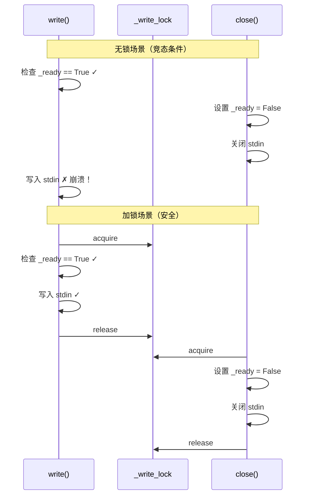
```mermaid
sequenceDiagram
    participant W as write()
    participant L as _write_lock
    participant C as close()

    Note over W,C: 无锁场景（竞态条件）
    W->>W: 检查 _ready == True ✓
    C->>C: 设置 _ready = False
    C->>C: 关闭 stdin
    W->>W: 写入 stdin ✗ 崩溃！

    Note over W,C: 加锁场景（安全）
    W->>L: acquire
    W->>W: 检查 _ready == True ✓
    W->>W: 写入 stdin ✓
    W->>L: release
    C->>L: acquire
    C->>C: 设置 _ready = False
    C->>C: 关闭 stdin
    C->>L: release
```

如果不加锁，`close()` 可能在 `write()` 检查完 `_ready` 之后、实际写入之前关闭 stdin，导致写入已关闭的流。锁消除了 TOCTOU（Time-of-check to time-of-use）竞态条件。

### 3.6 投机式 JSON 解析

`_read_messages_impl()` 不依赖换行符或长度前缀界定消息边界，而是利用 JSON 自身的语法完整性进行投机式解析：

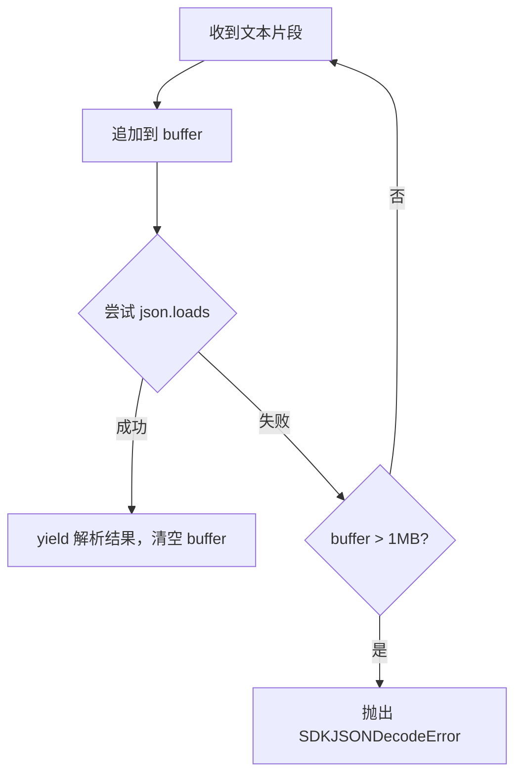
```mermaid
graph TD
    A[收到文本片段] --> B[追加到 buffer]
    B --> C{尝试 json.loads}
    C -->|成功| D[yield 解析结果，清空 buffer]
    C -->|失败| E{buffer > 1MB?}
    E -->|否| A
    E -->|是| F[抛出 SDKJSONDecodeError]
```

`TextReceiveStream` 可能在任意位置截断长行，无法保证每次收到完整的一行 JSON。buffer 上限（默认 1MB，可通过 `max_buffer_size` 配置）兜底防止异常数据撑爆内存。

### 3.7 优雅降级（Graceful Degradation）

辅助功能的失败不阻断核心功能：

- **版本检查**：失败仅输出 warning，不阻断连接
- **stderr 读取**：异常全部静默吞掉，不影响主流程
- **资源清理**：`close()` 中每一步都用 `suppress(Exception)` 包裹，确保清理过程不因某一步失败而中断后续清理
- **CLI 查找**：多级 fallback——bundled → PATH → 硬编码常见路径

---

## 四、技术栈选型

| 技术 | 角色 | 选型理由 |
|------|------|----------|
| `anyio` | 异步运行时抽象 | 兼容 asyncio/trio，不锁定运行时 |
| `mcp` | MCP 协议支持 | 官方 MCP SDK，支持进程内 MCP Server |
| `dataclass` | 配置建模 | 轻量、类型安全、IDE 友好 |
| `TypedDict` | 协议类型 | 精确描述 JSON 结构，兼顾类型检查和运行时灵活性 |
| `Union` 判别联合 | 消息类型 | 通过 `type` 字段区分消息种类，类型安全的多态 |
| `PEP 561 py.typed` | 类型标记 | 让 MyPy 等工具识别包的类型信息 |

值得注意的是，SDK 没有引入任何重量级框架。`anyio` + `dataclass` + `TypedDict` 的组合既保证了类型安全，又将依赖树控制在最小范围内。这种"够用就好"的选型哲学，降低了 SDK 与用户项目产生依赖冲突的风险。

---

## 五、数据流设计

### 5.1 三方协作模型

SDK 的数据流本质上是一个三方协作模型：

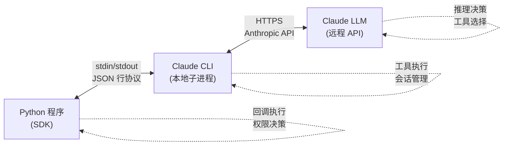
```mermaid
graph LR
    SDK["Python 程序<br/>(SDK)"] <-->|stdin/stdout<br/>JSON 行协议| CLI["Claude CLI<br/>(本地子进程)"]
    CLI <-->|HTTPS<br/>Anthropic API| LLM["Claude LLM<br/>(远程 API)"]

    SDK -.->|"回调执行<br/>权限决策"| SDK
    CLI -.->|"工具执行<br/>会话管理"| CLI
    LLM -.->|"推理决策<br/>工具选择"| LLM
```

| 角色 | 职责 | 运行位置 |
|------|------|----------|
| Python 程序 (SDK) | 发消息、接消息、执行权限回调 | 用户进程 |
| Claude CLI | 管理会话、编排工具调用、执行工具 | 本地子进程 |
| Claude LLM | 推理和决策（调用什么工具、传什么参数） | 远程 API |

关键设计：LLM 只做决策，不执行任何东西，也不知道权限回调的存在。CLI 是中间人，负责调用远程 API 和本地执行工具。SDK 在用户进程中做权限决策。三方各司其职，形成纵深防御。

### 5.2 完整请求-响应数据流

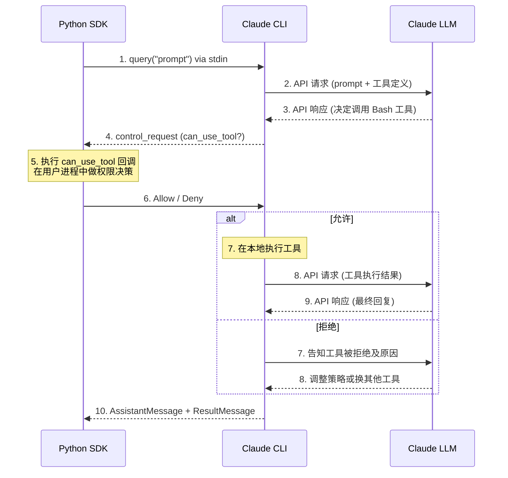
```mermaid
sequenceDiagram
    participant SDK as Python SDK
    participant CLI as Claude CLI
    participant LLM as Claude LLM

    SDK->>CLI: 1. query("prompt") via stdin
    CLI->>LLM: 2. API 请求 (prompt + 工具定义)
    LLM-->>CLI: 3. API 响应 (决定调用 Bash 工具)
    CLI-->>SDK: 4. control_request (can_use_tool?)

    Note over SDK: 5. 执行 can_use_tool 回调<br/>在用户进程中做权限决策

    SDK->>CLI: 6. Allow / Deny

    alt 允许
        Note over CLI: 7. 在本地执行工具
        CLI->>LLM: 8. API 请求 (工具执行结果)
        LLM-->>CLI: 9. API 响应 (最终回复)
    else 拒绝
        CLI->>LLM: 7. 告知工具被拒绝及原因
        LLM-->>CLI: 8. 调整策略或换其他工具
    end

    CLI-->>SDK: 10. AssistantMessage + ResultMessage
```

### 5.3 消息路由机制

`Query._read_messages()` 是核心消息路由器，根据消息类型分发到不同处理管道：

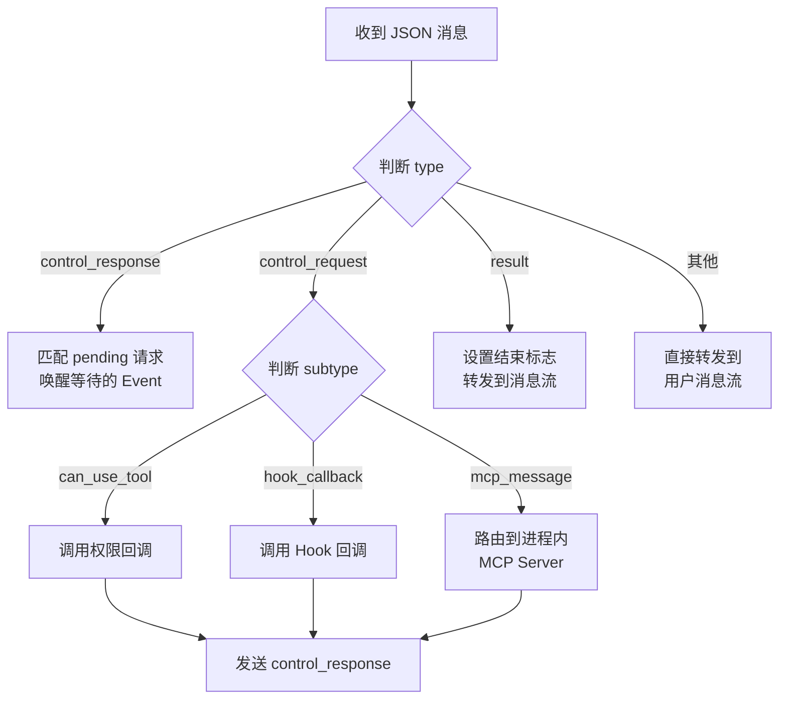
```mermaid
graph TD
    IN[收到 JSON 消息] --> TYPE{判断 type}

    TYPE -->|control_response| CR[匹配 pending 请求<br/>唤醒等待的 Event]
    TYPE -->|control_request| CQ{判断 subtype}
    TYPE -->|result| RS[设置结束标志<br/>转发到消息流]
    TYPE -->|其他| FW[直接转发到<br/>用户消息流]

    CQ -->|can_use_tool| P[调用权限回调]
    CQ -->|hook_callback| H[调用 Hook 回调]
    CQ -->|mcp_message| M[路由到进程内<br/>MCP Server]

    P --> RESP[发送 control_response]
    H --> RESP
    M --> RESP
```

### 5.4 Hook 回调数据流

Hook 系统支持 10 种事件类型，开发者可以在工具执行前后注入自定义逻辑：

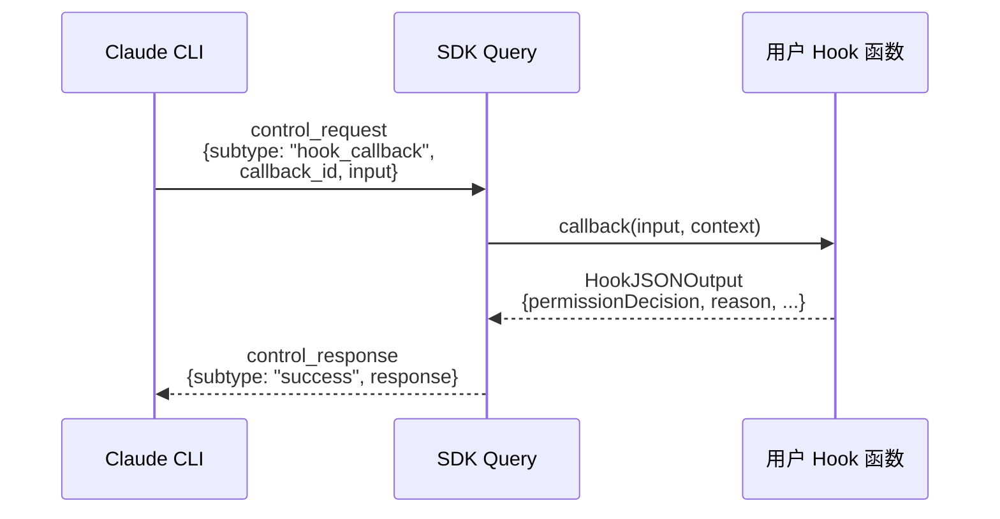
```mermaid
sequenceDiagram
    participant CLI as Claude CLI
    participant Q as SDK Query
    participant H as 用户 Hook 函数

    CLI->>Q: control_request<br/>{subtype: "hook_callback",<br/>callback_id, input}
    Q->>H: callback(input, context)
    H-->>Q: HookJSONOutput<br/>{permissionDecision, reason, ...}
    Q-->>CLI: control_response<br/>{subtype: "success", response}
```

### 5.5 进程内 MCP Server 数据流

通过 `@tool` 装饰器定义的工具运行在用户进程内，无需额外子进程：

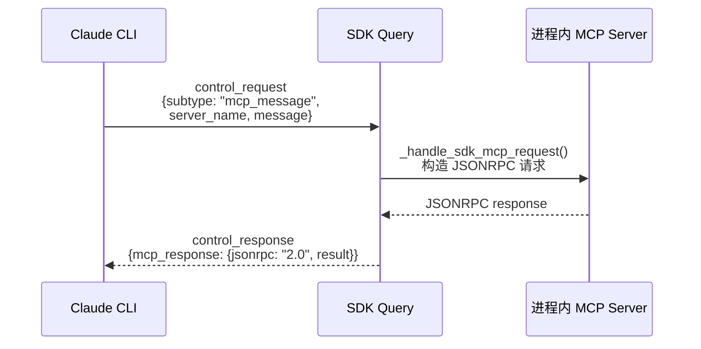
```mermaid
sequenceDiagram
    participant CLI as Claude CLI
    participant Q as SDK Query
    participant MCP as 进程内 MCP Server

    CLI->>Q: control_request<br/>{subtype: "mcp_message",<br/>server_name, message}
    Q->>MCP: _handle_sdk_mcp_request()<br/>构造 JSONRPC 请求
    MCP-->>Q: JSONRPC response
    Q-->>CLI: control_response<br/>{mcp_response: {jsonrpc: "2.0", result}}
```

---

## 六、扩展性设计

SDK 提供了三个主要的扩展点，覆盖从工具定义到执行拦截的完整生命周期。

### 6.1 Hook 系统 — 工具执行拦截

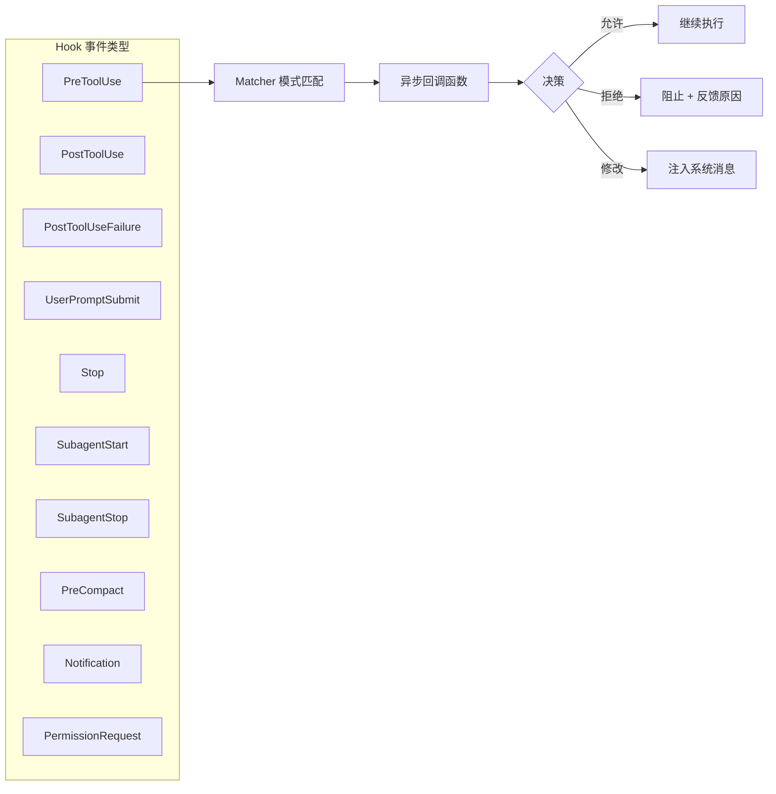
```mermaid
graph LR
    subgraph Hook 事件类型
        E1[PreToolUse]
        E2[PostToolUse]
        E3[PostToolUseFailure]
        E4[UserPromptSubmit]
        E5[Stop]
        E6[SubagentStart]
        E7[SubagentStop]
        E8[PreCompact]
        E9[Notification]
        E10[PermissionRequest]
    end

    E1 --> M[Matcher 模式匹配]
    M --> CB[异步回调函数]
    CB --> R{决策}
    R -->|允许| A[继续执行]
    R -->|拒绝| B[阻止 + 反馈原因]
    R -->|修改| C[注入系统消息]
```

通过 matcher 模式匹配工具名，支持异步回调。典型场景：拦截危险命令、记录审计日志、注入额外上下文。

### 6.2 进程内 MCP Server — 零开销工具扩展

通过 `@tool` 装饰器定义工具，`create_sdk_mcp_server()` 创建进程内 MCP 服务器。

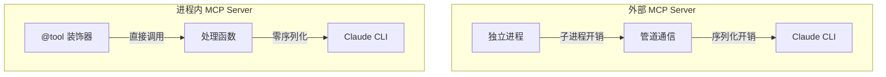
```mermaid
graph TB
    subgraph 外部 MCP Server
        EXT[独立进程] -->|子进程开销| PIPE[管道通信]
        PIPE -->|序列化开销| CLI1[Claude CLI]
    end

    subgraph 进程内 MCP Server
        INT["@tool 装饰器"] -->|直接调用| HANDLER[处理函数]
        HANDLER -->|零序列化| CLI2[Claude CLI]
    end
```

相比外部 MCP 进程，进程内方案无需额外子进程开销，可直接访问应用状态，部署更简单，调试更方便。

### 6.3 自定义 Agent — Orchestrator-Worker 编排

通过 `AgentDefinition` 定义专用子 Agent，限定其可用工具、模型和系统提示词。

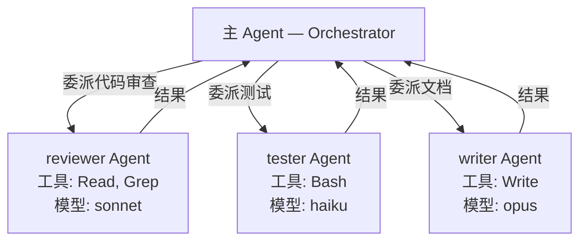
```mermaid
graph TB
    O[主 Agent — Orchestrator] -->|委派代码审查| A1[reviewer Agent<br/>工具: Read, Grep<br/>模型: sonnet]
    O -->|委派测试| A2[tester Agent<br/>工具: Bash<br/>模型: haiku]
    O -->|委派文档| A3[writer Agent<br/>工具: Write<br/>模型: opus]

    A1 -->|结果| O
    A2 -->|结果| O
    A3 -->|结果| O
```

每个子 Agent 拥有独立的工具集、模型和上下文，实现任务的并行处理和上下文隔离。

---

## 七、核心数据结构

### 7.1 消息类型层次

SDK 使用判别联合（Discriminated Union）建模消息类型，通过 `type` 字段区分：

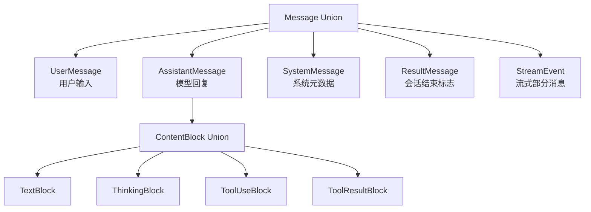
```mermaid
graph TB
    MSG[Message Union] --> UM[UserMessage<br/>用户输入]
    MSG --> AM[AssistantMessage<br/>模型回复]
    MSG --> SM[SystemMessage<br/>系统元数据]
    MSG --> RM[ResultMessage<br/>会话结束标志]
    MSG --> SE[StreamEvent<br/>流式部分消息]

    AM --> CB[ContentBlock Union]
    CB --> TB[TextBlock]
    CB --> TK[ThinkingBlock]
    CB --> TU[ToolUseBlock]
    CB --> TR[ToolResultBlock]
```

`ResultMessage` 携带完整的会话元数据：耗时、费用、token 用量、会话 ID、结构化输出等，是会话结束的明确信号。

### 7.2 配置体系

`ClaudeAgentOptions` 是一个包含 40+ 字段的 dataclass，覆盖 SDK 的全部配置维度：

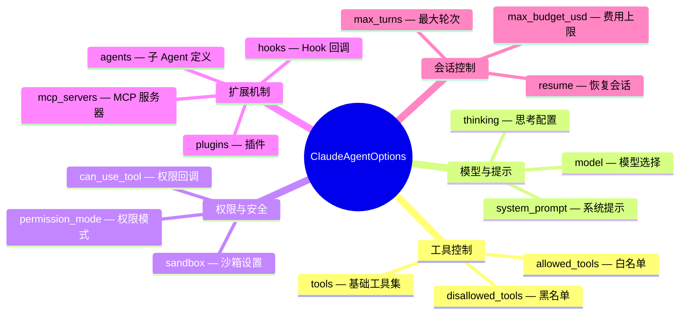
```mermaid
mindmap
  root((ClaudeAgentOptions))
    工具控制
      tools — 基础工具集
      allowed_tools — 白名单
      disallowed_tools — 黑名单
    模型与提示
      model — 模型选择
      system_prompt — 系统提示
      thinking — 思考配置
    权限与安全
      permission_mode — 权限模式
      can_use_tool — 权限回调
      sandbox — 沙箱设置
    扩展机制
      hooks — Hook 回调
      mcp_servers — MCP 服务器
      agents — 子 Agent 定义
      plugins — 插件
    会话控制
      max_turns — 最大轮次
      max_budget_usd — 费用上限
      resume — 恢复会话
```

### 7.3 错误层次

异常体系按故障域分类，便于调用方精确捕获：

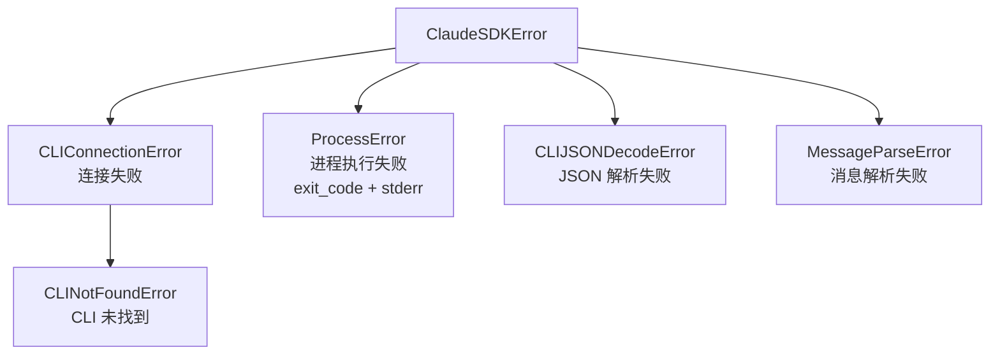
```mermaid
graph TB
    BASE[ClaudeSDKError] --> CONN[CLIConnectionError<br/>连接失败]
    CONN --> NF[CLINotFoundError<br/>CLI 未找到]
    BASE --> PROC[ProcessError<br/>进程执行失败<br/>exit_code + stderr]
    BASE --> JSON[CLIJSONDecodeError<br/>JSON 解析失败]
    BASE --> PARSE[MessageParseError<br/>消息解析失败]
```

---

## 八、架构优点总结

### 低门槛、高上限

`query()` 一行代码即可完成简单查询，`ClaudeSDKClient` 支撑复杂的多轮交互和工具编排。同一套 SDK 覆盖从脚本到生产系统的全场景，开发者可以按需逐步引入复杂度。

### 可测试性强

Transport 抽象使得单元测试可以完全脱离真实 CLI 进程。注入 mock transport 即可验证控制协议逻辑、消息路由、Hook 回调等核心行为，测试速度快且确定性高。

### 面向未来的扩展性

Transport 层的抽象设计意味着未来切换到 WebSocket、HTTP 等传输方式时，上层代码完全不需要改动。Hook 系统和 MCP Server 机制也为第三方生态留出了充足的扩展空间。

### 安全性内建

权限回调和 Hook 系统不是事后补丁，而是架构级的一等公民。LLM 不知道权限系统的存在，CLI 不会执行被拒绝的操作，SDK 在用户进程中做决策——三方各司其职，形成纵深防御。

### 并发安全

写锁消除了 TOCTOU 竞态条件，投机式 JSON 解析应对流式传输中的消息截断，stderr 后台读取通过 TaskGroup 管理生命周期。这些细节体现了对生产环境并发场景的充分考量。

### 优雅降级

版本检查失败只是 warning、stderr 异常静默处理、`close()` 中每一步都用 `suppress(Exception)` 包裹。辅助功能的失败不会阻断核心功能，提升了整体鲁棒性。

---

## 参考来源

- [Claude Agent SDK Python — GitHub](https://github.com/anthropics/claude-agent-sdk-python)
- [Claude Agent SDK — PyPI](https://pypi.org/project/claude-agent-sdk/)
- [Model Context Protocol 规范](https://modelcontextprotocol.io/)
- [anyio 文档](https://anyio.readthedocs.io/)
