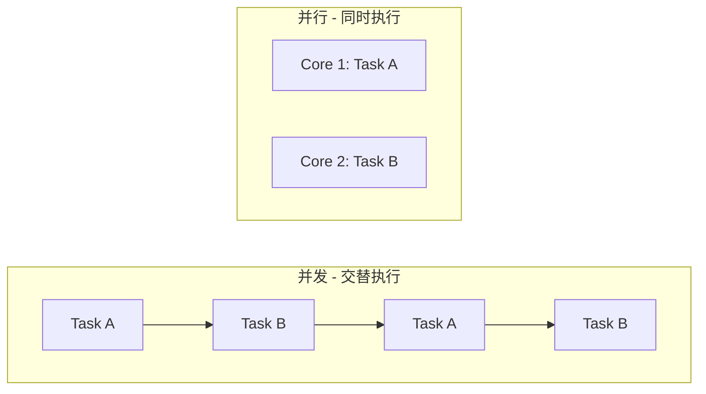
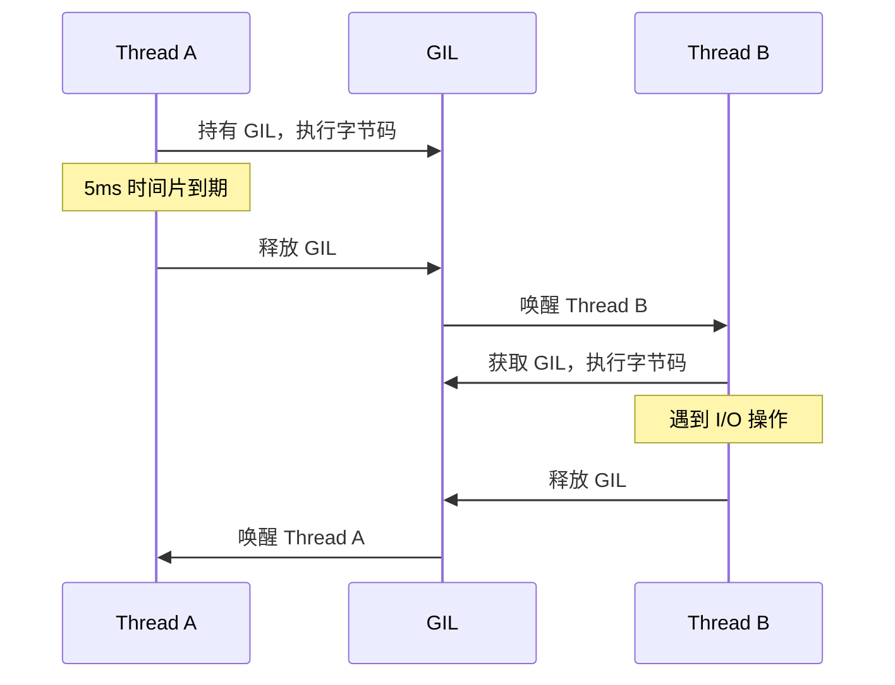
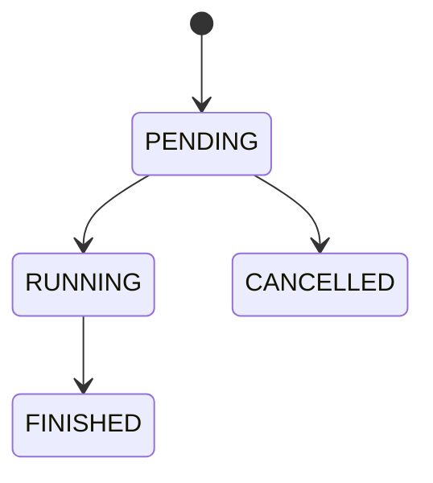
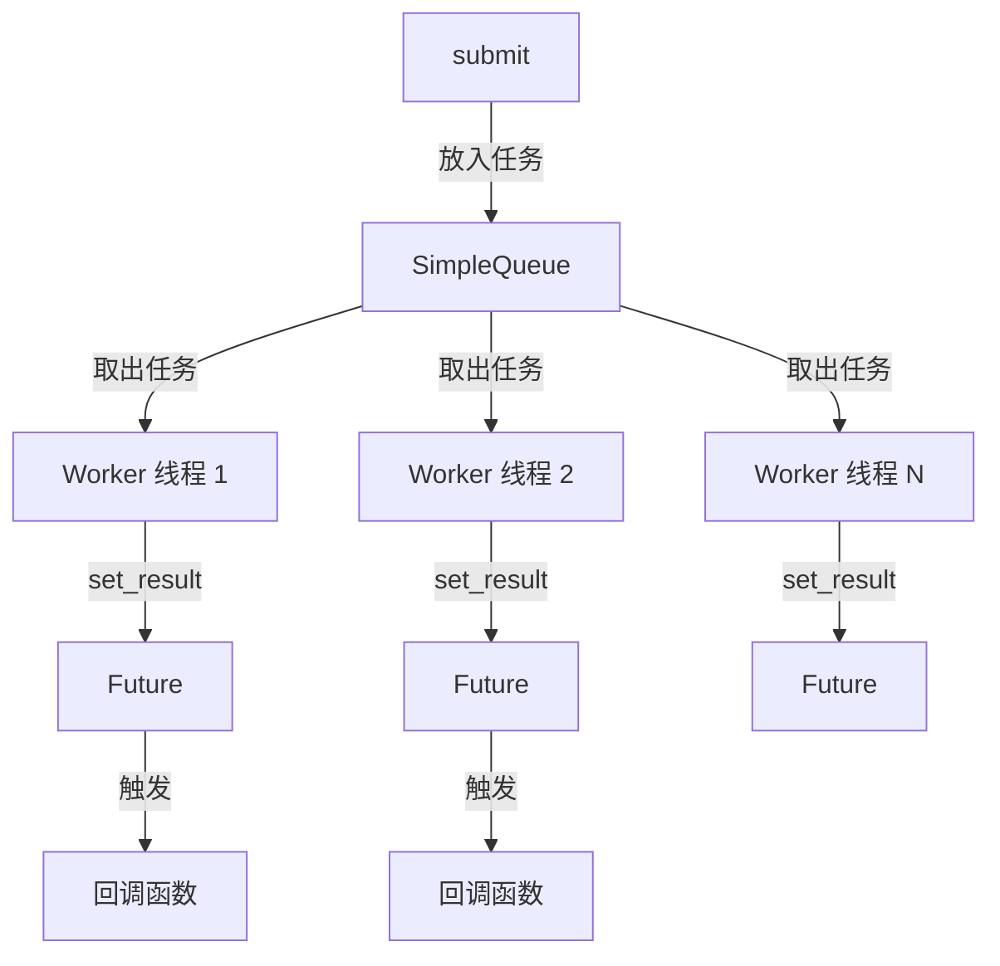
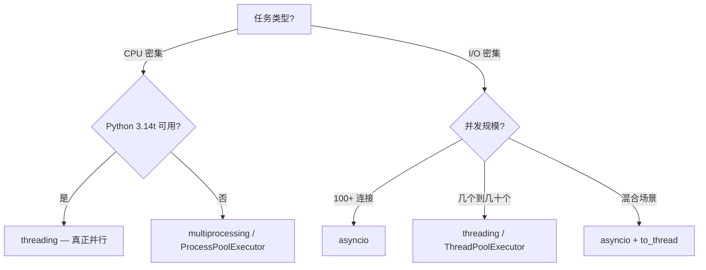

Python 的并发模型有四大支柱：**threading**、**multiprocessing**、**concurrent.futures**、**asyncio**。本文将从 GIL 的底层机制出发，逐一剖析每种并发方案的原理、内部实现与适用场景，并展望 Free-threaded Python 对未来生态的影响。

## 一、并发 vs 并行

- **并发（Concurrency）**：单核上交替执行多个任务，宏观上"同时"，微观上轮流。
- **并行（Parallelism）**：多核上真正同时执行多个任务。



Python 中选择哪种并发模型，取决于任务是 **I/O 密集**还是 **CPU 密集**，以及对并发规模的需求。

---

## 二、GIL — 一切的根源

### 2.1 GIL 是什么

GIL（Global Interpreter Lock）是 CPython 解释器中的一把全局互斥锁，确保同一时刻只有一个线程执行 Python 字节码。

### 2.2 为什么需要 GIL

CPython 使用**引用计数**管理内存。每个对象都有一个 `ob_refcnt` 字段：

```python
import sys
a = []
sys.getrefcount(a)  # 2（a 本身 + getrefcount 参数）
```

如果两个线程同时对同一个对象做 `ob_refcnt += 1`，这个操作在 CPU 层面是 read → modify → write 三步，不是原子的。没有 GIL，引用计数会出错，导致内存泄漏或对象被提前释放（use-after-free）。GIL 用一把大锁简单粗暴地解决了这个问题。

### 2.3 GIL 的内部机制

GIL 的核心逻辑在 CPython 源码的 `Python/ceval.c` 和 `Python/ceval_gil.c` 中：

1. **字节码执行循环**：`_PyEval_EvalFrameDefault()` 是一个巨大的 `switch` 循环，逐条执行字节码指令（`LOAD_FAST`、`BINARY_ADD`、`CALL_FUNCTION` 等）。
2. **GIL 释放时机**：
   - **I/O 操作**：线程执行 `read()`、`recv()` 等系统调用时主动释放 GIL
   - **时间片**：每隔约 **5ms**（Python 3.2+，由 `sys.getswitchinterval()` 控制），解释器设置 `eval_breaker` 标志，当前线程在下一个安全点释放 GIL
   - **C 扩展**：C 代码可以用 `Py_BEGIN_ALLOW_THREADS` / `Py_END_ALLOW_THREADS` 宏主动释放/重新获取 GIL
3. **GIL 竞争**：等待 GIL 的线程通过条件变量（`pthread_cond_t`）等待，GIL 释放时由操作系统唤醒一个等待线程。



### 2.4 GIL 的关键误解

```python
counter = 0
def increment():
    global counter
    for _ in range(1_000_000):
        counter += 1  # 不是原子操作！
```

`counter += 1` 编译为多条字节码：`LOAD_GLOBAL` → `LOAD_CONST` → `BINARY_ADD` → `STORE_GLOBAL`。GIL 可以在这些指令之间释放，所以 **GIL 不等于线程安全**。

### 2.5 Free-threaded Python（3.13/3.14+）

PEP 703 让 GIL 成为可选项，Python 3.14（2025 年 10 月）正式支持 free-threaded 构建。

**去掉 GIL 后如何保证内存安全？**

| 机制 | 说明 |
|------|------|
| **偏向引用计数** | 每个对象维护两个引用计数：本地计数（创建线程无锁修改）+ 共享计数（其他线程原子修改），定期合并 |
| **Per-object locks** | `dict`、`list`、`set` 等内置类型使用细粒度的对象级锁，替代全局 GIL |
| **mimalloc** | 集成高性能内存分配器，free-threaded 构建必须启用 |
| **对象不朽化** | 代码常量、驻留字符串等标记为"不朽"，永不释放，避免引用计数竞争 |

```bash
# 使用 free-threaded 构建
python3.14t my_script.py
# 或编译时指定
./configure --disable-gil && make
```

---

## 三、threading — 线程

### 3.1 操作系统线程

Python 的 `threading.Thread` 是对 OS 原生线程（Linux 上是 `pthread`）的 1:1 封装。线程共享进程的内存空间，切换开销比进程小，但需要处理共享状态的同步问题。

### 3.2 线程生命周期

```python
import threading

def worker(name):
    print(f"Thread {name} running in {threading.current_thread()}")

t = threading.Thread(target=worker, args=("A",))
t.start()   # 创建 OS 线程，开始执行
t.join()    # 阻塞主线程，等待 t 完成
t.is_alive() # False
```

内部流程：`start()` → 调用 `pthread_create()` → OS 分配线程栈 → 执行 `target` → 线程结束 → `join()` 返回。

### 3.3 同步原语

| 原语 | 用途 | 关键特性 |
|------|------|----------|
| `Lock` | 互斥访问 | 同一线程不可重入，否则死锁 |
| `RLock` | 可重入锁 | 同一线程可多次 acquire，需相同次数 release |
| `Event` | 线程间信号 | `set()` / `wait()` / `clear()` |
| `Semaphore` | 限制并发数 | 内部计数器，`acquire` 减 1，`release` 加 1 |
| `Condition` | 条件等待 | 结合锁和通知机制，`wait()` / `notify()` |
| `Barrier` | 同步屏障 | N 个线程都到达后才继续 |

```python
# 死锁经典案例
lock1, lock2 = threading.Lock(), threading.Lock()

def task_a():
    with lock1:        # 持有 lock1
        with lock2:    # 等待 lock2 → 死锁
            pass

def task_b():
    with lock2:        # 持有 lock2
        with lock1:    # 等待 lock1 → 死锁
            pass

# 解决：始终按相同顺序获取锁（lock1 → lock2）
```

### 3.4 Daemon 线程

```python
t = threading.Thread(target=background_task, daemon=True)
t.start()
# 主线程退出时，daemon 线程被强制终止（不会执行 finally）
```

---

## 四、multiprocessing — 进程

### 4.1 为什么需要多进程

在 GIL 存在的 CPython 中，多线程无法利用多核做 CPU 密集计算。`multiprocessing` 通过创建独立进程（各有自己的解释器和 GIL）实现真正的并行。

### 4.2 进程启动方式

这是 multiprocessing 最重要的内部机制之一：

| 方式 | 机制 | 优点 | 缺点 | 默认平台 |
|------|------|------|------|----------|
| `fork` | `fork()` 系统调用，复制父进程内存（COW） | 启动快，子进程继承父进程状态 | 父进程有线程时不安全 | Linux（3.13 前） |
| `spawn` | 启动全新 Python 解释器，通过 pickle 传递数据 | 最安全，无继承问题 | 启动慢，所有数据必须可 pickle | Windows / macOS |
| `forkserver` | 先启动一个干净的服务进程，后续 fork 从它派生 | 兼顾安全和速度 | 略复杂 | Linux（3.14+ 默认） |

```python
import multiprocessing as mp
mp.set_start_method('forkserver')  # 在程序入口设置一次
```

**Python 3.14 重要变更**：POSIX 平台默认从 `fork` 改为 `forkserver`，因为 `fork` 在多线程环境下有已知的死锁风险。

### 4.3 进程间通信（IPC）

进程内存隔离，数据交换需要显式 IPC：

```python
from multiprocessing import Process, Queue, Pipe, Value, Array

# 1. Queue — 基于 pickle 序列化，线程/进程安全
q = Queue()
q.put({"key": "value"})   # pickle.dumps → 管道写入
item = q.get()              # 管道读取 → pickle.loads

# 2. Pipe — 双向管道，仅限两个进程
parent_conn, child_conn = Pipe()

# 3. Value / Array — 共享内存（快，但类型受限）
counter = Value('i', 0)     # C int
with counter.get_lock():
    counter.value += 1

# 4. shared_memory（3.8+）— 零拷贝共享大数据
from multiprocessing.shared_memory import SharedMemory
shm = SharedMemory(create=True, size=1024)
```

### 4.4 Pool

```python
from multiprocessing import Pool

def heavy(x):
    return sum(i*i for i in range(x))

with Pool(4) as pool:
    results = pool.map(heavy, [10**6]*4)  # 4 个进程并行
    # pool.apply_async — 异步提交单个任务
    # pool.imap_unordered — 惰性迭代，结果不保序
```

---

## 五、concurrent.futures — 高级抽象

### 5.1 统一的 Executor 接口

`concurrent.futures` 将线程池和进程池统一在同一个 API 下：

```python
from concurrent.futures import ThreadPoolExecutor, ProcessPoolExecutor

# 只需换 Executor 类，代码完全一样
with ThreadPoolExecutor(max_workers=4) as executor:   # I/O 密集
    futures = [executor.submit(fetch, url) for url in urls]

with ProcessPoolExecutor(max_workers=4) as executor:  # CPU 密集
    futures = [executor.submit(compute, n) for n in numbers]
```

### 5.2 Future 对象

`Future` 是对"尚未完成的计算"的抽象，内部状态机：



关键方法：

```python
future = executor.submit(task, arg)

future.result(timeout=5)    # 阻塞等待结果，超时抛 TimeoutError
future.exception()          # 获取异常（不抛出）
future.done()               # 是否完成
future.cancel()             # 尝试取消（仅 PENDING 状态可取消）
future.add_done_callback(fn) # 完成时回调，fn(future)
```

### 5.3 as_completed vs map

```python
from concurrent.futures import as_completed

# as_completed：谁先完成谁先返回（无序）
for future in as_completed(futures):
    print(future.result())

# map：按提交顺序返回（有序，但可能阻塞在慢任务上）
for result in executor.map(task, items):
    print(result)
```

### 5.4 ThreadPoolExecutor 内部



1. 内部维护一个 `SimpleQueue` 作为任务队列
2. Worker 线程从队列取任务执行，空闲时阻塞在 `queue.get()`
3. `submit()` 将 `(fn, args, kwargs, future)` 放入队列
4. Worker 执行完毕后调用 `future.set_result()` 或 `future.set_exception()`，触发回调
5. `shutdown(wait=True)` 向队列放入 `None` 哨兵，worker 收到后退出

---

## 六、asyncio — 异步 I/O

### 6.1 核心概念

asyncio 是**单线程**并发模型，基于**协作式多任务**：任务在 `await` 点主动让出控制权。

```mermaid
sequenceDiagram
    participant Loop as 事件循环
    participant A as Task A
    participant B as Task B
    Loop->>A: 执行
    A->>Loop: await I/O（让出）
    Loop->>B: 执行
    B->>Loop: await I/O（让出）
    Loop->>A: I/O 就绪，恢复
```

### 6.2 事件循环内部

事件循环是 asyncio 的心脏，核心循环伪代码：

```python
while True:
    # 1. 执行所有就绪的回调（ready queue）
    for callback in self._ready:
        callback()

    # 2. 计算下次定时器到期时间
    timeout = self._calculate_timeout()

    # 3. 调用 selector.select(timeout) 等待 I/O 事件
    events = self._selector.select(timeout)

    # 4. 将就绪的 I/O 回调加入 ready queue
    for event in events:
        self._ready.append(event.callback)
```

事件循环底层依赖操作系统的 I/O 多路复用机制：

| 平台 | Selector | 时间复杂度 | 说明 |
|------|----------|-----------|------|
| Linux | `epoll` | O(1) | 最高效，监控大量 fd |
| macOS/BSD | `kqueue` | O(1) | 类似 epoll |
| Windows | `IOCP`（Proactor） | O(1) | 基于完成端口 |
| 通用 | `select` | O(n) | 兼容性好但慢 |

### 6.3 协程的本质

协程是基于 Python 生成器协议的扩展。`async def` 函数返回一个 coroutine 对象，它实现了 `__await__` 协议：

```python
async def fetch():
    await asyncio.sleep(1)
    return "data"

coro = fetch()       # 不执行！返回 coroutine 对象
# coro.send(None)    # 驱动协程执行到第一个 await 点
```

**await 链的底层**：

```
await asyncio.sleep(1)
  → await Future()
    → yield from Future.__await__()
      → yield self  # 将 Future 交给事件循环
        → 事件循环注册定时器
          → 1 秒后 future.set_result(None)
            → 协程被恢复
```

### 6.4 Task vs Coroutine

```python
async def work():
    await asyncio.sleep(1)
    return 42

# 协程：惰性的，必须被 await 或包装成 Task 才会执行
coro = work()

# Task：立即调度到事件循环，不需要 await 也会执行
task = asyncio.create_task(work())
# Task 内部调用 loop.call_soon(task.__step) 驱动协程
```

Task 是 Future 的子类，内部通过 `__step` 方法反复 `send()` 驱动协程，直到协程返回或抛异常。

### 6.5 关键 API

```python
import asyncio

async def main():
    # gather — 并发执行，收集所有结果（按参数顺序）
    results = await asyncio.gather(coro1(), coro2(), coro3())

    # TaskGroup（3.11+）— 结构化并发，异常自动传播
    async with asyncio.TaskGroup() as tg:
        t1 = tg.create_task(coro1())
        t2 = tg.create_task(coro2())
    # 块结束时所有任务必须完成，任一异常 → 其他任务取消

    # wait_for — 超时控制
    result = await asyncio.wait_for(slow_coro(), timeout=5.0)

    # Queue — 异步生产者-消费者
    queue = asyncio.Queue(maxsize=100)
    await queue.put(item)
    item = await queue.get()

    # Semaphore — 限制并发数
    sem = asyncio.Semaphore(10)
    async with sem:
        await fetch(url)

asyncio.run(main())
```

### 6.6 异步上下文管理器和异步迭代器

```python
# 异步上下文管理器：__aenter__ / __aexit__
async with aiohttp.ClientSession() as session:
    async with session.get(url) as resp:
        data = await resp.json()

# 异步生成器
async def stream_data(urls):
    for url in urls:
        data = await fetch(url)
        yield data

async for item in stream_data(urls):
    process(item)
```

### 6.7 asyncio 的陷阱

```python
# 1. 忘记 await
result = fetch()        # 返回 coroutine 对象，不是结果！
result = await fetch()  # 正确

# 2. 在 async 中用 time.sleep
async def bad():
    time.sleep(1)          # 阻塞整个事件循环！
    await asyncio.sleep(1) # 正确

# 3. create_task 的异常丢失
task = asyncio.create_task(might_fail())
# 如果不 await task，异常被静默吞掉
# 解决：用 TaskGroup，或始终 await

# 4. 在 async 中调用 CPU 密集代码
async def bad():
    result = heavy_compute()  # 阻塞事件循环！
    # 正确做法：放到线程池
    result = await asyncio.to_thread(heavy_compute)
```

---

## 七、四种模型对比

| 维度 | threading | multiprocessing | concurrent.futures | asyncio |
|------|-----------|-----------------|-------------------|---------|
| 执行单元 | OS 线程 | OS 进程 | 线程/进程（可切换） | 协程（单线程） |
| 内存 | 共享 | 隔离（需 IPC） | 取决于 Executor | 共享 |
| GIL 影响 | CPU 密集受限 | 不受限（各有 GIL） | 取决于 Executor | 不涉及（单线程） |
| 适用场景 | I/O 密集，中等并发 | CPU 密集 | 通用 | I/O 密集，高并发 |
| 并发规模 | 数百 | 数十（受 CPU 核数限制） | 同左 | 数万+ |
| 启动开销 | 低（~1MB 栈） | 高（完整进程） | 同左 | 极低（~KB 级） |
| 数据共享 | 直接共享，需加锁 | pickle / 共享内存 | 同左 | 直接共享，无需锁 |
| 调试难度 | 高（竞态、死锁） | 中（进程隔离） | 中 | 中（回调链追踪） |

---

## 八、决策流程



---

## 九、Free-threaded Python 对未来的影响

| 时间线 | 状态 |
|--------|------|
| Python 3.13（2024） | 实验性 free-threaded 构建 |
| Python 3.14（2025.10） | 正式支持（PEP 779），但 GIL 仍默认启用 |
| Python 3.15/3.16（预计） | 可能将 no-GIL 设为默认 |
| 2026-2027 | 生态系统全面适配，部分 CPU 密集场景 threading 替代 multiprocessing |

Free-threaded Python 不会让 multiprocessing 消失（进程隔离仍有价值），也不会让 asyncio 过时（协程在高并发 I/O 场景仍然是最轻量的方案）。但它会让 threading 从"I/O 专用"变成"通用并发工具"。

---

## 参考来源

- [PEP 703 - Making the Global Interpreter Lock Optional](https://peps.python.org/pep-0703/)
- [CPython ceval.c 源码](https://github.com/python/cpython/blob/main/Python/ceval.c)
- [Python asyncio 官方文档](https://docs.python.org/3/library/asyncio.html)
- [Python concurrent.futures 官方文档](https://docs.python.org/3/library/concurrent.futures.html)
