Rust 的所有权系统是这门语言最具革命性的设计，它在编译期就解决了内存安全和线程安全问题，无需垃圾回收器（GC），也没有运行时性能开销。本文将从底层原理到高级模式，全方位深入剖析 Rust 所有权系统的设计哲学、内部机制、使用场景与最佳实践。

## 一、为什么需要所有权系统？

### 1.1 内存管理的三种范式

在理解所有权之前，我们需要先了解编程语言处理内存管理的三种主要方式：

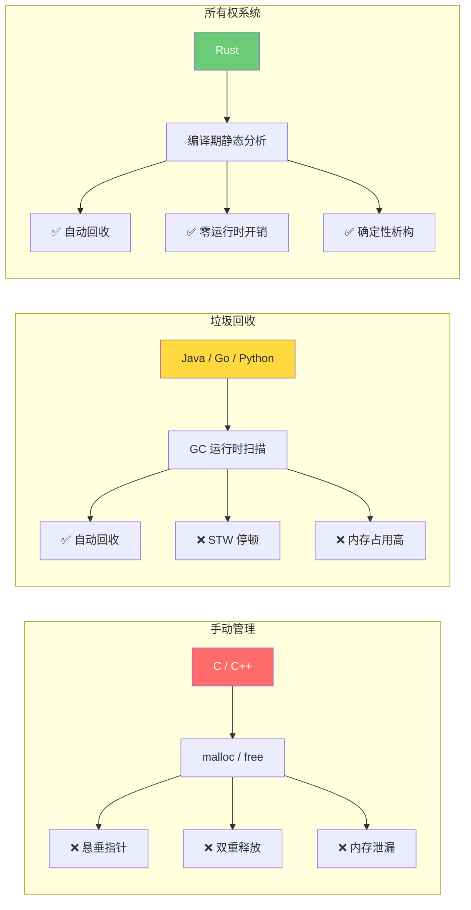

| 特性 | 手动管理 (C/C++) | 垃圾回收 (Java/Go) | 所有权系统 (Rust) |
|------|------------------|--------------------|--------------------|
| 内存安全 | ❌ 开发者负责 | ✅ GC 保证 | ✅ 编译器保证 |
| 性能开销 | ✅ 无 | ❌ GC 停顿 | ✅ 无 |
| 确定性释放 | ✅ 手动控制 | ❌ 不确定 | ✅ 作用域结束即释放 |
| 学习曲线 | 中等 | 低 | 高（但一劳永逸） |
| 数据竞争防护 | ❌ 无 | ❌ 运行时检测 | ✅ 编译期阻止 |

### 1.2 栈与堆：内存的两大阵地

Rust 的所有权系统与内存布局紧密相关，理解栈和堆是理解所有权的基础。

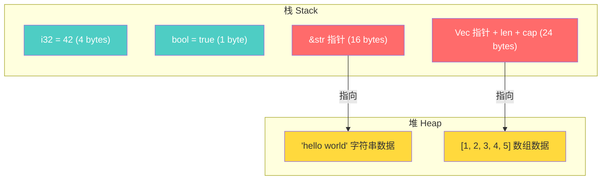

- **栈（Stack）**：存储固定大小的值，按 LIFO（后进先出）顺序分配和释放，速度极快
- **堆（Heap）**：存储动态大小的数据，需要分配器查找可用空间，相对较慢
- **关键点**：堆数据的"元信息"（指针、长度、容量）存在栈上，实际数据在堆上

## 二、所有权系统核心架构

### 2.1 整体架构

Rust 的所有权系统由三个层次递进的子系统构成，它们协同工作，在编译期构建起完整的内存安全保障：

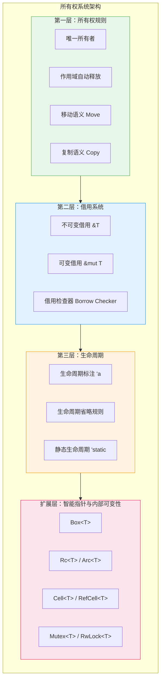

### 2.2 编译器内部的所有权检查流程

当你运行 `cargo build` 时，Rust 编译器（`rustc`）内部会经历以下阶段来检查所有权规则：

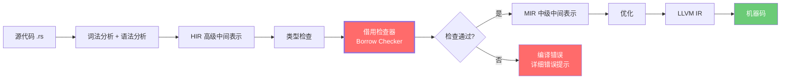

借用检查器（Borrow Checker）是整个流程的核心关卡。它基于 **非词法作用域生命周期（NLL, Non-Lexical Lifetimes）** 算法，分析每个引用的实际使用范围，而不仅仅看变量的词法作用域。

## 三、所有权的三条核心规则

### 规则一：每个值有且只有一个所有者

```rust
fn main() {
    // s1 是字符串 "hello" 的所有者
    let s1 = String::from("hello");

    // 所有权转移（move）给 s2，s1 失效
    let s2 = s1;

    // println!("{}", s1); // ❌ 编译错误：value borrowed here after move
    println!("{}", s2);    // ✅ s2 是当前所有者
}
```

### 规则二：值在所有者离开作用域时自动释放（Drop）

```rust
fn main() {
    {
        let s = String::from("hello"); // s 进入作用域
        println!("{}", s);              // 使用 s
    } // s 离开作用域，Rust 自动调用 drop(s)，释放堆内存
    // 此处 s 不再可用
}
```

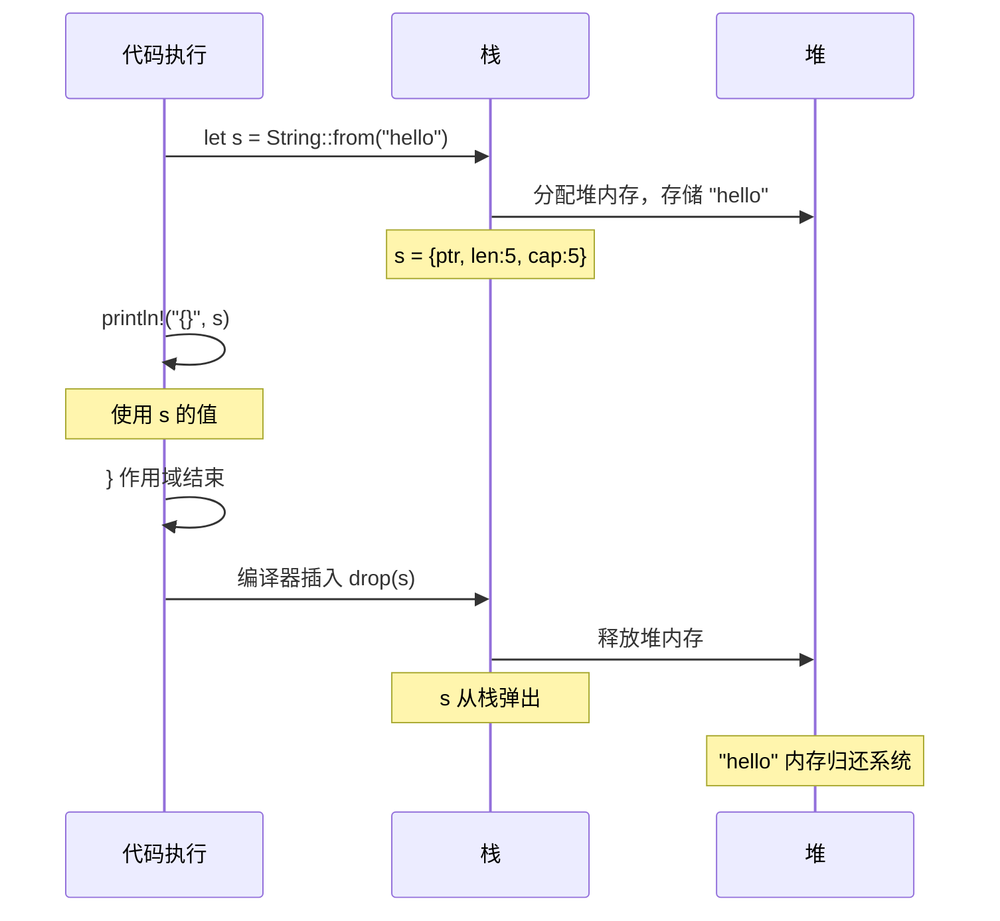

### 规则三：所有权可以转移（Move），但不可隐式复制

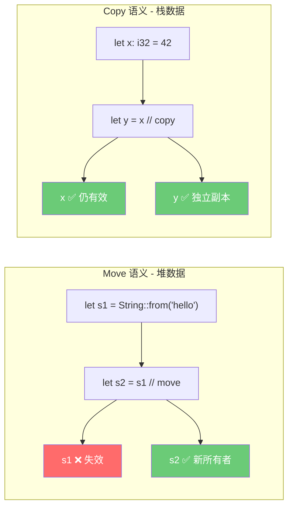

**Move 和 Copy 的区别**：

```rust
// === Move 语义：堆分配的类型 ===
let s1 = String::from("hello");
let s2 = s1;          // s1 的所有权移动到 s2
// println!("{}", s1); // ❌ 编译错误

// === Copy 语义：栈上的简单类型 ===
let x = 42;
let y = x;            // x 的值被复制到 y
println!("{}", x);    // ✅ x 仍然有效

// === 显式克隆：深拷贝堆数据 ===
let s3 = String::from("hello");
let s4 = s3.clone();  // 深拷贝，s3 仍有效
println!("{} {}", s3, s4); // ✅ 两者都有效
```

**实现 Copy trait 的类型**（全部存储在栈上）：
- 所有整数类型（`i32`, `u64`, `isize` 等）
- 浮点类型（`f32`, `f64`）
- 布尔类型（`bool`）
- 字符类型（`char`）
- 元组（当所有元素都实现 `Copy` 时）
- 固定大小数组（当元素实现 `Copy` 时）

## 四、借用系统：灵活而安全的访问机制

所有权规则如果只允许转移，代码会非常难写。借用系统让我们可以**临时访问**数据而不获取所有权。

### 4.1 借用规则的核心约束

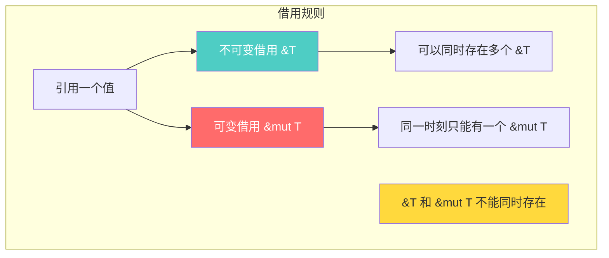

这条规则的本质是 **读写锁（Read-Write Lock）** 的编译期版本：

| 场景 | 允许？ | 类比 |
|------|--------|------|
| 多个 `&T` 同时存在 | ✅ 允许 | 多个读者同时读 |
| 一个 `&mut T` 独占 | ✅ 允许 | 一个写者独占写 |
| `&T` 和 `&mut T` 共存 | ❌ 禁止 | 读写不能同时发生 |
| 多个 `&mut T` 同时存在 | ❌ 禁止 | 不能有多个写者 |

### 4.2 借用的生命周期与 NLL

Rust 2018 版引入了 **非词法作用域生命周期（NLL）**，让借用检查更加智能：

```rust
fn main() {
    let mut data = vec![1, 2, 3];

    let first = &data[0];     // 不可变借用开始
    println!("{}", first);     // 不可变借用最后一次使用
    // NLL: first 的生命周期到这里就结束了，不必等到 } 

    data.push(4);              // ✅ 可变操作，因为不可变借用已结束
    println!("{:?}", data);
}
```

```mermaid
gantt
    title NLL 借用生命周期示意
    dateFormat X
    axisFormat %s

    section 变量 data
    data 所有权存活        :active, 0, 5

    section 借用 first (&data)
    first 不可变借用       :crit, 1, 3

    section 可变操作
    data.push(4) 可变操作  :done, 3, 4
```

> 在 NLL 之前（Rust 2015），`first` 的生命周期会延续到花括号 `}` 结束，导致 `data.push(4)` 编译失败。NLL 让编译器追踪引用的**实际使用点**而非词法范围。

### 4.3 借用与函数

```rust
// 传递引用，不转移所有权
fn calculate_length(s: &String) -> usize {
    s.len()
} // s 离开作用域，但因为它没有所有权，所以什么也不会发生

// 可变借用：允许修改借来的值
fn append_world(s: &mut String) {
    s.push_str(", world!");
}

fn main() {
    let mut greeting = String::from("hello");
    
    let len = calculate_length(&greeting);      // 不可变借用
    println!("长度: {}", len);
    
    append_world(&mut greeting);                 // 可变借用
    println!("{}", greeting);                    // "hello, world!"
}
```

### 4.4 常见借用冲突及解决方案

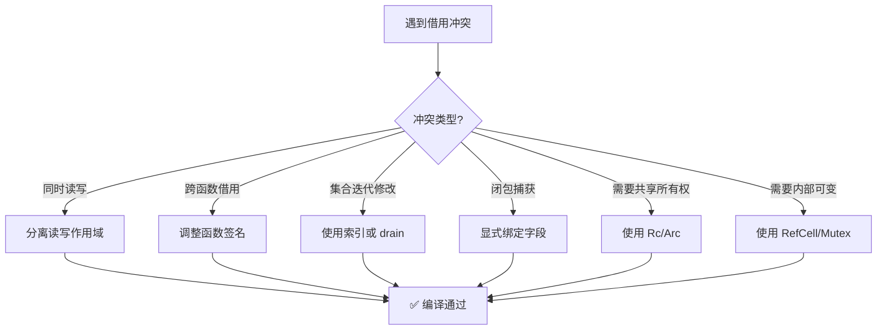

**冲突示例 1：迭代时修改集合**

```rust
fn main() {
    let mut scores = vec![90, 85, 78, 92, 88];

    // ❌ 错误：不能在遍历时修改
    // for score in &scores {
    //     if *score < 80 {
    //         scores.retain(|&s| s >= 80);
    //     }
    // }

    // ✅ 正确：先收集需要的信息，再修改
    scores.retain(|&score| score >= 80);
    println!("{:?}", scores); // [90, 85, 92, 88]
}
```

**冲突示例 2：结构体的部分借用**

```rust
struct Player {
    name: String,
    health: i32,
    score: u64,
}

impl Player {
    fn display_and_heal(&mut self) {
        // ❌ 如果用方法调用，可能产生冲突
        // let name = &self.name;     // 不可变借用 self
        // self.health += 10;         // 可变借用 self —— 冲突！

        // ✅ Rust 支持"分离借用"：同一结构体的不同字段可以分别借用
        let name = &self.name;        // 不可变借用 self.name
        self.health += 10;            // 可变借用 self.health —— OK！
        println!("{} 恢复了 10 点生命，当前: {}", name, self.health);
    }
}
```

## 五、生命周期：引用的有效期标注

### 5.1 什么是生命周期？

生命周期是编译器用来确保**所有引用都始终有效**的机制。大多数情况下，生命周期可以被编译器自动推断（称为"生命周期省略"），但在某些复杂场景中需要显式标注。

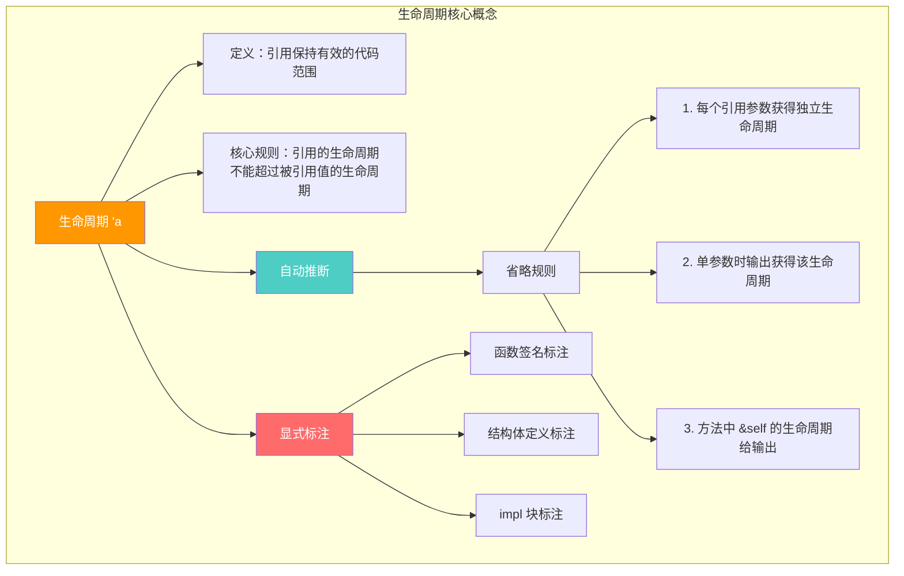

### 5.2 显式生命周期标注

当函数返回引用时，编译器需要知道返回的引用与哪个输入参数的生命周期相关联：

```rust
// 返回两个字符串中较长的那个
// 'a 表示：返回值的生命周期等于 x 和 y 中较短的那个
fn longest<'a>(x: &'a str, y: &'a str) -> &'a str {
    if x.len() > y.len() {
        x
    } else {
        y
    }
}

fn main() {
    let string1 = String::from("long string");
    let result;
    {
        let string2 = String::from("xyz");
        result = longest(string1.as_str(), string2.as_str());
        println!("较长的字符串: {}", result); // ✅ string2 还活着
    }
    // println!("{}", result); // ❌ string2 已被释放，result 可能悬垂
}
```

### 5.3 结构体中的生命周期

当结构体持有引用时，必须标注生命周期，确保引用不会比被引用的数据活得更久：

```rust
// 'a 约束：ImportantExcerpt 实例的生命周期不能超过 part 引用的数据
struct ImportantExcerpt<'a> {
    part: &'a str,
}

impl<'a> ImportantExcerpt<'a> {
    // 生命周期省略规则第三条：&self 的生命周期自动给返回值
    fn announce_and_return(&self, announcement: &str) -> &str {
        println!("请注意: {}", announcement);
        self.part
    }
}

fn main() {
    let novel = String::from("Call me Ishmael. Some years ago...");
    let first_sentence = novel.split('.').next().unwrap();
    let excerpt = ImportantExcerpt { part: first_sentence };
    println!("{}", excerpt.part);
}
```

### 5.4 生命周期省略规则

编译器通过三条规则自动推断生命周期，无需开发者显式标注：

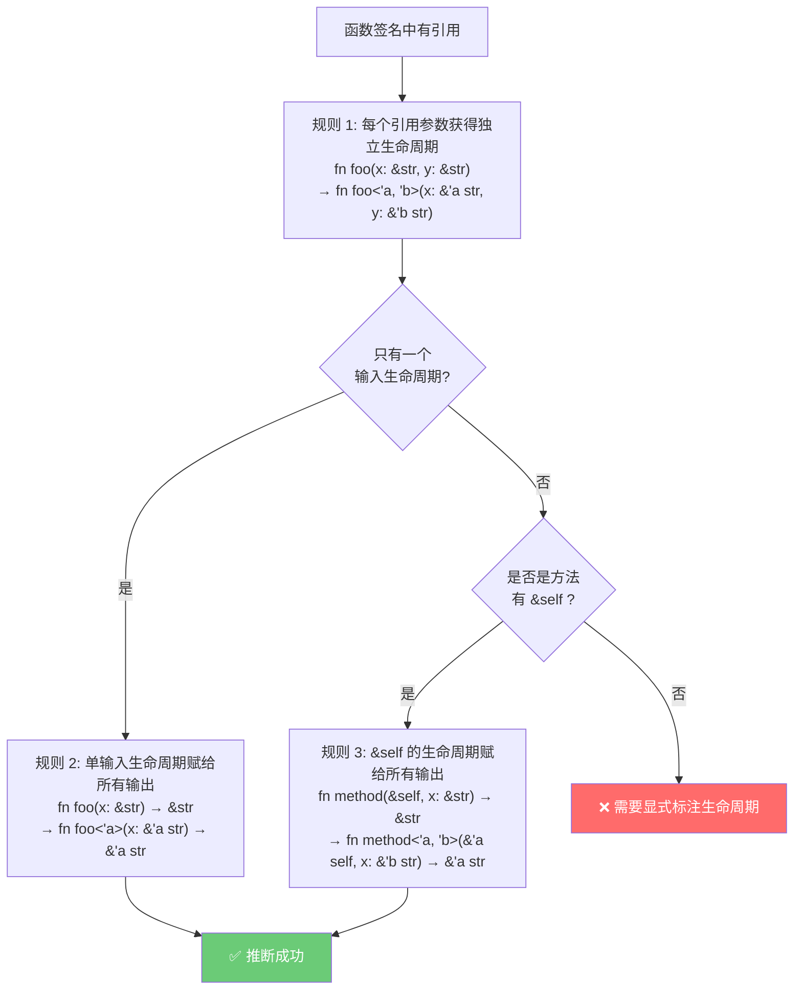

## 六、智能指针与所有权扩展

当基础的所有权模型无法满足需求时，Rust 提供了一系列智能指针来扩展所有权能力。

### 6.1 智能指针决策树

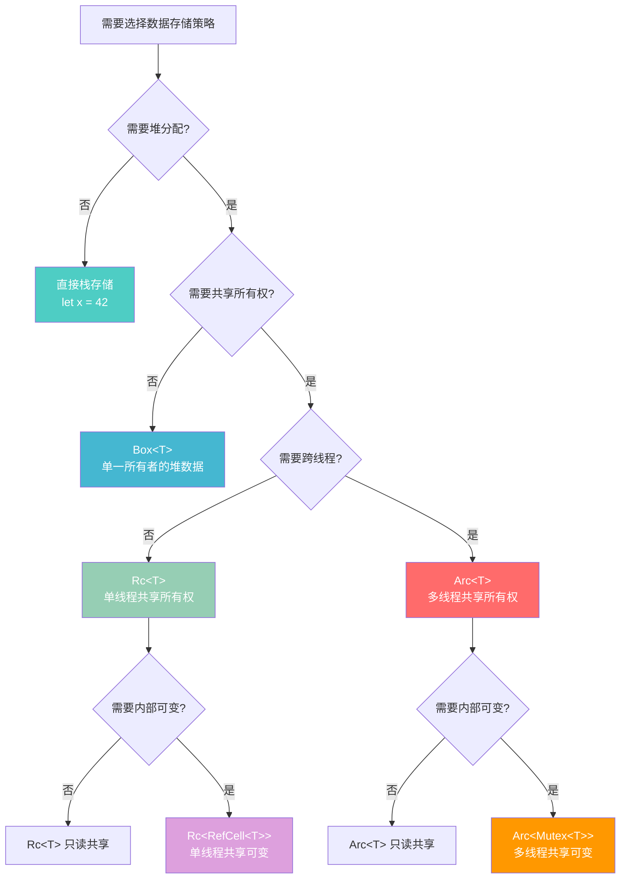

### 6.2 Box\<T\>：最简单的堆分配

```rust
// 递归类型必须使用 Box，因为编译器无法确定递归类型的大小
enum List {
    Cons(i32, Box<List>),
    Nil,
}

use List::{Cons, Nil};

fn main() {
    // 没有 Box，编译器会报错：recursive type has infinite size
    let list = Cons(1, Box::new(Cons(2, Box::new(Cons(3, Box::new(Nil))))));
    
    // trait 对象也常用 Box
    let animal: Box<dyn std::fmt::Display> = Box::new("一只猫");
    println!("{}", animal);
}
```

### 6.3 Rc\<T\> 与 Arc\<T\>：共享所有权

```rust
use std::rc::Rc;

// 场景：多个节点共享同一个子节点（如 DAG 图）
fn main() {
    let shared_data = Rc::new(vec![1, 2, 3]);
    
    let a = Rc::clone(&shared_data);  // 引用计数 +1
    let b = Rc::clone(&shared_data);  // 引用计数 +1
    
    println!("引用计数: {}", Rc::strong_count(&shared_data)); // 3
    println!("a = {:?}", a);
    println!("b = {:?}", b);
    
    drop(a);  // 引用计数 -1
    println!("drop(a) 后引用计数: {}", Rc::strong_count(&shared_data)); // 2
} // shared_data 和 b 离开作用域，引用计数归零，内存释放
```

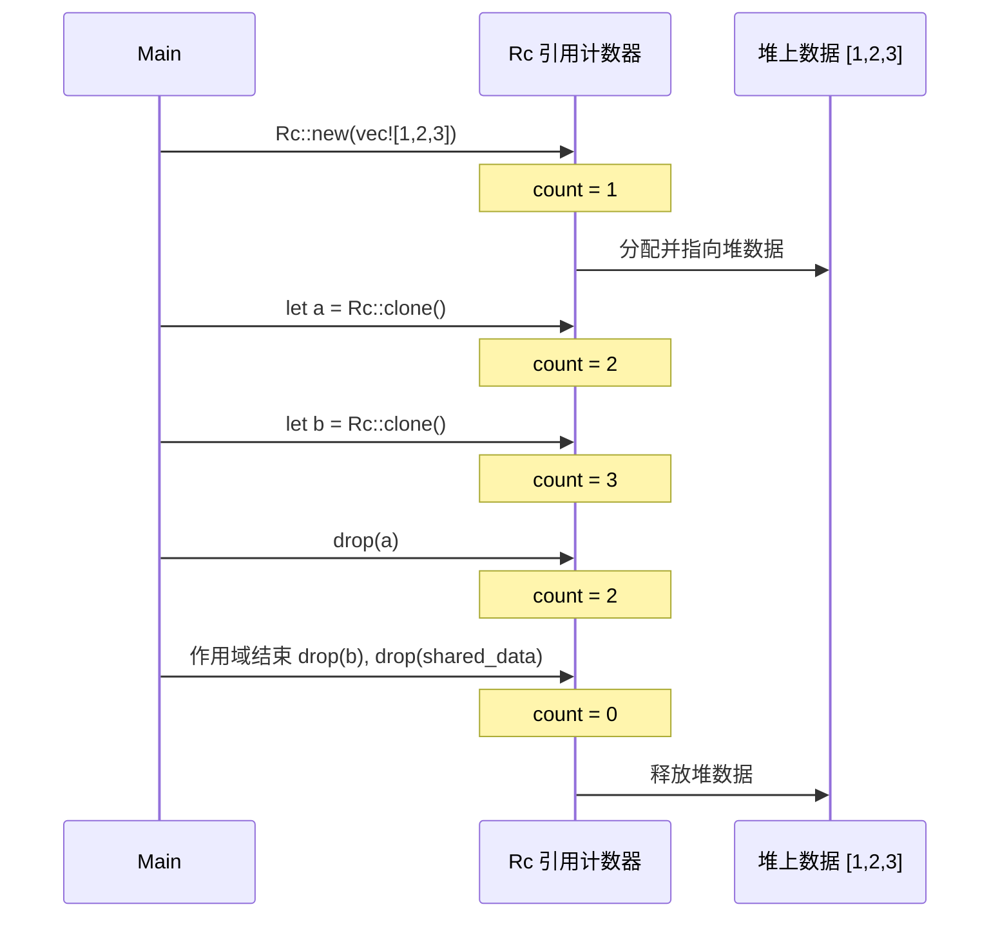

### 6.4 内部可变性：Cell 与 RefCell

**内部可变性** 允许你通过不可变引用修改数据。这听起来违反了借用规则，但实际上是将借用检查从编译期推迟到运行时。

```rust
use std::cell::RefCell;

// 场景：缓存系统 —— 对外不可变，内部维护缓存
struct CachedValue {
    value: String,
    cache: RefCell<Option<usize>>, // 内部可变
}

impl CachedValue {
    fn new(value: String) -> Self {
        CachedValue {
            value,
            cache: RefCell::new(None),
        }
    }

    // &self 不可变引用，但内部可以修改 cache
    fn get_length(&self) -> usize {
        let mut cache = self.cache.borrow_mut(); // 运行时借用检查
        match *cache {
            Some(len) => len,
            None => {
                let len = self.value.len();
                *cache = Some(len);
                len
            }
        }
    }
}

fn main() {
    let cv = CachedValue::new(String::from("hello"));
    println!("长度: {}", cv.get_length()); // 计算并缓存
    println!("长度: {}", cv.get_length()); // 直接从缓存取
}
```

### 6.5 智能指针对比总结

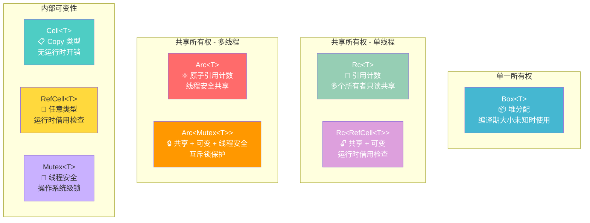

## 七、所有权在实际场景中的应用

### 7.1 场景一：构建一个安全的多线程计数器

```rust
use std::sync::{Arc, Mutex};
use std::thread;

fn main() {
    // Arc 提供跨线程共享，Mutex 提供内部可变性
    let counter = Arc::new(Mutex::new(0));
    let mut handles = vec![];

    for _ in 0..10 {
        let counter = Arc::clone(&counter);
        let handle = thread::spawn(move || {
            let mut num = counter.lock().unwrap();
            *num += 1;
        });
        handles.push(handle);
    }

    for handle in handles {
        handle.join().unwrap();
    }

    println!("最终计数: {}", *counter.lock().unwrap()); // 10
}
```

### 7.2 场景二：实现一个类型安全的状态机

所有权系统可以用来建模状态机，使非法状态转换在编译期就被阻止：

```rust
// 利用所有权转移实现类型安全的状态机
struct Draft {
    content: String,
}

struct PendingReview {
    content: String,
}

struct Published {
    content: String,
}

impl Draft {
    fn new(content: String) -> Self {
        Draft { content }
    }

    // 消耗 Draft，返回 PendingReview —— 状态不可逆
    fn submit(self) -> PendingReview {
        println!("提交审核: {}", self.content);
        PendingReview { content: self.content }
    }
}

impl PendingReview {
    fn approve(self) -> Published {
        println!("审核通过!");
        Published { content: self.content }
    }

    fn reject(self) -> Draft {
        println!("审核驳回，退回草稿");
        Draft { content: self.content }
    }
}

impl Published {
    fn view(&self) -> &str {
        &self.content
    }
}

fn main() {
    let post = Draft::new(String::from("Rust 所有权系统深度解析"));
    let post = post.submit();     // Draft -> PendingReview
    // post.submit();              // ❌ 编译错误：PendingReview 没有 submit 方法
    let post = post.approve();    // PendingReview -> Published
    println!("已发布: {}", post.view());
}
```

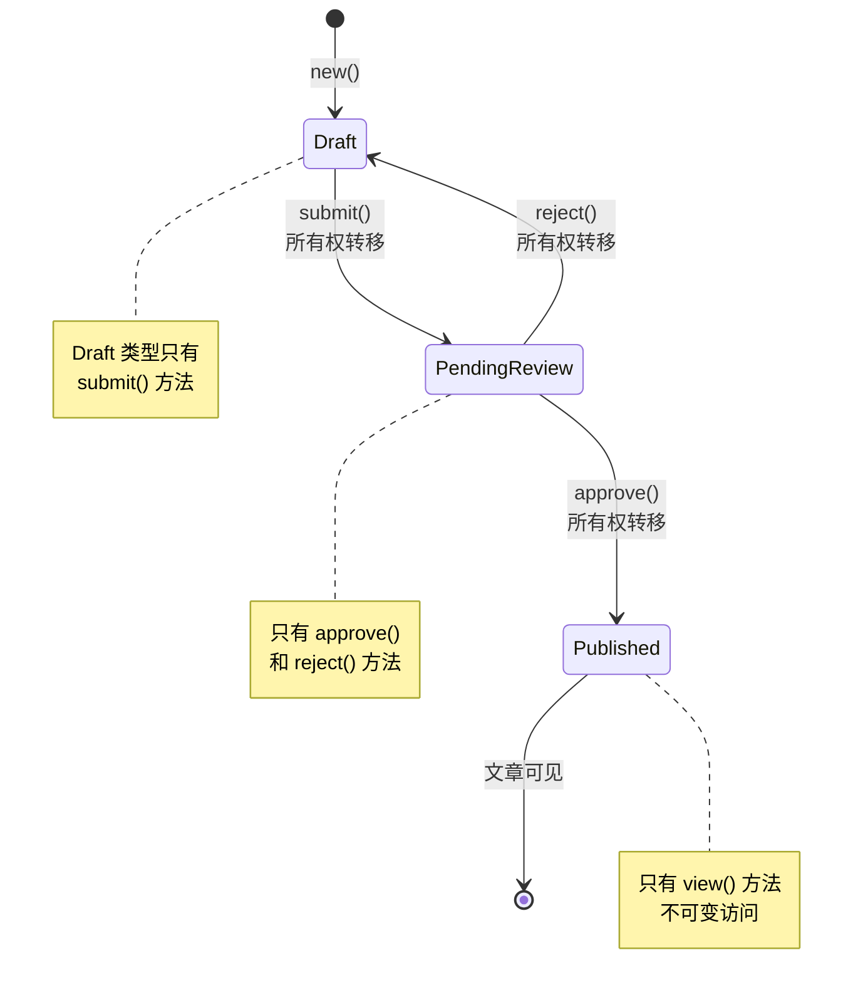

### 7.3 场景三：零拷贝解析器

```rust
// 使用借用实现零拷贝解析，不分配新的堆内存
struct Config<'a> {
    host: &'a str,
    port: &'a str,
}

fn parse_config(input: &str) -> Config<'_> {
    let mut host = "";
    let mut port = "";
    
    for line in input.lines() {
        if let Some(value) = line.strip_prefix("host=") {
            host = value.trim();
        } else if let Some(value) = line.strip_prefix("port=") {
            port = value.trim();
        }
    }
    
    Config { host, port }
}

fn main() {
    let raw_config = String::from("host=127.0.0.1\nport=8080");
    let config = parse_config(&raw_config);
    
    // config.host 和 config.port 直接引用 raw_config 中的数据
    // 零拷贝，零分配！
    println!("服务器: {}:{}", config.host, config.port);
}
```

## 八、最佳实践与反模式

### 8.1 最佳实践清单

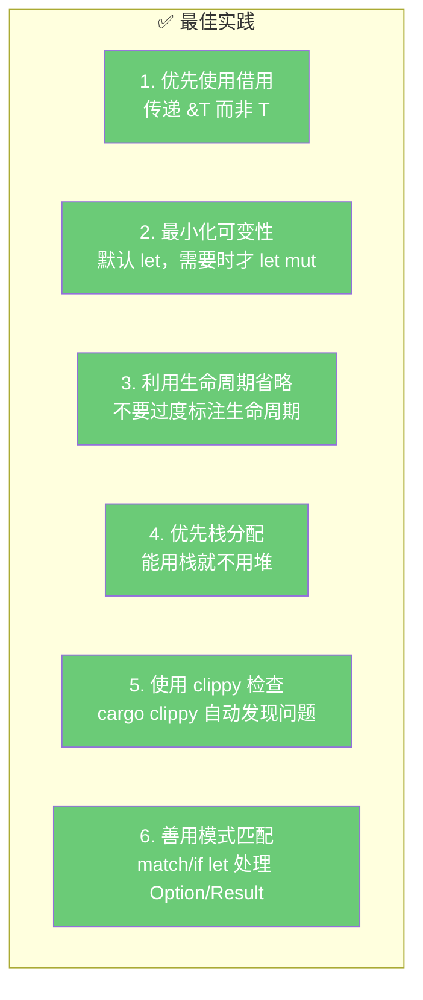

### 8.2 五种所有权策略的选择

根据你的场景选择合适的所有权策略：

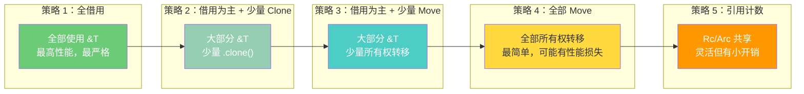

| 策略 | 适用场景 | 复杂度 | 性能 |
|------|---------|--------|------|
| 全借用 | 高性能库、嵌入式 | ⭐⭐⭐⭐⭐ | ⭐⭐⭐⭐⭐ |
| 借用 + Clone | 大多数应用 | ⭐⭐⭐ | ⭐⭐⭐⭐ |
| 借用 + Move | 流式处理、管道 | ⭐⭐⭐ | ⭐⭐⭐⭐ |
| 全 Move | 初学者、原型开发 | ⭐ | ⭐⭐⭐ |
| 引用计数 | 图结构、插件架构 | ⭐⭐ | ⭐⭐⭐ |

### 8.3 反模式警告

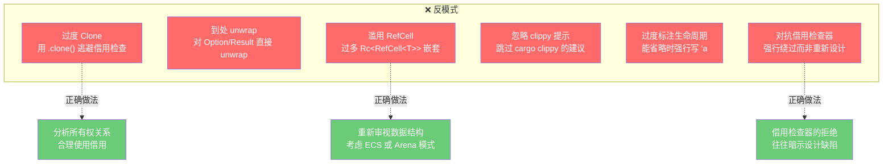

**关键原则**：当你发现自己在"对抗"借用检查器时，停下来重新思考数据结构和所有权关系。借用检查器的拒绝往往意味着你的设计存在潜在的内存安全问题。

## 九、所有权系统的设计哲学总结

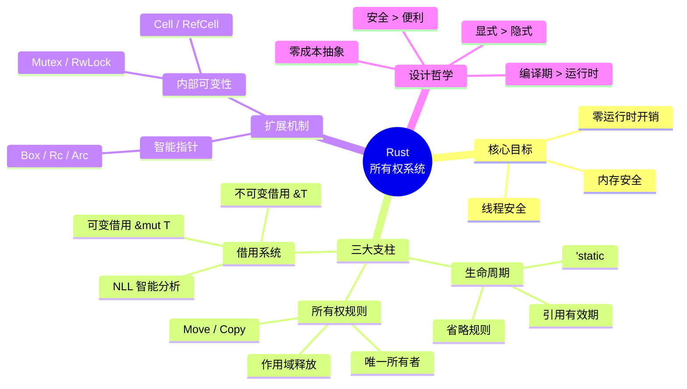

Rust 的所有权系统不仅仅是一个内存管理方案，更是一种**编程范式的革新**。它将原本存在于程序员脑中的"这块内存谁负责释放？这个数据谁在用？"等隐性知识，变成了编译器可以检查的显式规则。虽然学习曲线陡峭，但一旦掌握，你将获得：

- **自信地编写并发代码**：编译器帮你排除数据竞争
- **可预测的性能表现**：没有 GC 停顿，确定性析构
- **更少的运行时 bug**：大量错误在编译期就被消灭
- **自文档化的 API**：函数签名就能告诉你所有权和借用关系

正如 Rust 社区的名言：**"与借用检查器的斗争，终将变成与借用检查器的合作。"**
