Rust 的智能指针是行为类似指针的数据结构，附带额外的元数据和能力。与普通引用 `&T` 不同，智能指针通常**拥有**它所指向的数据。本文将从内存基础出发，逐一剖析标准库中的各类智能指针，深入理解其原理、内存布局与实战选型。

## 目录

1. [基础概念：内存、所有权与 RAII](#1-基础概念内存所有权与-raii)
2. [Box\<T\>：最简单的智能指针](#2-boxt最简单的智能指针)
3. [Deref 与 Drop：智能指针的两大支柱](#3-deref-与-drop智能指针的两大支柱)
4. [Rc\<T\> 与 Arc\<T\>：共享所有权](#4-rct-与-arct共享所有权)
5. [内部可变性：Cell、RefCell 与线程安全对应物](#5-内部可变性cellrefcell-与线程安全对应物)
6. [Cow\<T\>：写时克隆](#6-cowt写时克隆)
7. [Pin\<T\>：固定内存位置](#7-pint固定内存位置)
8. [胖指针、vtable 与分发策略](#8-胖指针vtable-与分发策略)
9. [组合模式与选型决策](#9-组合模式与选型决策)

---

## 1. 基础概念：内存、所有权与 RAII

本节建立理解智能指针所需的全部前置知识：栈与堆的区别、RAII 资源管理范式、以及 Rust 借用规则的本质。

### 1.1 栈与堆

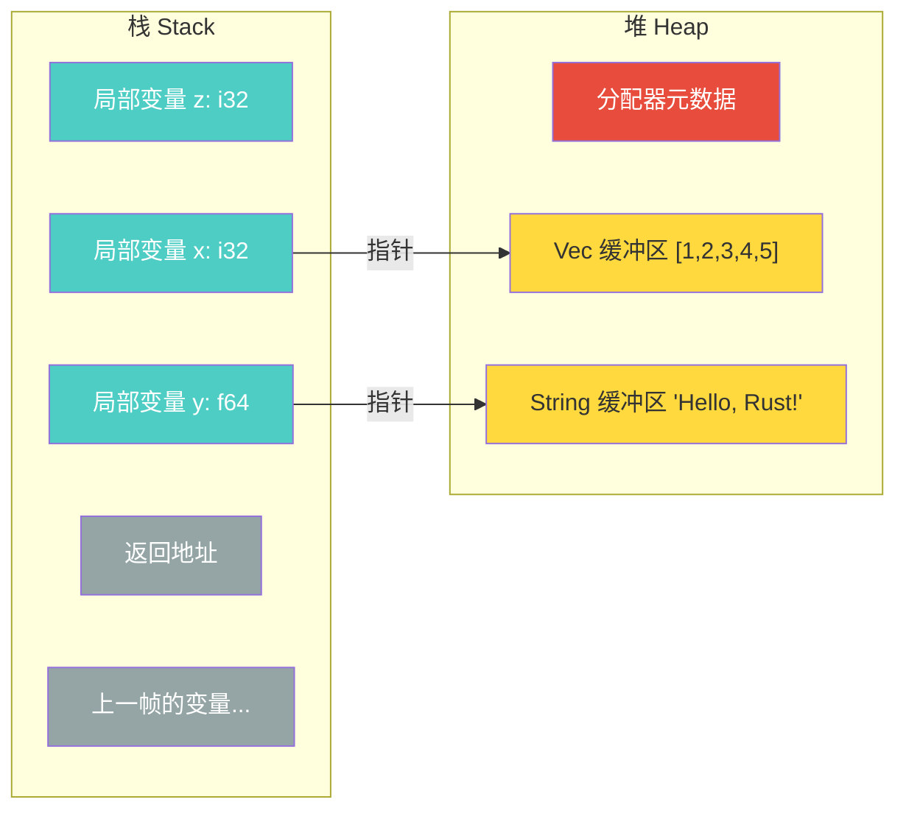

- **栈**：指针偏移分配，极快；编译时必须知道大小；主线程约 8 MB，子线程约 2 MB
- **堆**：分配器查找空闲块，较慢；受限于可用内存，几乎无上限

**何时必须使用堆分配：**

| 场景 | 原因 | 示例 |
|------|------|------|
| 编译时大小未知 | 栈要求编译时确定大小 | `Vec<T>`、`String` |
| 大数据 | 避免栈溢出 | `Box<[i32; 1_000_000]>` |
| 递归类型 | 需要指针间接层打破无限大小 | `enum List { Cons(i32, Box<List>), Nil }` |
| 数据需要超越作用域 | 转移所有权、跨线程传递 | `thread::spawn(move \|\| ...)` |
| trait 对象 | 运行时多态 | `Box<dyn Trait>` |

**堆分配的性能开销不在"堆"本身，而在于：**

1. **分配/回收**：分配器簿记开销
2. **指针间接访问**：随机跳转导致缓存未命中
3. **内存碎片**：大量小分配降低局部性

优化手段：`Vec::with_capacity(n)` 预分配、`SmallVec` 先栈后堆、arena 分配器批量管理短生命周期对象。

### 1.2 RAII 与 Rust 的 OBRM

**RAII（Resource Acquisition Is Initialization）** 将资源生命周期绑定到对象生命周期：

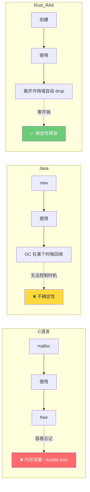

Rust 在 RAII 基础上进一步演化为 **OBRM（Ownership-Based Resource Management）**：

- **RAII** 解决"何时释放"（确定性析构）
- **OBRM** 额外解决"谁能访问"（所有权 + 借用检查，编译期消灭悬垂指针和数据竞争）

```rust
struct DatabaseConnection { conn: RawConnection }

impl DatabaseConnection {
    fn new(url: &str) -> Self {
        Self { conn: RawConnection::connect(url) }  // 资源获取 = 初始化
    }
}

impl Drop for DatabaseConnection {
    fn drop(&mut self) {
        self.conn.disconnect();  // 离开作用域自动断开，即使 panic 也会执行
    }
}
```

标准库中的 RAII 实例：`MutexGuard`（自动释放锁）、`File`（自动关闭文件描述符）、`Box<T>`（自动释放堆内存）。

### 1.3 借用规则：别名与可变性不共存

在任意时刻，要么存在**任意数量的 `&T`**（共享读取），要么存在**恰好一个 `&mut T`**（独占修改），二者不能共存。

这条规则直接消灭数据竞争——数据竞争需要"多指针 + 至少一个写入 + 无同步"三个条件同时成立，而 `&mut T` 的独占性在编译期就打破了这个组合。

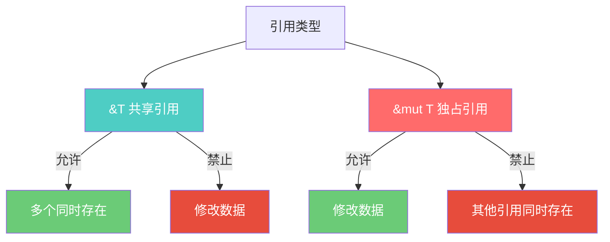

**NLL（非词法生命周期）**：引用的作用域从创建延伸到**最后一次使用**，而非到块末尾：

```rust
let mut s = String::from("hello");
let r1 = &s;
let r2 = &s;
println!("{} {}", r1, r2);  // r1, r2 最后一次使用，借用到此结束

let r3 = &mut s;            // OK，此时无活跃的不可变借用
r3.push_str(" world");
```

### 1.4 智能指针的定义

智能指针是行为类似指针的数据结构，附带额外的**元数据**和**能力**。与普通引用 `&T` 不同，智能指针通常**拥有**它所指向的数据。一个类型要成为智能指针，通常需要实现：

- **`Deref`**：允许像引用一样使用（`*ptr`、自动解引用）
- **`Drop`**：离开作用域时自动执行清理逻辑

`String` 和 `Vec<T>` 也是智能指针——它们拥有堆上的数据，实现了 `Deref` 和 `Drop`。

**标准库智能指针一览：**

| 类型 | 用途 | 所有权 | 线程安全 |
|------|------|--------|----------|
| `Box<T>` | 堆分配 | 单一所有者 | 取决于 T |
| `Rc<T>` | 引用计数 | 多所有者 | 否 |
| `Arc<T>` | 原子引用计数 | 多所有者 | 是 |
| `Cell<T>` | 内部可变性（Copy 类型） | 单一所有者 | 否 |
| `RefCell<T>` | 内部可变性（运行时检查） | 单一所有者 | 否 |
| `Cow<T>` | 写时克隆 | 按需 | 取决于 T |
| `Pin<T>` | 固定内存位置 | 取决于内部指针 | 取决于 T |
| `Weak<T>` | 弱引用 | 非所有者 | 与 Rc/Arc 对应 |

---

## 2. Box\<T\>：最简单的智能指针

### 2.1 实现原理

`Box<T>` 在堆上分配数据，在栈上存储指向该数据的指针。编译后就是一个裸指针，**零额外开销**。移动 `Box<T>` 只复制指针（一个 `usize`），不复制堆上的数据。

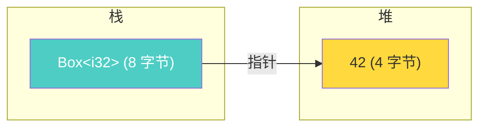

### 2.2 三大业务场景

**场景一：递归类型——打破无限大小**

编译器需要在编译时知道每个类型的大小。没有 `Box`，`List` 的大小是 `i32 + List` = `i32 + i32 + List` = ... 无穷。加了 `Box` 后，大小变成 `i32 + pointer`，是确定的。

```rust
enum List {
    Cons(i32, Box<List>),  // 大小 = i32 + 一个指针，确定
    Nil,
}

// 同理：二叉树
struct TreeNode {
    value: i32,
    left: Option<Box<TreeNode>>,
    right: Option<Box<TreeNode>>,
}
```

**场景二：大数据避免栈溢出**

```rust
// 栈上分配 4 MB → 可能栈溢出
// let huge_on_stack: [i32; 1_000_000] = [0; 1_000_000];

// 堆上分配 → 安全，栈上只有 8 字节指针
let huge_on_heap: Box<[i32; 1_000_000]> = Box::new([0; 1_000_000]);
```

**场景三：trait 对象（动态分发）**

```rust
trait Animal {
    fn speak(&self);
}
struct Dog;
impl Animal for Dog { fn speak(&self) { println!("Woof!"); } }
struct Cat;
impl Animal for Cat { fn speak(&self) { println!("Meow!"); } }

// 异构集合：不同类型放在同一个 Vec 里
let animals: Vec<Box<dyn Animal>> = vec![Box::new(Dog), Box::new(Cat)];
for animal in &animals {
    animal.speak();  // 通过 vtable 动态分发
}
```

### 2.3 技术选型

- 需要堆分配 + 单一所有权 → `Box<T>`
- 需要共享所有权 → 考虑 `Rc<T>` / `Arc<T>`（见第 4 节）
- 热路径上的 trait 对象 → 优先考虑泛型静态分发（见第 8 节）

---

## 3. Deref 与 Drop：智能指针的两大支柱

`Deref` 和 `Drop` 是所有智能指针的共同基础。理解它们的实现原理，就理解了智能指针"智能"在哪里。

### 3.1 Deref：自动解引用

**trait 定义：**

```rust
pub trait Deref {
    type Target: ?Sized;
    fn deref(&self) -> &Self::Target;
}

pub trait DerefMut: Deref {
    fn deref_mut(&mut self) -> &mut Self::Target;
}
```

当你写 `*v` 时，编译器实际执行 `*(v.deref())`。`deref()` 返回**引用**而非值本身，避免将数据从 `self` 中移出。

**解引用强制转换（Deref Coercion）** 是编译器的关键机制——当类型不匹配时，编译器自动、反复调用 `Deref`，直到类型匹配：


三条转换规则：

1. `&T` → `&U`，当 `T: Deref<Target=U>`（不可变到不可变）
2. `&mut T` → `&mut U`，当 `T: DerefMut<Target=U>`（可变到可变）
3. `&mut T` → `&U`，当 `T: Deref<Target=U>`（可变到不可变，安全降级）

反方向不允许：`&T` 永远不能转成 `&mut T`。

```rust
fn hello(name: &str) { println!("Hello, {}!", name); }

let m = Box::new(String::from("Rust"));
hello(&m);  // &Box<String> → &String → &str，自动 Deref 链
// 没有 Deref Coercion 你需要写：hello(&(*m)[..]);
```

**标准库 Deref 实现：**

| 类型 | Target | 效果 |
|------|--------|------|
| `String` | `str` | `&String` → `&str` |
| `Vec<T>` | `[T]` | `&Vec<T>` → `&[T]` |
| `Box<T>` / `Rc<T>` / `Arc<T>` | `T` | 透明访问内部值 |

整个 Deref Coercion 在**编译时完成**，零运行时开销。只在类型**透明包装**另一个类型时实现 `Deref`，不要当作通用类型转换工具。

### 3.2 Drop：确定性析构

```rust
pub trait Drop {
    fn drop(&mut self);
}
```

**Drop 顺序规则：**

- **局部变量**：声明的**逆序**（后声明的先 drop）
- **结构体字段**：声明的**正序**（先声明的先 drop）
- 元组和数组：元素顺序

```rust
struct Named(&'static str);
impl Drop for Named {
    fn drop(&mut self) { println!("Dropping: {}", self.0); }
}

fn main() {
    let a = Named("first");
    let b = Named("second");
    let c = Named("third");
}
// 输出：Dropping: third → second → first（声明逆序）
```

**提前释放：** 不能直接调用 `c.drop()`，需使用 `std::mem::drop(c)`。`drop` 函数的实现极其简单：`fn drop<T>(_: T) {}`——取得所有权后值离开作用域，自动触发 `Drop::drop()`。

**关键规则：**

- **`Copy` 和 `Drop` 互斥**：`Copy` 意味着按位复制安全，`Drop` 意味着有清理逻辑，二者矛盾
- **不要在 `drop` 中 panic**：栈展开期间再 panic 会导致程序 abort
- **字段自动 drop**：即使没有自定义 `Drop`，所有字段的析构函数仍会被自动调用

**`ManuallyDrop<T>`**：需要精细控制析构时机时使用：

```rust
use std::mem::ManuallyDrop;
let mut data = ManuallyDrop::new(String::from("hello"));
// data 不会自动 drop，需要手动调用：
unsafe { ManuallyDrop::drop(&mut data); }
```

---

## 4. Rc\<T\> 与 Arc\<T\>：共享所有权

Rust 的所有权模型规定每个值有且只有一个所有者。但图结构、共享缓存、多组件共享配置等场景天然需要**多个所有者**。`Rc` 和 `Arc` 通过引用计数解决这个问题。

### 4.1 Rc\<T\>：单线程引用计数

**内存布局：**

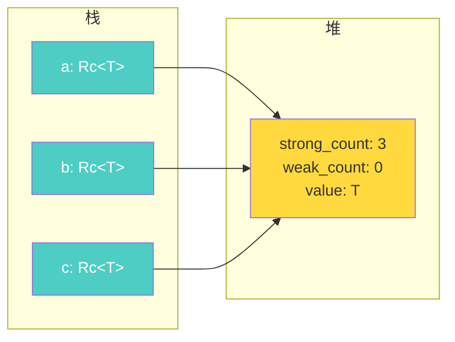

`Rc::clone(&a)` 只增加引用计数（一次整数加法），不深拷贝数据。当最后一个 `Rc` 离开作用域、strong_count 归零时，数据被释放。

```rust
use std::rc::Rc;

let a = Rc::new(vec![1, 2, 3]);       // strong_count = 1
let b = Rc::clone(&a);                // strong_count = 2
{
    let c = Rc::clone(&a);            // strong_count = 3
}                                      // c drop → strong_count = 2
// a, b drop → strong_count = 0 → Vec 被释放
```

**关键约束：** `Rc<T>` 只提供 `&T`，不能获得 `&mut T`。需要修改数据时必须组合 `Cell` 或 `RefCell`。`Rc<T>` 未实现 `Send`/`Sync`，编译器拒绝跨线程传递。

### 4.2 Arc\<T\>：多线程原子引用计数

`Arc<T>` 是 `Rc<T>` 的线程安全版本，使用**原子操作**维护引用计数。

```rust
use std::sync::Arc;
use std::thread;

let data = Arc::new(vec![1, 2, 3]);
let handles: Vec<_> = (0..3).map(|_| {
    let data = Arc::clone(&data);
    thread::spawn(move || {
        println!("线程读取: {:?}", data);
    })
}).collect();
for h in handles { h.join().unwrap(); }
```

`Arc<T>` 让引用计数线程安全，但**不**让数据本身线程安全。要跨线程修改数据，必须组合 `Mutex<T>` 或 `RwLock<T>`。

### 4.3 Rc 与 Arc 对比

| 特性 | `Rc<T>` | `Arc<T>` |
|------|---------|----------|
| 线程安全 | 否 | 是（原子操作） |
| 性能 | 更快（非原子操作） | 稍慢（原子操作开销） |
| 模块 | `std::rc::Rc` | `std::sync::Arc` |
| 配合可变性 | `Cell` / `RefCell` | `Mutex` / `RwLock` / Atomics |
| `Send` / `Sync` | 均否 | 均是（当 `T: Send + Sync`） |

### 4.4 Weak\<T\>：弱引用与打破循环

当 A 和 B 互相持有 `Rc` 强引用时，各自的 strong_count 永远不会降到 0，造成**内存泄漏**。`Weak<T>` 不增加 strong_count，解决这个问题。

**双重引用计数机制：**

- **`strong_count`**：`Rc`/`Arc` 的克隆数。归零时**释放数据**
- **`weak_count`**：`Weak` 的引用数。归零时**释放元数据内存块**

```rust
use std::rc::{Rc, Weak};

let strong = Rc::new(42);
let weak: Weak<i32> = Rc::downgrade(&strong);  // 创建弱引用

assert_eq!(*weak.upgrade().unwrap(), 42);  // upgrade() → Option<Rc<T>>

drop(strong);  // strong_count 归零，数据被释放
assert!(weak.upgrade().is_none());         // 数据已释放，返回 None
```

**经典业务场景：带父指针的树**

父 → 子用强引用（`Rc`），子 → 父用弱引用（`Weak`），避免循环：

```rust
use std::rc::{Rc, Weak};
use std::cell::RefCell;

struct Node {
    value: i32,
    children: RefCell<Vec<Rc<Node>>>,  // 强引用：父拥有子
    parent: RefCell<Weak<Node>>,        // 弱引用：子不拥有父
}
```

### 4.5 技术选型

- 单线程共享所有权 → `Rc<T>`，避免原子操作开销
- 跨线程共享所有权 → `Arc<T>`
- 库代码更倾向 `Arc<T>`，为调用者提供灵活性
- 有循环引用风险 → 用 `Weak<T>` 打破循环

---

## 5. 内部可变性：Cell、RefCell 与线程安全对应物

Rust 的借用规则有时过于保守。某些情况下，你需要在不可变引用 `&T` 背后修改数据。内部可变性类型将借用检查从**编译时**推迟到**运行时**。所有内部可变性类型的基础是 `UnsafeCell<T>`——Rust 中唯一合法获取可变别名数据的方式。

### 5.1 Cell\<T\>：值复制的内部可变性

适用于 `Copy` 类型，通过**整体替换**值来实现可变性，无需引用追踪。

```rust
use std::cell::Cell;

let counter = Cell::new(0);
counter.set(counter.get() + 1);  // 通过 &Cell<i32>（不可变引用）修改值
counter.set(counter.get() + 1);
println!("counter = {}", counter.get());  // 2
```

**优点：** 无运行时借用追踪开销。**限制：** 只能 `get`/`set` 整个值，不能获取内部引用。

### 5.2 RefCell\<T\>：运行时借用检查

适用于任意类型，提供引用级别的内部可变性，在运行时执行借用检查。

```rust
use std::cell::RefCell;

let data = RefCell::new(vec![1, 2, 3]);

{
    let borrowed = data.borrow();       // 不可变借用 → 返回 Ref<T>
    println!("{:?}", *borrowed);
}   // Ref 被 drop，借用结束

data.borrow_mut().push(4);             // 可变借用 → 返回 RefMut<T>
println!("{:?}", data.borrow());        // [1, 2, 3, 4]
```

**内部实现原理：** `RefCell` 用一个有符号整数追踪借用状态：

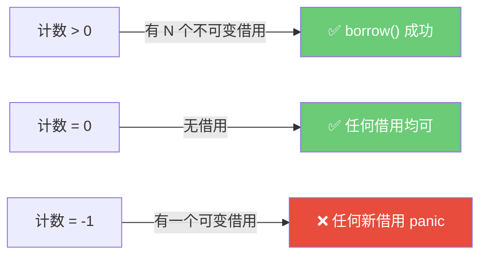

- `borrow()` 时若计数 = -1（已有可变借用）→ **panic**
- `borrow_mut()` 时若计数 ≠ 0（已有任何借用）→ **panic**

**安全版本：** `try_borrow()` / `try_borrow_mut()` 返回 `Result`，不会 panic。

### 5.3 Cell 家族一览与线程安全对应物

| 类型 | 线程安全 | 写入方式 | 说明 |
|------|---------|---------|------|
| `UnsafeCell<T>` | 否 | 不限（unsafe） | 所有内部可变性的基础 |
| `Cell<T>` | 否 | 值替换 | Copy 类型，无借用追踪 |
| `RefCell<T>` | 否 | 引用（运行时检查） | 任意类型，违规时 panic |
| `OnceCell<T>` | 否 | 只写一次 | 延迟初始化 |
| `OnceLock<T>` | 是 | 只写一次 | 线程安全的 `OnceCell` |
| `LazyCell<T>` | 否 | Deref 时自动初始化 | 惰性求值 |
| `LazyLock<T>` | 是 | Deref 时自动初始化 | 线程安全的 `LazyCell` |

**单线程 → 多线程对应关系：**

| 单线程 | 多线程 |
|--------|--------|
| `Cell<T>` | `Atomic*` 类型 |
| `RefCell<T>` | `Mutex<T>` / `RwLock<T>` |
| `OnceCell<T>` | `OnceLock<T>` |

### 5.4 技术选型

- 简单 Copy 类型的内部可变性 → `Cell<T>`（零开销）
- 任意类型的内部可变性 → `RefCell<T>`（运行时检查）
- `RefCell` 是最后手段——运行时 panic 比编译期错误更危险，优先重构代码满足借用检查器
- 多线程场景 → `Mutex<T>` / `RwLock<T>`

---

## 6. Cow\<T\>：写时克隆

### 6.1 实现原理

```rust
pub enum Cow<'a, B: ?Sized + ToOwned + 'a> {
    Borrowed(&'a B),                    // 持有借用引用
    Owned(<B as ToOwned>::Owned),       // 持有所有权数据
}
```

`Cow`（Clone on Write）可以持有**借用**或**所有权**数据。不可变访问时直接使用借用数据（零开销），需要修改时才克隆。名字是 **Clone** on Write 而非 Copy on Write——Rust 的 `Clone` 可以执行自定义深拷贝逻辑。

**核心方法：**

- `Deref`：以 `&B` 方式访问数据，无论 Borrowed 还是 Owned
- `to_mut()`：返回 `&mut`，如果是 Borrowed 则先克隆
- `into_owned()`：转换为 Owned 变体

### 6.2 业务场景：条件性修改

```rust
use std::borrow::Cow;

/// 对字符串进行 HTML 转义
/// 大多数字符串不需要转义 → 直接返回借用，零分配
/// 少数需要转义 → 分配新字符串
fn html_escape(input: &str) -> Cow<str> {
    if input.contains('<') || input.contains('>') || input.contains('&') {
        let escaped = input
            .replace('&', "&amp;")
            .replace('<', "&lt;")
            .replace('>', "&gt;");
        Cow::Owned(escaped)
    } else {
        Cow::Borrowed(input)  // 零分配
    }
}

let safe = html_escape("Hello, world!");                    // Borrowed
let escaped = html_escape("<script>alert(1)</script>");     // Owned
```

### 6.3 相关机制：Rc/Arc 的写时克隆

`Rc::make_mut` 和 `Arc::make_mut` 提供类似语义——只有在引用计数 > 1 时才克隆数据：

```rust
use std::rc::Rc;

let mut data = Rc::new(vec![1, 2, 3]);
let shared = Rc::clone(&data);

Rc::make_mut(&mut data).push(4);  // data 被共享，make_mut 会克隆

println!("{:?}", data);    // [1, 2, 3, 4]
println!("{:?}", shared);  // [1, 2, 3]  — 不受影响
```

### 6.4 技术选型

- 函数通常返回借用数据但偶尔需要分配 → `Cow<T>`
- 路径规范化、字符串转义、配置默认值等"常借偶拥"场景最适合

---

## 7. Pin\<T\>：固定内存位置

### 7.1 问题背景

Rust 的 `async fn` 编译后生成的状态机可能是**自引用结构体**——内部字段引用了自身的其他字段。如果这个结构体被移动，内部引用就变成**悬垂指针**。

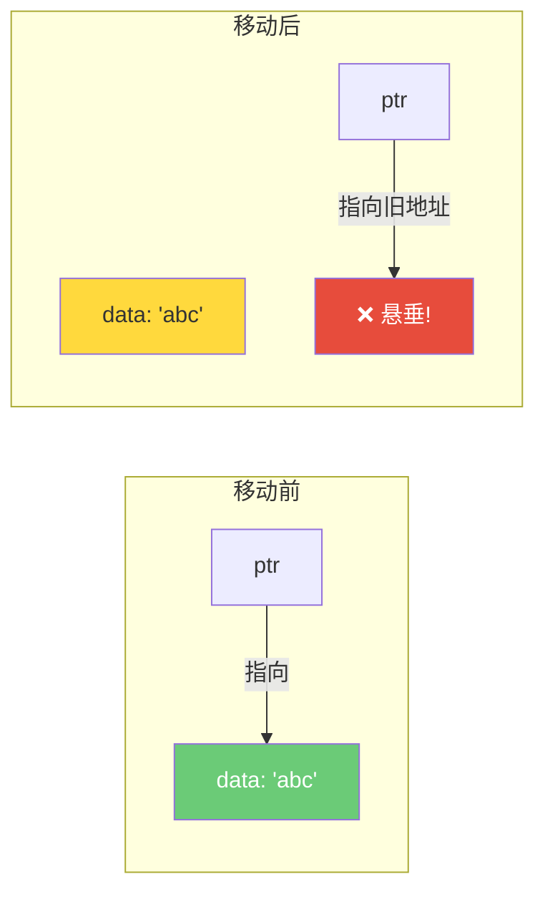

### 7.2 Pin 的保证

`Pin<P>` 包装一个指针 `P`，**保证被指向的值不会在内存中移动**。它通过阻止获取 `&mut T`（`&mut T` 允许 `mem::swap`）来实现这一保证。

```rust
use std::pin::Pin;

// 堆上固定
let pinned: Pin<Box<MyFuture>> = Box::pin(my_async_fn());

// 栈上固定（Rust 1.68+）
let future = my_async_fn();
let pinned = std::pin::pin!(future);
```

### 7.3 Unpin trait

`Unpin` 是一个自动 trait，大多数类型默认实现它：

- `Unpin` 类型可以在 `Pin` 中自由移动——`Pin` 对它们完全透明
- `async fn` / `async {}` 生成的类型是 `!Unpin`（可能自引用）
- 对于 `Unpin` 类型，`Pin::new()` 可用；对于 `!Unpin` 类型，必须用 `Box::pin()` 或 `pin!` 宏

### 7.4 与 Future::poll 的关系

```rust
pub trait Future {
    type Output;
    fn poll(self: Pin<&mut Self>, cx: &mut Context<'_>) -> Poll<Self::Output>;
}
```

`poll` 接受 `self: Pin<&mut Self>` 而不是 `&mut self`，确保 future 一旦开始轮询就不能被移动。使用 `.await` 时编译器自动处理 Pin，你只在手动实现 `Future` 或编写组合器时需要直接处理 `Pin`。

### 7.5 结构化固定（Pin Projection）

对于固定的结构体，需要决定哪些字段传播固定保证：

```rust
use pin_project::pin_project;

#[pin_project]
struct MyFuture {
    #[pin]
    inner: SomeOtherFuture,  // 结构化固定
    count: usize,            // 不固定
}

impl Future for MyFuture {
    type Output = ();
    fn poll(self: Pin<&mut Self>, cx: &mut Context<'_>) -> Poll<()> {
        let this = self.project();
        // this.inner: Pin<&mut SomeOtherFuture>  ← 保持固定
        // this.count: &mut usize                 ← 可自由使用
        this.inner.poll(cx)
    }
}
```

### 7.6 技术选型

- 大多数代码不需要直接处理 `Pin`——`.await` 自动处理
- 手动实现 `Future` 或编写异步组合器时才需要
- 使用 `pin-project` crate 简化结构化固定

---

## 8. 胖指针、vtable 与分发策略

本节将 Box 的 trait 对象场景（第 2 节）深入展开，解析底层的指针布局和分发机制。

### 8.1 瘦指针 vs 胖指针

**瘦指针（Thin Pointer）：** 一个 `usize`（8 字节），如 `&i32`、`&String`、`Box<Vec<i32>>`。

**胖指针（Fat Pointer）：** 两个 `usize`（16 字节）。

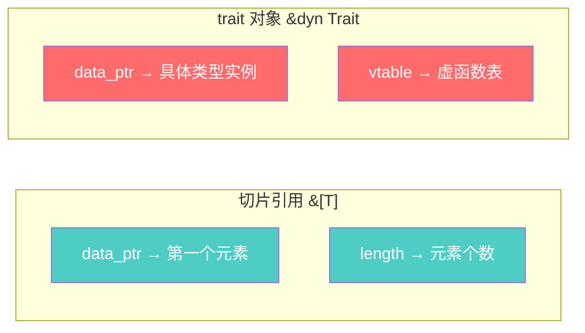

### 8.2 vtable（虚函数表）

对于每个 `(具体类型, Trait)` 组合，编译器生成一个**全局唯一的静态 vtable**：

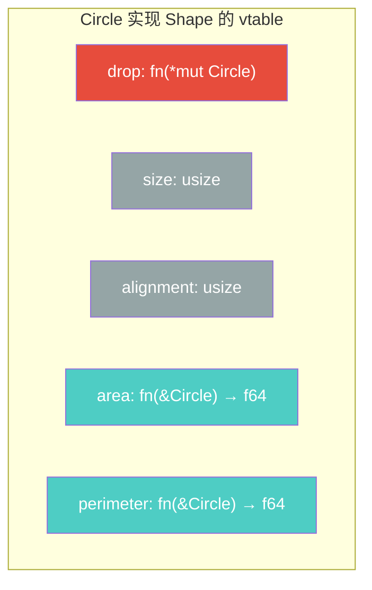

**Rust vs C++ 的 vtable 策略：**

- **C++**：vtable 指针是对象的隐藏成员（每个对象内部携带 vptr）
- **Rust**：vtable 指针存在胖指针中，不存在对象内部

Rust 的方式意味着对象的内存布局不受是否用作 trait 对象的影响。同一个 `Circle` 实例，既可以直接使用（无 vtable 开销），也可以作为 `&dyn Shape` 使用（只在指针处增加 vtable）。

**对象安全（dyn 兼容性）要求：**

- 方法不能返回 `Self`（运行时大小未知）
- 方法不能有泛型类型参数（无法生成 vtable）
- trait 不能要求 `Self: Sized`

### 8.3 静态分发 vs 动态分发

**静态分发（泛型 / 单态化）：** 编译器为每个具体类型生成专门的函数副本，方法调用在编译时解析。

```rust
// 编译器为 area::<Circle> 和 area::<Square> 生成两份代码
fn area<T: Shape>(shape: &T) -> f64 {
    shape.area()  // 编译时已知具体类型，可以内联
}
```

**动态分发（dyn Trait）：** 方法调用在运行时通过 vtable 查找解析。

```rust
fn area(shape: &dyn Shape) -> f64 {
    shape.area()  // 运行时 vtable 查找
}

// 异构集合成为可能
let shapes: Vec<Box<dyn Shape>> = vec![
    Box::new(Circle { radius: 1.0 }),
    Box::new(Square { side: 2.0 }),
];
```

**对比总结：**

| 方面 | 静态分发（泛型） | 动态分发（`dyn Trait`） |
|------|-----------------|----------------------|
| 解析时机 | 编译时 | 运行时 |
| 机制 | 单态化 | vtable 查找 |
| 内联 | 可以 | 不可以 |
| 二进制大小 | 更大 | 更小 |
| 异构集合 | 不支持 | 支持 |
| 每次调用开销 | 零 | ~2 次指针解引用 |

### 8.4 技术选型

- **库代码**：优先泛型（静态分发），把选择权留给调用者
- **应用代码**：需要灵活性时可用动态分发，性能差异在多数场景可忽略
- **热路径**：优先静态分发
- **插件架构 / 异构集合**：动态分发是唯一选择

---

## 9. 组合模式与选型决策

前面各节分别介绍了每种智能指针的原理和场景。实际开发中，它们往往**组合使用**。本节汇总常见组合模式，并给出最终的选型决策树。

### 9.1 常见组合模式

**模式一：`Rc<RefCell<T>>` —— 单线程共享可变状态**

```rust
use std::rc::Rc;
use std::cell::RefCell;

let shared = Rc::new(RefCell::new(vec![1, 2, 3]));

let clone1 = Rc::clone(&shared);
clone1.borrow_mut().push(4);

let clone2 = Rc::clone(&shared);
println!("{:?}", clone2.borrow());  // [1, 2, 3, 4]
```

**模式二：`Arc<Mutex<T>>` —— 多线程共享可变状态**

```rust
use std::sync::{Arc, Mutex};
use std::thread;

let data = Arc::new(Mutex::new(vec![]));

let handles: Vec<_> = (0..5).map(|i| {
    let data = Arc::clone(&data);
    thread::spawn(move || {
        data.lock().unwrap().push(i);
    })
}).collect();

for h in handles { h.join().unwrap(); }
println!("{:?}", data.lock().unwrap());
```

**模式三：Newtype + Deref 实现类型安全包装**

```rust
use std::ops::Deref;

struct Email(String);

impl Deref for Email {
    type Target = str;
    fn deref(&self) -> &str { &self.0 }
}

fn send_email(to: &Email, body: &str) {
    println!("发送到 {}: {}", &**to, body);
}
```

### 9.2 最佳实践总结

1. **优先栈分配**。只在需要时使用堆（`Box`、`Vec` 等）
2. **优先静态分发**（泛型），除非需要异构集合或运行时多态
3. **谨慎使用 `Rc`/`Arc`**。它们增加开销，且可能通过循环引用泄漏内存
4. **`RefCell` 是最后手段**。运行时 panic 比编译期错误更危险，优先重构代码满足借用检查器
5. **`Cow<T>` 用于常借偶拥的场景**
6. **`Weak` 打破循环引用**。图或树中的回指引用用 `Weak`
7. **只在持有外部资源时实现 `Drop`**。Rust 自动处理嵌套 drop
8. **只在透明包装时实现 `Deref`**。不要用作通用类型转换
9. **简单 Copy 类型用 `Cell` 而非 `RefCell`**。无运行时借用追踪开销
10. **`Pin` 只在处理 `!Unpin` 类型时使用**。大多数代码不需要直接处理

### 9.3 选型决策树

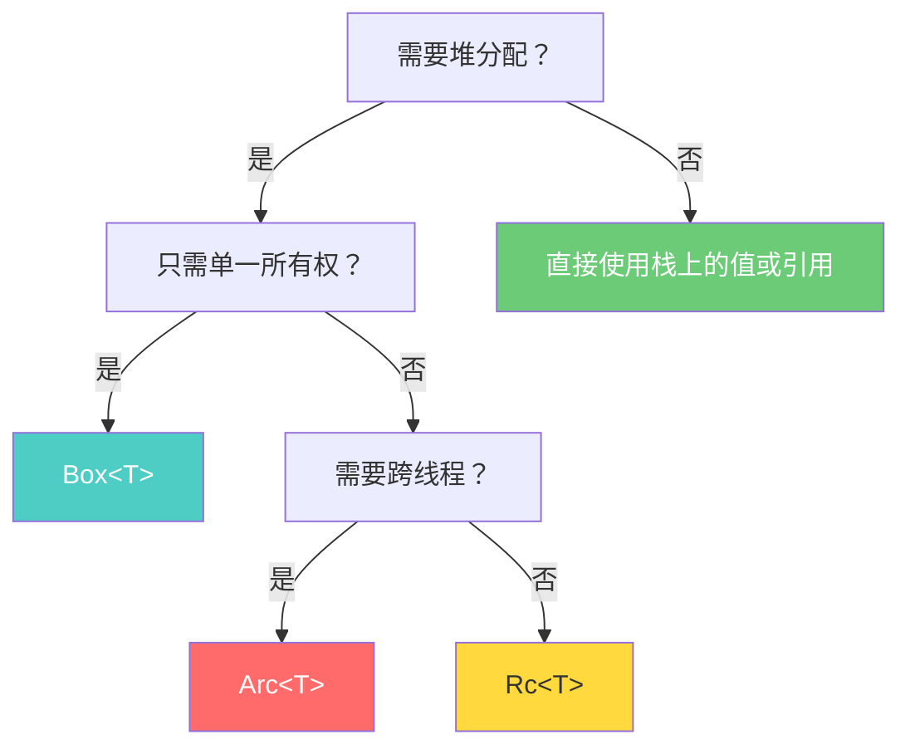

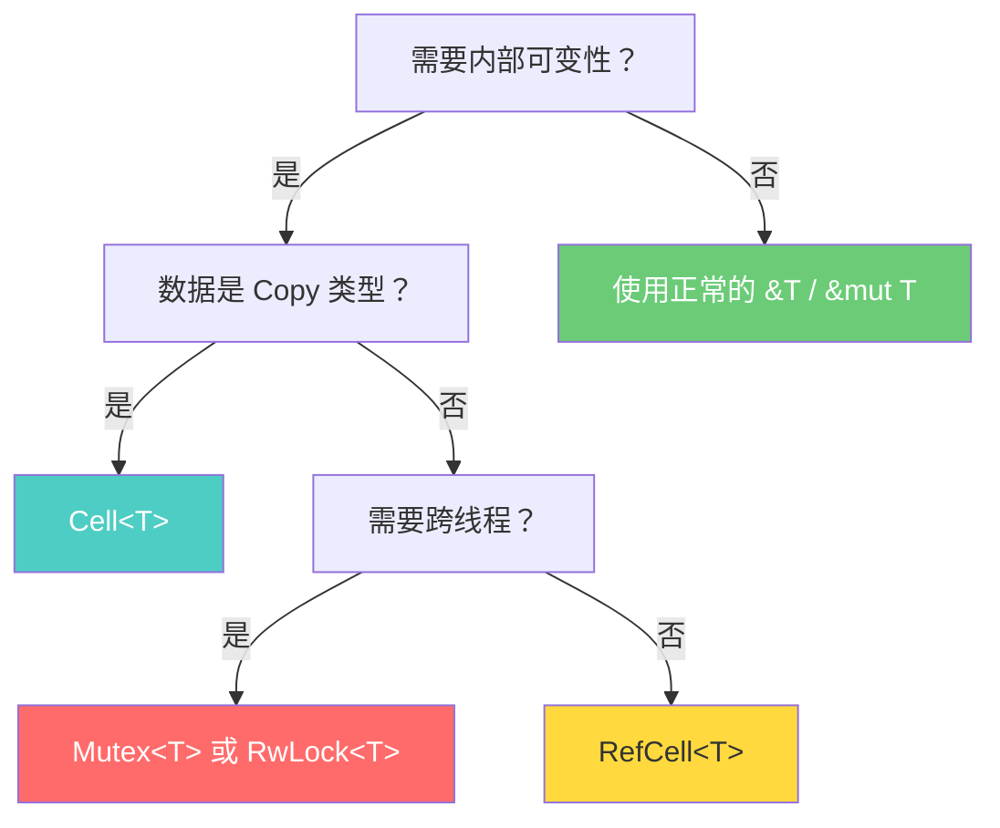

**其他常见决策：**

- 多所有权 + 可变性？单线程 → `Rc<RefCell<T>>`，多线程 → `Arc<Mutex<T>>` 或 `Arc<RwLock<T>>`
- 需要条件性修改（大多数时候只读）？→ `Cow<T>`
- 需要防止值移动（async / 自引用）？→ `Pin<Box<T>>` 或 `pin!()`
- 有循环引用风险？→ 用 `Weak<T>` 打破循环

---

## 参考资料

- [The Rust Programming Language -- Chapter 15: Smart Pointers](https://doc.rust-lang.org/book/ch15-00-smart-pointers.html)
- [Rust Standard Library -- std::cell](https://doc.rust-lang.org/std/cell/)
- [Rust Standard Library -- std::pin](https://doc.rust-lang.org/std/pin/index.html)
- [Rust Standard Library -- Deref trait](https://doc.rust-lang.org/std/ops/trait.Deref.html)
- [Rust Standard Library -- Drop trait](https://doc.rust-lang.org/std/ops/trait.Drop.html)
- [Rust Standard Library -- Rc](https://doc.rust-lang.org/std/rc/index.html)
- [Rust Standard Library -- Arc](https://doc.rust-lang.org/std/sync/struct.Arc.html)
- [Rust Standard Library -- Cow](https://doc.rust-lang.org/std/borrow/enum.Cow.html)
- [The Rust Book -- References and Borrowing](https://doc.rust-lang.org/book/ch04-02-references-and-borrowing.html)
- [Rust By Example -- RAII](https://doc.rust-lang.org/rust-by-example/scope/raii.html)
- [Cloudflare Blog -- Pin, Unpin, and why Rust needs them](https://blog.cloudflare.com/pin-and-unpin-in-rust/)
- [RFC 2349 -- Pin](https://rust-lang.github.io/rfcs/2349-pin.html)
