# GAVIN AI 训练营网站 - 设计与实现计划

## 一、项目概述

### 1.1 项目目标
构建一个现代化、交互性强的课程展示网站，为"GAVIN AI 训练营"提供优雅的在线体验。网站需要清晰展示8周课程内容、AI工具生态、实战项目，并通过视觉化设计和动画效果提升用户体验。

### 1.2 设计理念
**参考苹果网站的设计风格**：
- 简约主义：大量留白，聚焦核心内容
- 高雅精致：细腻的动画过渡，流畅的交互体验
- 视觉优先：用图像、图表、动画代替大段文字
- 渐进展示：信息分层，支持展开查看详情
- 流畅动效：视差滚动、淡入淡出、平滑过渡

### 1.3 技术选型
- **框架**：Astro 4.x（静态站点生成，极致性能）
- **样式**：Tailwind CSS（快速构建苹果风格设计）
- **动画**：
  - GSAP（复杂动画编排）
  - Framer Motion（React组件动画）
  - View Transitions API（原生页面过渡）
- **图表**：Mermaid.js（架构图、流程图）
- **图标**：Lucide Icons（简约一致的图标系统）
- **字体**：Inter / SF Pro Display 风格字体

---

## 二、信息架构

### 2.1 网站地图

```
GAVIN AI 训练营
│
├── 首页 (/)
│   ├── Hero Section（核心价值主张）
│   ├── 课程亮点
│   ├── 学习路径预览
│   ├── 工具生态展示
│   └── CTA（立即报名）
│
├── 课程概览 (/curriculum)
│   ├── 8周课程时间轴
│   ├── 学习目标总览
│   ├── 实战项目预览
│   └── 课程收益
│
├── 每周课程 (/weeks)
│   ├── 第一周 (/weeks/1)
│   │   ├── 周概览
│   │   ├── 学习目标
│   │   ├── 知识点详解
│   │   └── 小节列表
│   │       ├── 1.1 AI工具生态概览 (/weeks/1/lessons/1)
│   │       ├── 1.2 大语言模型初探 (/weeks/1/lessons/2)
│   │       ├── 1.3 环境搭建 (/weeks/1/lessons/3)
│   │       └── 1.4 项目原型实践 (/weeks/1/lessons/4)
│   ├── 第二周 (/weeks/2)
│   ├── 第三周 (/weeks/3)
│   ├── ...
│   └── 第八周 (/weeks/8)
│
├── AI 工具 (/tools)
│   ├── 工具总览 (/tools)
│   ├── Cursor (/tools/cursor)
│   │   ├── 工具介绍
│   │   ├── 核心功能
│   │   ├── 架构图（Mermaid）
│   │   ├── 使用场景
│   │   └── 最佳实践
│   ├── Claude Code (/tools/claude-code)
│   │   ├── 工具介绍
│   │   ├── Agent架构（Mermaid）
│   │   ├── Command系统
│   │   ├── Hook机制
│   │   └── 实战案例
│   ├── NotebookLM (/tools/notebooklm)
│   │   ├── 工具介绍
│   │   ├── 知识管理流程（Mermaid）
│   │   ├── 应用场景
│   │   └── 使用技巧
│   ├── MCP协议 (/tools/mcp)
│   │   ├── 协议概述
│   │   ├── Client-Server架构（Mermaid）
│   │   ├── 交互流程（Sequence Diagram）
│   │   └── 实现指南
│   ├── AI Agent (/tools/agent)
│   │   ├── Agent概念
│   │   ├── 工作原理（Flowchart）
│   │   ├── 多Agent协作（Mermaid）
│   │   └── 构建指南
│   └── 大语言模型 (/tools/llm)
│       ├── OpenAI GPT
│       ├── Google Gemini
│       ├── Anthropic Claude
│       └── 对比分析
│
├── 实战项目 (/projects)
│   ├── 项目总览 (/projects)
│   ├── 项目一：项目管理工具 (/projects/1)
│   │   ├── 项目介绍
│   │   ├── 技术栈
│   │   ├── 架构设计（Mermaid）
│   │   ├── 实现流程
│   │   └── 成果展示
│   ├── 项目二：智能数据库查询 (/projects/2)
│   ├── 项目三：代码库理解/MCP服务器 (/projects/3)
│   ├── 项目四：Agent核心与定制 (/projects/4)
│   └── 项目五：端到端全流程实践 (/projects/5)
│
├── 关于课程 (/about)
│   ├── 课程核心价值
│   ├── 学习收益
│   ├── 入学要求
│   └── 常见问题
│
└── 报名 (/enroll)
    ├── 报名表单
    ├── 课程安排
    └── 联系方式
```

### 2.2 页面层级关系

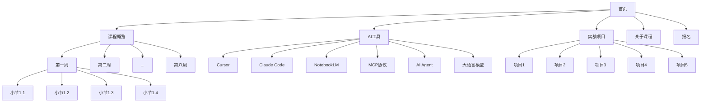

---

## 三、设计系统

### 3.1 色彩方案（苹果风格）

**主色调**：
```css
/* 浅色模式 */
--primary: #0071e3;        /* 苹果蓝 */
--secondary: #86868b;      /* 灰色 */
--accent: #06c;            /* 强调色 */
--background: #ffffff;     /* 纯白背景 */
--surface: #f5f5f7;        /* 浅灰表面 */
--text-primary: #1d1d1f;   /* 深黑文字 */
--text-secondary: #86868b; /* 灰色文字 */

/* 深色模式 */
--primary-dark: #2997ff;
--background-dark: #000000;
--surface-dark: #1d1d1f;
--text-primary-dark: #f5f5f7;
--text-secondary-dark: #a1a1a6;

/* 功能色 */
--success: #34c759;
--warning: #ff9500;
--error: #ff3b30;
--info: #5ac8fa;

/* 渐变 */
--gradient-1: linear-gradient(135deg, #667eea 0%, #764ba2 100%);
--gradient-2: linear-gradient(135deg, #f093fb 0%, #f5576c 100%);
--gradient-3: linear-gradient(135deg, #4facfe 0%, #00f2fe 100%);
```

**工具品牌色**：
```css
--cursor-purple: #8b5cf6;
--claude-orange: #d97706;
--notebooklm-blue: #3b82f6;
--mcp-green: #10b981;
```

### 3.2 字体系统

```css
/* 主字体 */
font-family-base: -apple-system, BlinkMacSystemFont, 'SF Pro Display', 'Inter', system-ui, sans-serif;
font-family-mono: 'SF Mono', 'Fira Code', 'Cascadia Code', monospace;

/* 字号比例（参考苹果设计） */
--text-xs: 12px;
--text-sm: 14px;
--text-base: 17px;
--text-lg: 21px;
--text-xl: 28px;
--text-2xl: 40px;
--text-3xl: 48px;
--text-4xl: 64px;
--text-5xl: 80px;
--text-6xl: 96px;

/* 字重 */
--font-normal: 400;
--font-medium: 500;
--font-semibold: 600;
--font-bold: 700;

/* 行高 */
--leading-tight: 1.2;
--leading-normal: 1.5;
--leading-relaxed: 1.75;
```

### 3.3 间距系统

```css
/* 基于 4px 网格 */
--space-1: 4px;
--space-2: 8px;
--space-3: 12px;
--space-4: 16px;
--space-5: 20px;
--space-6: 24px;
--space-8: 32px;
--space-10: 40px;
--space-12: 48px;
--space-16: 64px;
--space-20: 80px;
--space-24: 96px;
--space-32: 128px;
--space-40: 160px;
--space-48: 192px;

/* 容器宽度 */
--container-sm: 640px;
--container-md: 768px;
--container-lg: 1024px;
--container-xl: 1280px;
--container-2xl: 1536px;
```

### 3.4 圆角系统

```css
--radius-sm: 6px;
--radius-md: 12px;
--radius-lg: 18px;
--radius-xl: 24px;
--radius-2xl: 32px;
--radius-full: 9999px;
```

### 3.5 阴影系统

```css
/* 苹果风格阴影 */
--shadow-sm: 0 2px 8px rgba(0, 0, 0, 0.04);
--shadow-md: 0 4px 16px rgba(0, 0, 0, 0.08);
--shadow-lg: 0 8px 32px rgba(0, 0, 0, 0.12);
--shadow-xl: 0 16px 48px rgba(0, 0, 0, 0.16);
```

### 3.6 动画系统

```css
/* 缓动函数（参考苹果） */
--ease-in-out: cubic-bezier(0.42, 0, 0.58, 1);
--ease-out: cubic-bezier(0, 0, 0.2, 1);
--ease-in: cubic-bezier(0.4, 0, 1, 1);
--ease-spring: cubic-bezier(0.175, 0.885, 0.32, 1.275);

/* 动画时长 */
--duration-fast: 150ms;
--duration-normal: 300ms;
--duration-slow: 500ms;
--duration-slower: 800ms;
```

**动画类型**：
1. **淡入淡出**：页面加载、内容切换
2. **滑动**：导航菜单、侧边栏
3. **缩放**：卡片悬停、图片放大
4. **视差滚动**：背景层移动
5. **渐进加载**：内容依次出现
6. **磁性效果**：按钮、链接的微交互

---

## 四、核心组件设计

### 4.1 布局组件

#### 4.1.1 BaseLayout
```typescript
// src/layouts/BaseLayout.astro
interface Props {
  title: string;
  description?: string;
  image?: string;
}
```
**功能**：
- 页面基础框架
- SEO元数据
- 导航和页脚
- 全局样式和脚本

#### 4.1.2 Navigation
```typescript
// src/components/Navigation.astro
```
**特性**：
- 固定在顶部，滚动时背景模糊效果
- Logo + 主导航链接
- 响应式汉堡菜单（移动端）
- 当前页面高亮
- 平滑滚动锚点

**动画**：
- 滚动时导航栏背景从透明到模糊白色
- Logo微动画（悬停时）
- 菜单项下划线动画

#### 4.1.3 Footer
```typescript
// src/components/Footer.astro
```
**内容**：
- 课程链接
- 工具链接
- 社交媒体
- 版权信息

### 4.2 展示组件

#### 4.2.1 HeroSection
```typescript
// src/components/HeroSection.astro
interface Props {
  title: string;
  subtitle: string;
  cta?: { text: string; href: string };
  backgroundImage?: string;
  gradient?: boolean;
}
```
**设计**：
- 全屏或半屏高度
- 大标题 + 副标题
- CTA按钮（带悬停效果）
- 可选背景图或渐变
- 视差滚动效果

**动画**：
- 标题字符逐个淡入
- 副标题向上滑入
- 按钮缩放动画

#### 4.2.2 CourseWeekCard
```typescript
// src/components/CourseWeekCard.astro
interface Props {
  weekNumber: number;
  title: string;
  objectives: string[];
  keyTopics: string[];
  projectName?: string;
  href: string;
}
```
**设计**：
- 卡片式布局
- 周数徽章
- 折叠式内容（默认显示标题，点击展开详情）
- Hover效果（阴影、缩放）

**动画**：
- 悬停时卡片微上浮 + 阴影加深
- 展开/收起时内容滑动动画

#### 4.2.3 ToolShowcase
```typescript
// src/components/ToolShowcase.astro
interface Props {
  name: string;
  icon: string;
  description: string;
  features: string[];
  color: string;
  href: string;
}
```
**设计**：
- 网格布局（3列 / 响应式）
- 工具图标 + 名称
- 简短描述
- 主要特性列表（带图标）
- 品牌色点缀

**动画**：
- 滚动进入视口时依次淡入
- 悬停时图标旋转/缩放

#### 4.2.4 ProjectCard
```typescript
// src/components/ProjectCard.astro
interface Props {
  projectNumber: number;
  title: string;
  description: string;
  techStack: string[];
  outcomes: string[];
  thumbnail?: string;
  href: string;
}
```
**设计**：
- 大卡片（带缩略图）
- 技术栈标签
- 成果展示
- "查看详情"链接

**动画**：
- 缩略图视差效果
- Hover时内容区滑出

#### 4.2.5 TimelineView
```typescript
// src/components/TimelineView.astro
interface Props {
  items: Array<{
    week: number;
    title: string;
    milestone: string;
  }>;
}
```
**设计**：
- 垂直时间轴
- 节点标记（圆点）
- 连接线
- 里程碑标注

**动画**：
- 滚动时时间轴渐进显示
- 节点依次亮起

### 4.3 内容组件

#### 4.3.1 ExpandableSection
```typescript
// src/components/ExpandableSection.astro
interface Props {
  title: string;
  defaultExpanded?: boolean;
}
```
**功能**：
- 点击标题展开/收起内容
- 旋转箭头图标
- 平滑高度过渡动画

#### 4.3.2 MermaidDiagram
```typescript
// src/components/MermaidDiagram.astro
interface Props {
  diagram: string;
  caption?: string;
}
```
**功能**：
- 渲染Mermaid图表
- 自适应容器
- 可选图注
- 深色模式支持

#### 4.3.3 FeatureGrid
```typescript
// src/components/FeatureGrid.astro
interface Props {
  features: Array<{
    icon: string;
    title: string;
    description: string;
  }>;
  columns?: 2 | 3 | 4;
}
```
**设计**：
- 响应式网格
- 图标 + 标题 + 描述
- 简洁布局

#### 4.3.4 StatsSection
```typescript
// src/components/StatsSection.astro
interface Props {
  stats: Array<{
    value: string;
    label: string;
  }>;
}
```
**设计**：
- 大数字展示
- 标签说明
- 横向排列

**动画**：
- 数字滚动动画（CountUp效果）

#### 4.3.5 CTASection
```typescript
// src/components/CTASection.astro
interface Props {
  title: string;
  description: string;
  primaryCta: { text: string; href: string };
  secondaryCta?: { text: string; href: string };
}
```
**设计**：
- 醒目的标题
- 双按钮（主次）
- 渐变背景或纯色背景

### 4.4 交互组件

#### 4.4.1 TabsView
```typescript
// src/components/TabsView.astro
interface Props {
  tabs: Array<{
    id: string;
    label: string;
    content: string;
  }>;
}
```
**功能**：
- 标签切换
- 内容淡入淡出
- 底部指示器滑动

#### 4.4.2 AccordionList
```typescript
// src/components/AccordionList.astro
interface Props {
  items: Array<{
    title: string;
    content: string;
  }>;
  allowMultiple?: boolean;
}
```
**功能**：
- 手风琴式展开
- 单个或多个同时展开
- 平滑动画

#### 4.4.3 ImageCarousel
```typescript
// src/components/ImageCarousel.astro
interface Props {
  images: Array<{
    src: string;
    alt: string;
    caption?: string;
  }>;
}
```
**功能**：
- 图片轮播
- 左右箭头 + 圆点指示器
- 自动播放（可选）
- 触摸滑动支持

---

## 五、页面详细设计

### 5.1 首页 (/)

**布局结构**：
```
┌─────────────────────────────────┐
│   Navigation (Fixed Top)        │
├─────────────────────────────────┤
│   Hero Section                  │
│   - 主标题: GAVIN AI 训练营     │
│   - 副标题: 核心价值主张        │
│   - CTA按钮: 立即报名           │
│   - 背景: 渐变 + 动态粒子       │
├─────────────────────────────────┤
│   StatsSection                  │
│   - 8周课程                     │
│   - 5个实战项目                 │
│   - 6大AI工具                   │
│   - ∞ 研发效能提升              │
├─────────────────────────────────┤
│   Core Values Section           │
│   - 标题: 课程核心价值          │
│   - FeatureGrid (3列)           │
│     • 实现代码智能辅助          │
│     • 深度理解代码库            │
│     • 自动化文档设计            │
│     • 构建智能体                │
│     • 全流程AI赋能              │
│     • 提升研发效能              │
├─────────────────────────────────┤
│   Learning Path Preview         │
│   - 标题: 学习路径              │
│   - TimelineView (8周概览)      │
│   - 每周关键里程碑              │
├─────────────────────────────────┤
│   Tools Ecosystem               │
│   - 标题: AI工具生态            │
│   - ToolShowcase Grid           │
│     • Cursor                    │
│     • Claude Code               │
│     • NotebookLM                │
│     • MCP                       │
│     • AI Agent                  │
│     • LLMs                      │
├─────────────────────────────────┤
│   Projects Preview              │
│   - 标题: 实战项目              │
│   - ProjectCard × 5 (轮播)     │
├─────────────────────────────────┤
│   Benefits Section              │
│   - 标题: 学完后的收益          │
│   - FeatureGrid (2列)           │
│     • 精通AI编码工具            │
│     • 深化大模型应用洞察        │
│     • 全流程AI赋能实践          │
│     • 构建专业级AI基础设施      │
│     • 定制化智能体核心          │
│     • 提升团队研发效能          │
├─────────────────────────────────┤
│   CTA Section                   │
│   - 开启AI编码之旅              │
│   - 主按钮: 立即报名            │
│   - 副按钮: 了解更多            │
├─────────────────────────────────┤
│   Footer                        │
└─────────────────────────────────┘
```

**关键动画**：
1. Hero区域标题字符逐个淡入
2. 统计数字滚动动画
3. 时间轴滚动渐进显示
4. 工具卡片依次淡入（stagger）
5. 项目卡片轮播切换

### 5.2 课程概览页 (/curriculum)

**布局结构**：
```
┌─────────────────────────────────┐
│   Navigation                    │
├─────────────────────────────────┤
│   Hero Section                  │
│   - 标题: 8周AI编码训练营       │
│   - 副标题: 系统学习路线图      │
├─────────────────────────────────┤
│   Overview Tabs                 │
│   - Tab 1: 课程大纲             │
│   - Tab 2: 学习目标             │
│   - Tab 3: 实战项目             │
│   - Tab 4: 课程收益             │
├─────────────────────────────────┤
│   [Tab 1 Content]               │
│   Week Grid (2×4)               │
│   ┌──────┬──────┬──────┬──────┐│
│   │ 第1周│ 第2周│ 第3周│ 第4周││
│   │ Card │ Card │ Card │ Card ││
│   ├──────┼──────┼──────┼──────┤│
│   │ 第5周│ 第6周│ 第7周│ 第8周││
│   │ Card │ Card │ Card │ Card ││
│   └──────┴──────┴──────┴──────┘│
│   每个卡片:                     │
│   - 周数                        │
│   - 标题                        │
│   - 关键主题（折叠）            │
│   - 查看详情按钮                │
├─────────────────────────────────┤
│   Learning Journey Diagram      │
│   - Mermaid流程图               │
│   - 展示8周学习脉络             │
├─────────────────────────────────┤
│   CTA Section                   │
└─────────────────────────────────┘
```

**Mermaid示例**：
```mermaid
graph LR
    A[第1周: 工具启蒙] --> B[第2周: 深入Cursor]
    B --> C[第3周: 深入Claude Code]
    C --> D[第4周: 代码库理解]
    D --> E[第5周: MCP协议]
    E --> F[第6周: Agent核心]
    F --> G[第7周: 全流程实践]
    G --> H[第8周: 回顾展望]

    style A fill:#8b5cf6
    style B fill:#3b82f6
    style C fill:#d97706
    style D fill:#10b981
    style E fill:#06b6d4
    style F fill:#ec4899
    style G fill:#f59e0b
    style H fill:#6366f1
```

### 5.3 每周课程页 (/weeks/[week])

**以第一周为例** (`/weeks/1`):

```
┌─────────────────────────────────┐
│   Navigation                    │
├─────────────────────────────────┤
│   Week Hero                     │
│   - 第一周                      │
│   - AI编码新范式：工具启蒙     │
│   - 进度条: 1/8                 │
├─────────────────────────────────┤
│   Week Overview                 │
│   - 简介段落                    │
│   - 本周关键成果                │
├─────────────────────────────────┤
│   Learning Objectives           │
│   - 标题: 学习目标              │
│   - FeatureGrid (2×2)           │
│     • 认知工具全貌              │
│     • 掌握核心基础              │
│     • 零基础快速上手            │
│     • 完成首个AI项目            │
├─────────────────────────────────┤
│   Lessons List                  │
│   - 标题: 课程小节              │
│   - AccordionList               │
│     ▼ 1.1 AI工具生态概览        │
│       - 简介                    │
│       - 关键概念                │
│       - 查看详情 →              │
│     ▶ 1.2 大语言模型初探        │
│     ▶ 1.3 环境搭建              │
│     ▶ 1.4 项目原型实践          │
├─────────────────────────────────┤
│   Key Topics                    │
│   - 标题: 核心知识点            │
│   - Expandable Sections         │
│     ▼ AI辅助工具生态概览        │
│       [详细内容]                │
│     ▶ 主流LLM初探               │
│     ▶ 环境搭建                  │
│     ▶ 项目原型实践              │
├─────────────────────────────────┤
│   Tools Used                    │
│   - 本周使用的工具              │
│   - ToolShowcase (小卡片)       │
│     • Cursor                    │
│     • Claude Code               │
│     • NotebookLM                │
├─────────────────────────────────┤
│   Week Project                  │
│   - 标题: 本周实战              │
│   - ProjectCard                 │
│     • 项目管理工具原型          │
├─────────────────────────────────┤
│   Week Navigation               │
│   - ← 课程概览                  │
│   - → 第二周                    │
└─────────────────────────────────┘
```

### 5.4 课程小节页 (/weeks/[week]/lessons/[lesson])

**以第一周第一节为例** (`/weeks/1/lessons/1`):

```
┌─────────────────────────────────┐
│   Navigation                    │
├─────────────────────────────────┤
│   Breadcrumb                    │
│   首页 > 课程概览 > 第一周 >   │
│   1.1 AI工具生态概览            │
├─────────────────────────────────┤
│   Lesson Hero                   │
│   - 小节编号: 1.1               │
│   - 标题: AI辅助工具生态概览    │
│   - 简短描述                    │
├─────────────────────────────────┤
│   Content Tabs                  │
│   - Tab 1: 学习内容             │
│   - Tab 2: 架构图解             │
│   - Tab 3: 实践练习             │
├─────────────────────────────────┤
│   [Tab 1: 学习内容]             │
│   - Section: AI原生代码编辑器   │
│     • Cursor介绍                │
│     • Claude Code介绍           │
│     • 对比分析                  │
│   - Section: 知识管理工具       │
│     • NotebookLM                │
│     • 使用场景                  │
│   - Section: 其他辅助工具       │
│     [可展开内容]                │
├─────────────────────────────────┤
│   [Tab 2: 架构图解]             │
│   - Mermaid Diagram             │
│     展示工具生态架构            │
│   - 图解说明                    │
├─────────────────────────────────┤
│   [Tab 3: 实践练习]             │
│   - 练习列表                    │
│   - 参考资源链接                │
├─────────────────────────────────┤
│   Lesson Navigation             │
│   - ← 上一节                    │
│   - ↑ 返回本周                  │
│   - → 下一节                    │
└─────────────────────────────────┘
```

**小节页的Mermaid图示例**（工具生态）:
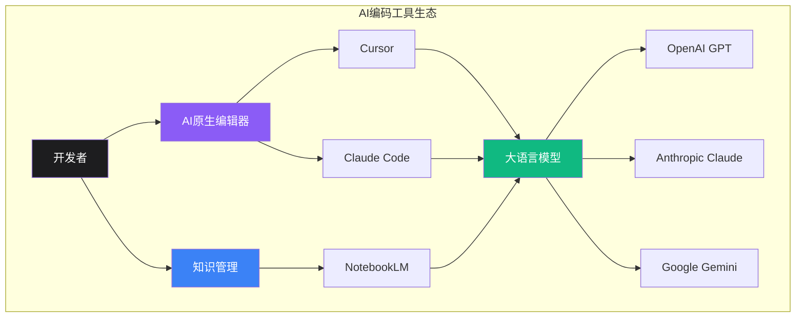

### 5.5 工具页面 (/tools/[tool])

**以Cursor为例** (`/tools/cursor`):

```
┌─────────────────────────────────┐
│   Navigation                    │
├─────────────────────────────────┤
│   Tool Hero                     │
│   - Cursor Logo                 │
│   - 标题: Cursor                │
│   - 副标题: AI原生代码编辑器    │
│   - 品牌色背景: #8b5cf6         │
├─────────────────────────────────┤
│   Tool Overview                 │
│   - 简介段落                    │
│   - 核心特点 (3-4点)            │
├─────────────────────────────────┤
│   Features Section              │
│   - 标题: 核心功能              │
│   - FeatureGrid (2×2)           │
│     • Rules设置                 │
│     • @文档集成                 │
│     • 智能补全                  │
│     • 聊天模式                  │
├─────────────────────────────────┤
│   Architecture Section          │
│   - 标题: 架构解析              │
│   - Mermaid Diagram             │
│     展示Cursor工作原理          │
│   - 架构说明                    │
├─────────────────────────────────┤
│   Workflow Section              │
│   - 标题: 工作流程              │
│   - Mermaid Flowchart           │
│     展示开发流程                │
├─────────────────────────────────┤
│   Use Cases Section             │
│   - 标题: 使用场景              │
│   - TabsView                    │
│     • Tab: 代码生成             │
│     • Tab: 代码重构             │
│     • Tab: 测试生成             │
│     • Tab: 文档编写             │
├─────────────────────────────────┤
│   Best Practices                │
│   - 标题: 最佳实践              │
│   - AccordionList               │
│     ▶ 如何设置Rules             │
│     ▶ 如何有效使用@             │
│     ▶ 如何提升补全准确度        │
│     ▶ 如何组织项目上下文        │
├─────────────────────────────────┤
│   Related Lessons               │
│   - 相关课程小节                │
│   - 链接到第二周课程            │
├─────────────────────────────────┤
│   Tool Navigation               │
│   - ← Claude Code               │
│   - ↑ 工具总览                  │
│   - → NotebookLM                │
└─────────────────────────────────┘
```

**Cursor架构图示例**:
```mermaid
graph TB
    subgraph "Cursor架构"
        A[用户]
        B[Cursor编辑器]
        C[上下文管理]
        D[AI引擎]
        E[代码库]

        C1[Rules配置]
        C2[@文档]
        C3[当前文件]
        C4[选中代码]

        D1[大语言模型]
        D2[代码索引]

        A -->|输入| B
        B --> C
        C --> C1
        C --> C2
        C --> C3
        C --> C4
        C --> D
        D --> D1
        D --> D2
        D2 --> E
        D -->|响应| B
        B -->|输出| A
    end

    style B fill:#8b5cf6,color:#fff
    style D fill:#667eea,color:#fff
```

**Cursor工作流程图**:
```mermaid
flowchart LR
    A[开始] --> B[设置Rules]
    B --> C[打开项目]
    C --> D[添加@文档]
    D --> E[编写代码]
    E --> F{需要帮助?}
    F -->|是| G[使用聊天/补全]
    G --> H[AI生成建议]
    H --> I[审核代码]
    I --> J{接受?}
    J -->|是| K[应用代码]
    J -->|否| G
    K --> L[继续开发]
    F -->|否| L
    L --> M[完成]

    style B fill:#8b5cf6,color:#fff
    style G fill:#667eea,color:#fff
    style H fill:#764ba2,color:#fff
```

**其他工具页面**:
- **Claude Code** (`/tools/claude-code`):
  - Agent架构图
  - Command系统流程图
  - Hook机制序列图
  - 多Agent协作图

- **NotebookLM** (`/tools/notebooklm`):
  - 知识管理流程图
  - 文档处理pipeline
  - AI增强阅读流程

- **MCP协议** (`/tools/mcp`):
  - Client-Server架构图
  - 协议交互序列图
  - 数据流图
  - 实现栈图

- **AI Agent** (`/tools/agent`):
  - Agent工作原理图
  - 多Agent协作图
  - 任务分解流程图
  - Agent生命周期图

### 5.6 实战项目页 (/projects/[project])

**以项目一为例** (`/projects/1`):

```
┌─────────────────────────────────┐
│   Navigation                    │
├─────────────────────────────────┤
│   Project Hero                  │
│   - 项目一                      │
│   - AI驱动的项目管理工具        │
│   - 项目缩略图/演示图           │
├─────────────────────────────────┤
│   Project Overview              │
│   - 项目简介                    │
│   - 学习目标                    │
│   - 适用周次: 第一周            │
├─────────────────────────────────┤
│   Tech Stack                    │
│   - 标题: 技术栈                │
│   - 标签云/卡片                 │
│     • Astro                     │
│     • TypeScript                │
│     • Tailwind CSS              │
│     • Cursor                    │
├─────────────────────────────────┤
│   Architecture Section          │
│   - 标题: 系统架构              │
│   - Mermaid架构图               │
│     展示前后端架构              │
│   - 架构说明                    │
├─────────────────────────────────┤
│   Implementation Flow           │
│   - 标题: 实现流程              │
│   - Mermaid流程图               │
│     展示开发步骤                │
│   - 流程说明                    │
├─────────────────────────────────┤
│   Key Features                  │
│   - 标题: 核心功能              │
│   - TabsView                    │
│     • 任务创建                  │
│     • 状态管理                  │
│     • AI辅助                    │
│     • 数据持久化                │
├─────────────────────────────────┤
│   AI Assistance                 │
│   - 标题: AI如何帮助开发        │
│   - FeatureGrid                 │
│     • 代码生成                  │
│     • 组件设计                  │
│     • 错误修复                  │
│     • 功能扩展                  │
├─────────────────────────────────┤
│   Outcomes Section              │
│   - 标题: 项目成果              │
│   - 列表或卡片                  │
│     • 掌握AI辅助编码            │
│     • 理解全栈开发流程          │
│     • 学会项目搭建              │
├─────────────────────────────────┤
│   Demo Section                  │
│   - 标题: 成果展示              │
│   - 截图轮播                    │
│   - 演示视频（可选）            │
├─────────────────────────────────┤
│   Related Content               │
│   - 相关课程: 第一周            │
│   - 相关工具: Cursor            │
├─────────────────────────────────┤
│   Project Navigation            │
│   - ← 项目总览                  │
│   - → 项目二                    │
└─────────────────────────────────┘
```

**项目架构图示例**（项目管理工具）:
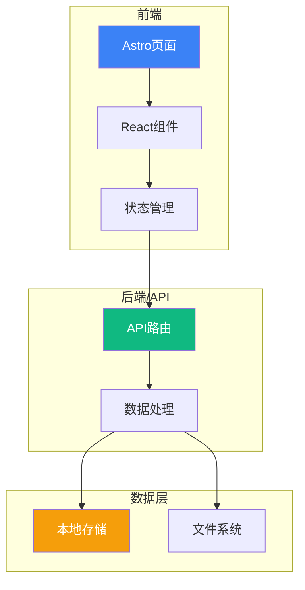

**实现流程图**:
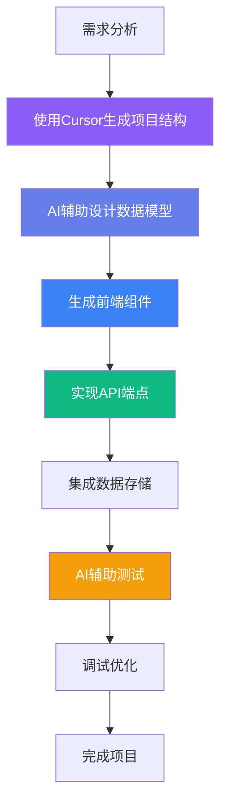

### 5.7 关于课程页 (/about)

```
┌─────────────────────────────────┐
│   Navigation                    │
├─────────────────────────────────┤
│   Hero Section                  │
│   - 关于GAVIN AI训练营          │
│   - 赋能研发团队的AI课程        │
├─────────────────────────────────┤
│   Core Value Section            │
│   - 标题: 课程核心价值          │
│   - 段落介绍                    │
│   - FeatureGrid (3列)           │
├─────────────────────────────────┤
│   Benefits Section              │
│   - 标题: 学完后的收益          │
│   - 两列布局                    │
│     左列: 图标+标题列表         │
│     右列: 详细说明（可展开）    │
├─────────────────────────────────┤
│   Requirements Section          │
│   - 标题: 入学基础要求          │
│   - AccordionList               │
│     ▶ 编程基础                  │
│     ▶ 开发流程认知              │
│     ▶ 版本控制技能              │
│     ▶ 学习热情                  │
├─────────────────────────────────┤
│   FAQ Section                   │
│   - 标题: 常见问题              │
│   - AccordionList               │
│     ▶ 课程适合谁？              │
│     ▶ 需要什么基础？            │
│     ▶ 课程时长？                │
│     ▶ 如何报名？                │
│     ...                         │
├─────────────────────────────────┤
│   CTA Section                   │
│   - 准备好开始了吗？            │
│   - 立即报名按钮                │
└─────────────────────────────────┘
```

### 5.8 工具总览页 (/tools)

```
┌─────────────────────────────────┐
│   Navigation                    │
├─────────────────────────────────┤
│   Hero Section                  │
│   - AI工具生态全景              │
│   - 掌握前沿AI编码工具          │
├─────────────────────────────────┤
│   Tools Ecosystem Diagram       │
│   - Mermaid生态图               │
│   - 展示工具间关系              │
├─────────────────────────────────┤
│   Tools Grid                    │
│   - ToolShowcase × 6            │
│     • Cursor                    │
│     • Claude Code               │
│     • NotebookLM                │
│     • MCP                       │
│     • AI Agent                  │
│     • LLMs                      │
├─────────────────────────────────┤
│   Comparison Section            │
│   - 标题: 工具对比              │
│   - 对比表格                    │
│     Cursor vs Claude Code       │
├─────────────────────────────────┤
│   Integration Guide             │
│   - 标题: 工具集成指南          │
│   - 如何组合使用工具            │
│   - Mermaid工作流图             │
└─────────────────────────────────┘
```

### 5.9 项目总览页 (/projects)

```
┌─────────────────────────────────┐
│   Navigation                    │
├─────────────────────────────────┤
│   Hero Section                  │
│   - 5个实战项目                 │
│   - 从原型到生产级应用          │
├─────────────────────────────────┤
│   Projects Timeline             │
│   - TimelineView                │
│   - 展示项目进阶路径            │
├─────────────────────────────────┤
│   Projects Grid                 │
│   - ProjectCard × 5             │
│     每个卡片包含:               │
│     • 项目编号                  │
│     • 标题                      │
│     • 简介                      │
│     • 技术栈                    │
│     • 适用周次                  │
│     • 查看详情                  │
├─────────────────────────────────┤
│   Skills Gained                 │
│   - 标题: 通过项目获得的技能    │
│   - FeatureGrid                 │
└─────────────────────────────────┘
```

---

## 六、Mermaid图表设计

### 6.1 工具架构图

#### 6.1.1 Cursor架构
```mermaid
graph TB
    subgraph "Cursor IDE"
        A[编辑器界面]
        B[聊天面板]
        C[命令面板]
    end

    subgraph "上下文系统"
        D[Rules引擎]
        E[@文档系统]
        F[代码索引]
        G[Memory Bank]
    end

    subgraph "AI层"
        H[提示词构建]
        I[LLM API]
        J[响应处理]
    end

    subgraph "代码库"
        K[项目文件]
        L[依赖库]
        M[文档]
    end

    A --> D
    B --> D
    C --> D
    D --> E
    D --> F
    D --> G
    E --> M
    F --> K
    G --> K
    D --> H
    H --> I
    I --> J
    J --> A
    J --> B
```

#### 6.1.2 Claude Code架构
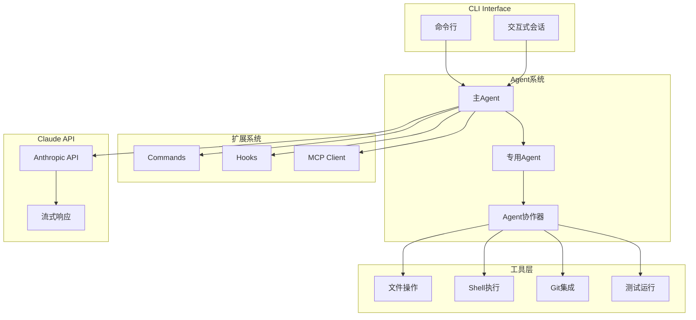

#### 6.1.3 MCP架构
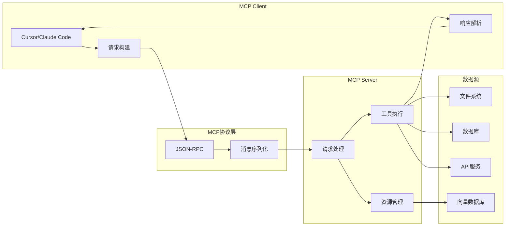

### 6.2 工作流程图

#### 6.2.1 AI辅助开发全流程
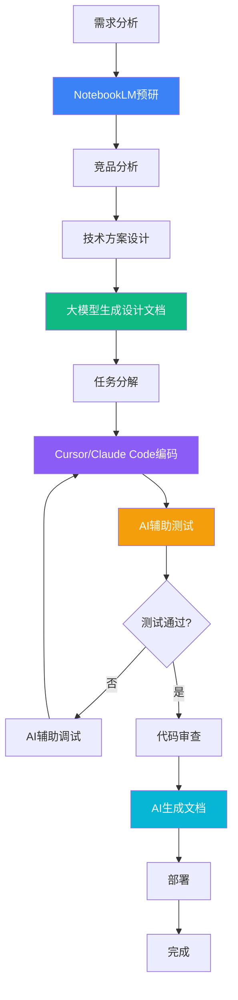

#### 6.2.2 代码库理解流程
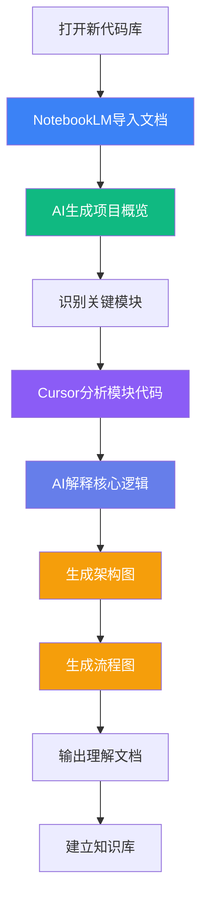

#### 6.2.3 MCP Server构建流程
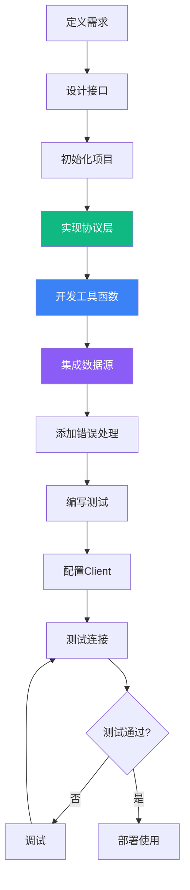

### 6.3 系统交互图

#### 6.3.1 Cursor与LLM交互序列图
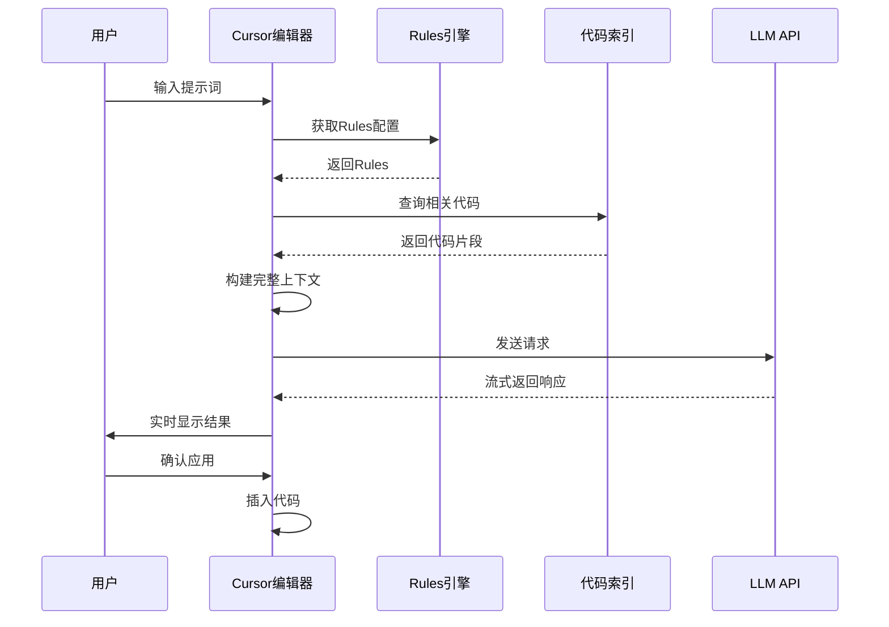

#### 6.3.2 Claude Code Agent协作
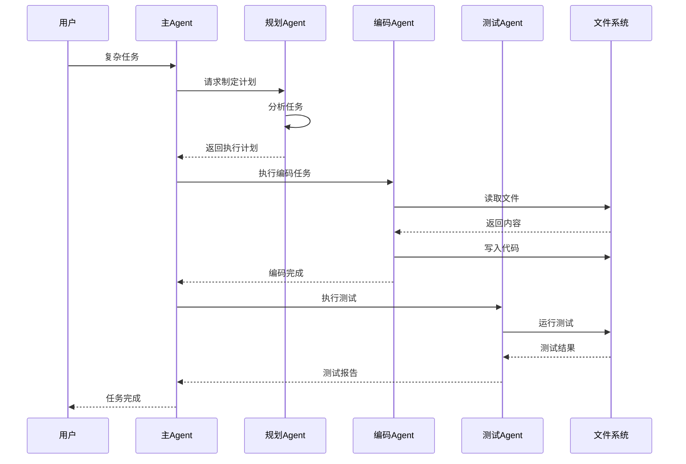

#### 6.3.3 MCP通信序列图
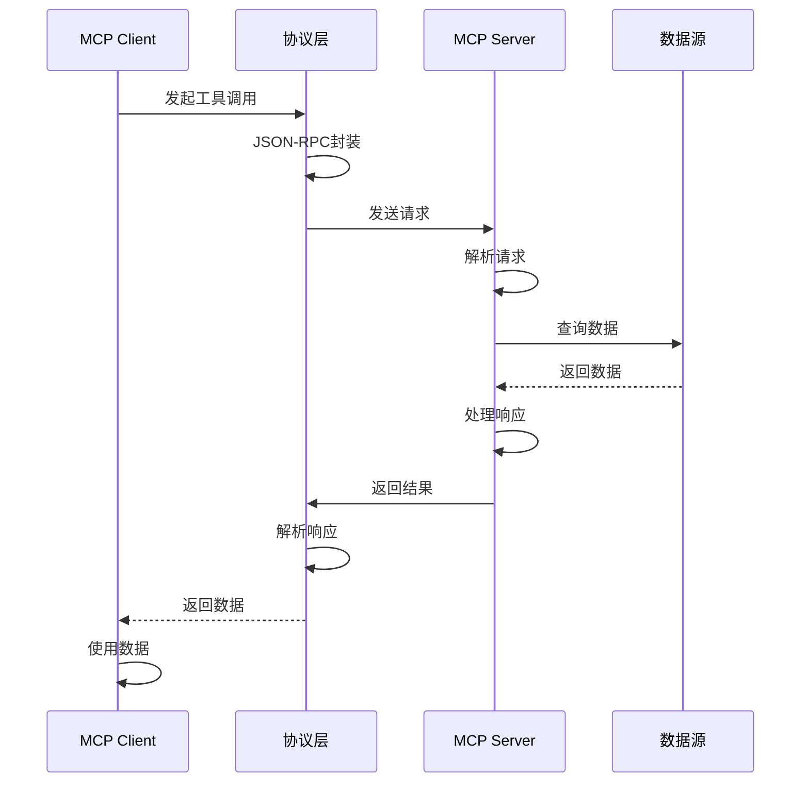

### 6.4 概念关系图

#### 6.4.1 AI工具生态
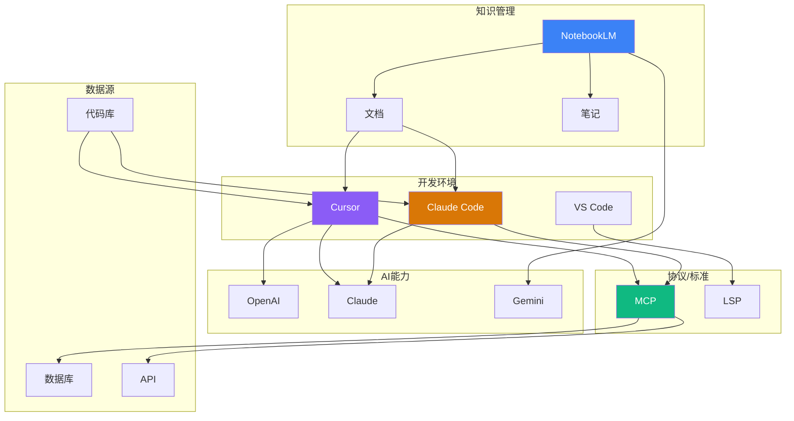

#### 6.4.2 学习路径图
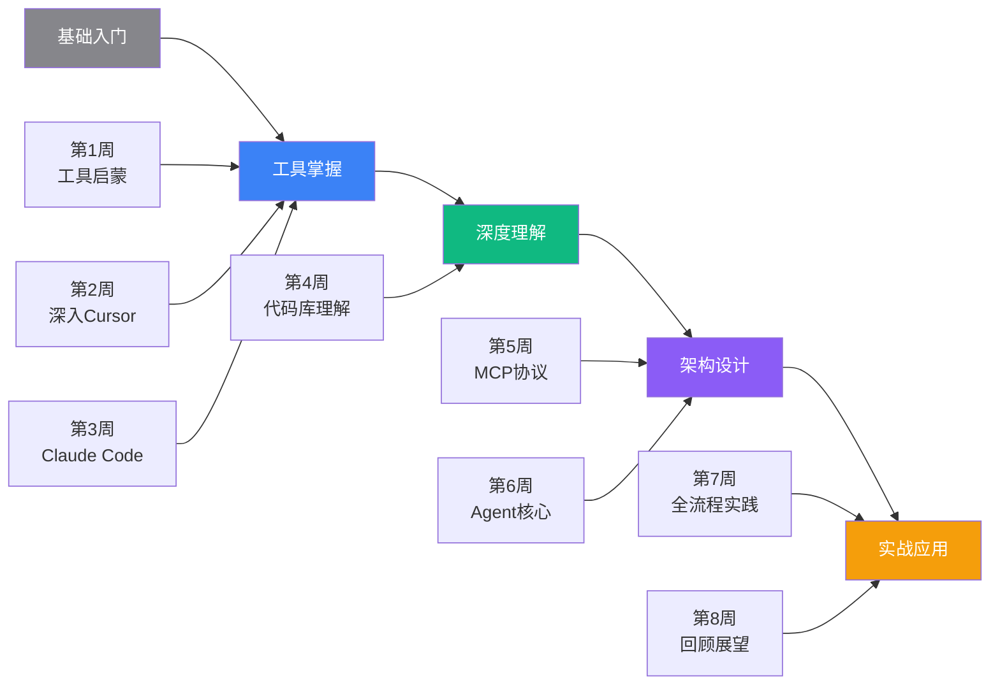

---

## 七、动画效果设计

### 7.1 页面加载动画

#### 7.1.1 Hero区域
```javascript
// 使用GSAP实现
gsap.timeline()
  .from('.hero-title', {
    opacity: 0,
    y: 50,
    duration: 0.8,
    ease: 'power3.out',
    stagger: 0.1 // 字符逐个出现
  })
  .from('.hero-subtitle', {
    opacity: 0,
    y: 30,
    duration: 0.6,
    ease: 'power2.out'
  }, '-=0.3')
  .from('.hero-cta', {
    opacity: 0,
    scale: 0.9,
    duration: 0.5,
    ease: 'back.out(1.7)'
  }, '-=0.2');
```

#### 7.1.2 滚动触发动画
```javascript
// 卡片依次淡入
gsap.utils.toArray('.course-card').forEach((card, i) => {
  gsap.from(card, {
    scrollTrigger: {
      trigger: card,
      start: 'top 80%',
      toggleActions: 'play none none reverse'
    },
    opacity: 0,
    y: 50,
    duration: 0.6,
    delay: i * 0.1,
    ease: 'power2.out'
  });
});
```

### 7.2 交互动画

#### 7.2.1 按钮悬停
```css
.btn {
  transition: all 0.3s cubic-bezier(0.42, 0, 0.58, 1);
}

.btn:hover {
  transform: translateY(-2px);
  box-shadow: 0 8px 16px rgba(0, 0, 0, 0.15);
}

.btn:active {
  transform: translateY(0);
  box-shadow: 0 4px 8px rgba(0, 0, 0, 0.1);
}
```

#### 7.2.2 卡片悬停
```javascript
// 磁性效果
card.addEventListener('mousemove', (e) => {
  const rect = card.getBoundingClientRect();
  const x = e.clientX - rect.left;
  const y = e.clientY - rect.top;

  const centerX = rect.width / 2;
  const centerY = rect.height / 2;

  const rotateX = (y - centerY) / 20;
  const rotateY = (centerX - x) / 20;

  gsap.to(card, {
    rotateX,
    rotateY,
    duration: 0.3,
    ease: 'power2.out'
  });
});

card.addEventListener('mouseleave', () => {
  gsap.to(card, {
    rotateX: 0,
    rotateY: 0,
    duration: 0.5,
    ease: 'elastic.out(1, 0.3)'
  });
});
```

### 7.3 视差滚动

```javascript
// 背景层视差
gsap.to('.parallax-bg', {
  scrollTrigger: {
    trigger: '.hero',
    start: 'top top',
    end: 'bottom top',
    scrub: 1
  },
  y: (i, target) => -target.offsetHeight * 0.5,
  ease: 'none'
});

// 前景层视差
gsap.to('.parallax-fg', {
  scrollTrigger: {
    trigger: '.hero',
    start: 'top top',
    end: 'bottom top',
    scrub: 1
  },
  y: (i, target) => -target.offsetHeight * 0.2,
  ease: 'none'
});
```

### 7.4 展开/收起动画

```javascript
// AccordionList展开
const expandAccordion = (item) => {
  const content = item.querySelector('.accordion-content');
  const icon = item.querySelector('.accordion-icon');

  gsap.timeline()
    .to(content, {
      height: 'auto',
      duration: 0.4,
      ease: 'power2.out'
    })
    .to(icon, {
      rotate: 180,
      duration: 0.3,
      ease: 'power2.out'
    }, '<');
};

// ExpandableSection展开
const expandSection = (section) => {
  const content = section.querySelector('.expandable-content');

  gsap.to(content, {
    maxHeight: content.scrollHeight,
    opacity: 1,
    duration: 0.5,
    ease: 'power2.out'
  });
};
```

### 7.5 页面过渡

```javascript
// 使用View Transitions API
document.addEventListener('astro:before-swap', () => {
  if (!document.startViewTransition) return;

  document.startViewTransition(() => {
    // 页面切换逻辑
  });
});
```

```css
/* 页面过渡样式 */
::view-transition-old(root),
::view-transition-new(root) {
  animation-duration: 0.5s;
  animation-timing-function: cubic-bezier(0.42, 0, 0.58, 1);
}

::view-transition-old(root) {
  animation-name: fade-out;
}

::view-transition-new(root) {
  animation-name: fade-in;
}

@keyframes fade-out {
  to {
    opacity: 0;
    transform: scale(0.95);
  }
}

@keyframes fade-in {
  from {
    opacity: 0;
    transform: scale(1.05);
  }
}
```

### 7.6 数字滚动动画

```javascript
// 统计数字CountUp
const animateValue = (element, start, end, duration) => {
  let startTime = null;

  const animation = (currentTime) => {
    if (!startTime) startTime = currentTime;
    const progress = Math.min((currentTime - startTime) / duration, 1);

    const easeOutQuad = t => t * (2 - t);
    const value = Math.floor(start + (end - start) * easeOutQuad(progress));

    element.textContent = value;

    if (progress < 1) {
      requestAnimationFrame(animation);
    }
  };

  requestAnimationFrame(animation);
};

// 使用示例
const stats = document.querySelectorAll('.stat-number');
const observer = new IntersectionObserver((entries) => {
  entries.forEach(entry => {
    if (entry.isIntersecting) {
      const target = parseInt(entry.target.dataset.target);
      animateValue(entry.target, 0, target, 2000);
      observer.unobserve(entry.target);
    }
  });
});

stats.forEach(stat => observer.observe(stat));
```

### 7.7 粒子背景动画

```javascript
// Hero区域动态粒子
class ParticleSystem {
  constructor(canvas) {
    this.canvas = canvas;
    this.ctx = canvas.getContext('2d');
    this.particles = [];
    this.init();
  }

  init() {
    // 创建粒子
    for (let i = 0; i < 50; i++) {
      this.particles.push({
        x: Math.random() * this.canvas.width,
        y: Math.random() * this.canvas.height,
        vx: (Math.random() - 0.5) * 0.5,
        vy: (Math.random() - 0.5) * 0.5,
        radius: Math.random() * 2 + 1
      });
    }

    this.animate();
  }

  animate() {
    this.ctx.clearRect(0, 0, this.canvas.width, this.canvas.height);

    // 更新和绘制粒子
    this.particles.forEach(p => {
      p.x += p.vx;
      p.y += p.vy;

      // 边界检测
      if (p.x < 0 || p.x > this.canvas.width) p.vx *= -1;
      if (p.y < 0 || p.y > this.canvas.height) p.vy *= -1;

      // 绘制粒子
      this.ctx.beginPath();
      this.ctx.arc(p.x, p.y, p.radius, 0, Math.PI * 2);
      this.ctx.fillStyle = 'rgba(139, 92, 246, 0.5)';
      this.ctx.fill();
    });

    // 连接近距离粒子
    this.particles.forEach((p1, i) => {
      this.particles.slice(i + 1).forEach(p2 => {
        const dx = p1.x - p2.x;
        const dy = p1.y - p2.y;
        const distance = Math.sqrt(dx * dx + dy * dy);

        if (distance < 100) {
          this.ctx.beginPath();
          this.ctx.moveTo(p1.x, p1.y);
          this.ctx.lineTo(p2.x, p2.y);
          this.ctx.strokeStyle = `rgba(139, 92, 246, ${1 - distance / 100})`;
          this.ctx.lineWidth = 0.5;
          this.ctx.stroke();
        }
      });
    });

    requestAnimationFrame(() => this.animate());
  }
}
```

---

## 八、Astro项目结构

```
gavin-ai-training-camp/
├── public/
│   ├── images/
│   │   ├── hero/
│   │   ├── tools/
│   │   │   ├── cursor-logo.svg
│   │   │   ├── claude-code-logo.svg
│   │   │   ├── notebooklm-logo.svg
│   │   │   └── ...
│   │   ├── projects/
│   │   └── icons/
│   ├── videos/
│   └── favicon.svg
├── src/
│   ├── components/
│   │   ├── layout/
│   │   │   ├── Navigation.astro
│   │   │   ├── Footer.astro
│   │   │   └── BaseHead.astro
│   │   ├── sections/
│   │   │   ├── HeroSection.astro
│   │   │   ├── StatsSection.astro
│   │   │   ├── CTASection.astro
│   │   │   └── TimelineView.astro
│   │   ├── cards/
│   │   │   ├── CourseWeekCard.astro
│   │   │   ├── ToolShowcase.astro
│   │   │   └── ProjectCard.astro
│   │   ├── content/
│   │   │   ├── ExpandableSection.astro
│   │   │   ├── MermaidDiagram.astro
│   │   │   ├── FeatureGrid.astro
│   │   │   └── AccordionList.astro
│   │   ├── interactive/
│   │   │   ├── TabsView.astro
│   │   │   ├── ImageCarousel.astro
│   │   │   └── ParticleBackground.astro
│   │   └── ui/
│   │       ├── Button.astro
│   │       ├── Badge.astro
│   │       └── Icon.astro
│   ├── layouts/
│   │   ├── BaseLayout.astro
│   │   ├── CourseLayout.astro
│   │   └── ToolLayout.astro
│   ├── pages/
│   │   ├── index.astro
│   │   ├── curriculum.astro
│   │   ├── about.astro
│   │   ├── enroll.astro
│   │   ├── weeks/
│   │   │   ├── index.astro
│   │   │   ├── [week].astro
│   │   │   └── [week]/
│   │   │       └── lessons/
│   │   │           └── [lesson].astro
│   │   ├── tools/
│   │   │   ├── index.astro
│   │   │   ├── cursor.astro
│   │   │   ├── claude-code.astro
│   │   │   ├── notebooklm.astro
│   │   │   ├── mcp.astro
│   │   │   ├── agent.astro
│   │   │   └── llm.astro
│   │   └── projects/
│   │       ├── index.astro
│   │       └── [project].astro
│   ├── data/
│   │   ├── courses.ts
│   │   ├── tools.ts
│   │   ├── projects.ts
│   │   └── mermaid-diagrams.ts
│   ├── styles/
│   │   ├── global.css
│   │   ├── animations.css
│   │   └── apple-theme.css
│   ├── scripts/
│   │   ├── animations.ts
│   │   ├── particles.ts
│   │   └── mermaid-setup.ts
│   └── utils/
│       ├── helpers.ts
│       └── constants.ts
├── astro.config.mjs
├── tailwind.config.mjs
├── tsconfig.json
└── package.json
```

---

## 九、数据结构设计

### 9.1 课程数据 (courses.ts)

```typescript
// src/data/courses.ts

export interface Lesson {
  id: string;
  number: string; // "1.1"
  title: string;
  description: string;
  keyPoints: string[];
  mermaidDiagrams?: {
    type: 'architecture' | 'flowchart' | 'sequence' | 'graph';
    diagram: string;
    caption?: string;
  }[];
  resources?: {
    title: string;
    url: string;
  }[];
}

export interface Week {
  number: number;
  title: string;
  subtitle: string;
  objectives: string[];
  keyTopics: string[];
  lessons: Lesson[];
  projectId?: string;
  toolsUsed: string[]; // tool IDs
  mermaidDiagrams?: {
    type: string;
    diagram: string;
    caption?: string;
  }[];
}

export const weeks: Week[] = [
  {
    number: 1,
    title: "AI 编码新范式：工具启蒙与快速实践",
    subtitle: "建立AI工具认知，完成首个AI辅助项目",
    objectives: [
      "认知工具全貌：建立对AI辅助工具生态的初步认知",
      "掌握核心基础：了解主流大语言模型的核心能力",
      "零基础快速上手：完成Cursor与Claude Code的安装配置",
      "完成首个AI项目：构建简单的项目管理工具原型"
    ],
    keyTopics: [
      "AI辅助工具生态概览",
      "主流大语言模型(LLM)初探",
      "AI工具环境搭建与核心功能",
      "项目原型实践"
    ],
    lessons: [
      {
        id: "1-1",
        number: "1.1",
        title: "AI 工具生态概览",
        description: "了解AI辅助开发工具的全景，包括AI原生代码编辑器、知识管理工具等。",
        keyPoints: [
          "AI原生代码编辑器：Cursor、Claude Code",
          "知识管理工具：NotebookLM",
          "工具间的协同关系"
        ],
        mermaidDiagrams: [
          {
            type: 'graph',
            diagram: `graph TB
              subgraph "AI编码工具生态"
                A[开发者]
                B[AI原生编辑器]
                C[知识管理]
                D[大语言模型]
                ...
              end`,
            caption: "AI工具生态架构"
          }
        ]
      },
      // 其他小节...
    ],
    projectId: "1",
    toolsUsed: ["cursor", "claude-code"],
    mermaidDiagrams: [
      {
        type: 'flowchart',
        diagram: `flowchart LR
          A[工具认知] --> B[环境搭建]
          B --> C[基础实践]
          C --> D[项目原型]`,
        caption: "第一周学习路径"
      }
    ]
  },
  // 其他周...
];
```

### 9.2 工具数据 (tools.ts)

```typescript
// src/data/tools.ts

export interface Tool {
  id: string;
  name: string;
  tagline: string;
  description: string;
  icon: string;
  color: string; // 品牌色
  features: {
    icon: string;
    title: string;
    description: string;
  }[];
  architecture?: {
    diagram: string;
    caption: string;
  };
  workflow?: {
    diagram: string;
    caption: string;
  };
  useCases: {
    title: string;
    description: string;
    example?: string;
  }[];
  bestPractices: {
    title: string;
    content: string;
  }[];
  relatedWeeks: number[];
  officialUrl?: string;
}

export const tools: Tool[] = [
  {
    id: "cursor",
    name: "Cursor",
    tagline: "AI原生代码编辑器",
    description: "Cursor是一款专为AI时代设计的代码编辑器，内置强大的上下文管理和智能补全功能。",
    icon: "/images/tools/cursor-logo.svg",
    color: "#8b5cf6",
    features: [
      {
        icon: "settings",
        title: "Rules设置",
        description: "自定义编码规范和项目约定，让AI理解你的偏好"
      },
      {
        icon: "at-sign",
        title: "@文档集成",
        description: "引用文档和代码片段，构建精准上下文"
      },
      {
        icon: "zap",
        title: "智能补全",
        description: "基于全项目上下文的代码补全"
      },
      {
        icon: "message-square",
        title: "聊天模式",
        description: "与AI对话，解决编程问题"
      }
    ],
    architecture: {
      diagram: `graph TB
        subgraph "Cursor架构"
          A[编辑器界面]
          B[上下文系统]
          C[AI引擎]
          D[代码库]
        end`,
      caption: "Cursor系统架构"
    },
    workflow: {
      diagram: `flowchart LR
        A[开始] --> B[设置Rules]
        B --> C[编写代码]
        C --> D[AI辅助]
        D --> E[完成]`,
      caption: "Cursor工作流程"
    },
    useCases: [
      {
        title: "代码生成",
        description: "描述需求，AI生成代码",
        example: "// 示例代码"
      },
      // 更多用例...
    ],
    bestPractices: [
      {
        title: "如何设置Rules",
        content: "在项目根目录创建.cursorrules文件..."
      },
      // 更多最佳实践...
    ],
    relatedWeeks: [1, 2],
    officialUrl: "https://cursor.sh"
  },
  // 其他工具...
];
```

### 9.3 项目数据 (projects.ts)

```typescript
// src/data/projects.ts

export interface Project {
  id: string;
  number: number;
  title: string;
  subtitle: string;
  description: string;
  objectives: string[];
  techStack: string[];
  architecture?: {
    diagram: string;
    caption: string;
  };
  implementationFlow?: {
    diagram: string;
    caption: string;
  };
  features: {
    title: string;
    description: string;
  }[];
  aiAssistance: {
    title: string;
    description: string;
  }[];
  outcomes: string[];
  relatedWeek: number;
  relatedTools: string[]; // tool IDs
  thumbnail?: string;
  screenshots?: string[];
}

export const projects: Project[] = [
  {
    id: "1",
    number: 1,
    title: "AI驱动的项目管理工具",
    subtitle: "从零到一的AI辅助开发实践",
    description: "使用Cursor AI辅助，快速构建一个具备任务创建、状态管理等基本功能的项目管理工具。",
    objectives: [
      "快速掌握AI工具的核心功能",
      "体验AI辅助编码的效率",
      "构建实用的原型应用"
    ],
    techStack: ["Astro", "TypeScript", "Tailwind CSS", "Cursor"],
    architecture: {
      diagram: `graph TB
        A[前端UI] --> B[状态管理]
        B --> C[API层]
        C --> D[数据存储]`,
      caption: "项目架构"
    },
    implementationFlow: {
      diagram: `flowchart TD
        A[需求分析] --> B[AI生成结构]
        B --> C[开发组件]
        C --> D[集成测试]
        D --> E[完成]`,
      caption: "实现流程"
    },
    features: [
      {
        title: "任务创建",
        description: "创建和管理项目任务"
      },
      {
        title: "状态管理",
        description: "跟踪任务状态变化"
      }
    ],
    aiAssistance: [
      {
        title: "代码生成",
        description: "AI辅助生成前后端代码"
      },
      {
        title: "组件设计",
        description: "AI建议组件结构"
      }
    ],
    outcomes: [
      "掌握AI辅助编码基础",
      "理解全栈开发流程",
      "学会项目搭建方法"
    ],
    relatedWeek: 1,
    relatedTools: ["cursor"],
    thumbnail: "/images/projects/project-1-thumb.png"
  },
  // 其他项目...
];
```

### 9.4 Mermaid图表数据 (mermaid-diagrams.ts)

```typescript
// src/data/mermaid-diagrams.ts

export interface MermaidDiagram {
  id: string;
  title: string;
  type: 'graph' | 'flowchart' | 'sequenceDiagram' | 'classDiagram' | 'stateDiagram';
  diagram: string;
  caption?: string;
  relatedTo: {
    type: 'tool' | 'week' | 'project' | 'lesson';
    id: string;
  }[];
}

export const diagrams: MermaidDiagram[] = [
  {
    id: "ai-tools-ecosystem",
    title: "AI工具生态全景",
    type: "graph",
    diagram: `graph TB
      subgraph "开发环境"
        A[Cursor]
        B[Claude Code]
      end

      subgraph "AI能力"
        C[LLMs]
      end

      A --> C
      B --> C`,
    caption: "AI编码工具生态架构",
    relatedTo: [
      { type: 'week', id: '1' },
      { type: 'tool', id: 'cursor' }
    ]
  },
  // 更多图表...
];
```

---

## 十、技术实现要点

### 10.1 Astro配置 (astro.config.mjs)

```javascript
import { defineConfig } from 'astro/config';
import tailwind from '@astrojs/tailwind';
import react from '@astrojs/react';
import mdx from '@astrojs/mdx';

export default defineConfig({
  integrations: [
    tailwind(),
    react(),
    mdx()
  ],
  vite: {
    ssr: {
      noExternal: ['gsap', 'mermaid']
    }
  },
  output: 'static',
  site: 'https://gavin-ai-training-camp.com'
});
```

### 10.2 Tailwind配置 (tailwind.config.mjs)

```javascript
/** @type {import('tailwindcss').Config} */
export default {
  content: ['./src/**/*.{astro,html,js,jsx,md,mdx,svelte,ts,tsx,vue}'],
  theme: {
    extend: {
      colors: {
        'apple-blue': '#0071e3',
        'apple-gray': '#86868b',
        'cursor-purple': '#8b5cf6',
        'claude-orange': '#d97706',
        'notebooklm-blue': '#3b82f6',
        'mcp-green': '#10b981'
      },
      fontFamily: {
        sans: ['-apple-system', 'BlinkMacSystemFont', 'SF Pro Display', 'Inter', 'system-ui', 'sans-serif'],
        mono: ['SF Mono', 'Fira Code', 'Cascadia Code', 'monospace']
      },
      fontSize: {
        'hero': '80px',
        'display': '64px'
      },
      spacing: {
        '128': '32rem',
        '144': '36rem'
      },
      animation: {
        'fade-in': 'fadeIn 0.5s ease-out',
        'slide-up': 'slideUp 0.6s ease-out',
        'scale-in': 'scaleIn 0.4s ease-out'
      },
      keyframes: {
        fadeIn: {
          '0%': { opacity: '0' },
          '100%': { opacity: '1' }
        },
        slideUp: {
          '0%': { transform: 'translateY(30px)', opacity: '0' },
          '100%': { transform: 'translateY(0)', opacity: '1' }
        },
        scaleIn: {
          '0%': { transform: 'scale(0.9)', opacity: '0' },
          '100%': { transform: 'scale(1)', opacity: '1' }
        }
      }
    }
  },
  plugins: []
};
```

### 10.3 Mermaid集成

```typescript
// src/scripts/mermaid-setup.ts

import mermaid from 'mermaid';

export function initMermaid() {
  mermaid.initialize({
    startOnLoad: true,
    theme: 'base',
    themeVariables: {
      primaryColor: '#8b5cf6',
      primaryTextColor: '#fff',
      primaryBorderColor: '#7c3aed',
      lineColor: '#a78bfa',
      secondaryColor: '#3b82f6',
      tertiaryColor: '#10b981',
      background: '#ffffff',
      mainBkg: '#f5f5f7',
      textColor: '#1d1d1f',
      fontSize: '16px',
      fontFamily: '-apple-system, BlinkMacSystemFont, sans-serif'
    },
    flowchart: {
      curve: 'basis',
      padding: 20
    },
    sequence: {
      actorMargin: 50,
      boxTextMargin: 5,
      noteMargin: 10
    }
  });

  // 深色模式支持
  const darkModeQuery = window.matchMedia('(prefers-color-scheme: dark)');
  darkModeQuery.addEventListener('change', (e) => {
    mermaid.initialize({
      theme: e.matches ? 'dark' : 'base'
    });
    mermaid.contentLoaded();
  });
}
```

### 10.4 GSAP动画设置

```typescript
// src/scripts/animations.ts

import gsap from 'gsap';
import { ScrollTrigger } from 'gsap/ScrollTrigger';

gsap.registerPlugin(ScrollTrigger);

export function initAnimations() {
  // Hero标题动画
  gsap.from('.hero-title', {
    opacity: 0,
    y: 50,
    duration: 0.8,
    ease: 'power3.out',
    stagger: 0.05
  });

  // 滚动触发卡片动画
  gsap.utils.toArray('.animated-card').forEach((card: any, i) => {
    gsap.from(card, {
      scrollTrigger: {
        trigger: card,
        start: 'top 80%',
        end: 'bottom 20%',
        toggleActions: 'play none none reverse'
      },
      opacity: 0,
      y: 50,
      duration: 0.6,
      delay: i * 0.1,
      ease: 'power2.out'
    });
  });

  // 视差滚动
  gsap.utils.toArray('.parallax').forEach((layer: any) => {
    const depth = layer.dataset.depth || 0.5;
    gsap.to(layer, {
      scrollTrigger: {
        trigger: layer.parentElement,
        start: 'top top',
        end: 'bottom top',
        scrub: 1
      },
      y: (i, target) => -target.offsetHeight * depth,
      ease: 'none'
    });
  });
}
```

### 10.5 响应式设计

```css
/* src/styles/global.css */

/* 移动端优先 */
.container {
  @apply px-4;
}

@media (min-width: 640px) {
  .container {
    @apply px-6;
  }
}

@media (min-width: 768px) {
  .container {
    @apply px-8;
  }
}

@media (min-width: 1024px) {
  .container {
    @apply max-w-7xl mx-auto;
  }
}

/* 响应式文字 */
.hero-title {
  @apply text-4xl sm:text-5xl md:text-6xl lg:text-7xl xl:text-hero;
}

.section-title {
  @apply text-3xl sm:text-4xl md:text-5xl;
}

/* 响应式网格 */
.tool-grid {
  @apply grid grid-cols-1 sm:grid-cols-2 lg:grid-cols-3 gap-6;
}

.week-grid {
  @apply grid grid-cols-1 md:grid-cols-2 lg:grid-cols-4 gap-8;
}
```

---

## 十一、开发阶段规划

### 11.1 第一阶段：基础框架搭建
**目标**：建立项目基础，完成核心布局组件

**任务**：
1. 初始化Astro项目
2. 配置Tailwind CSS
3. 设置项目结构
4. 开发BaseLayout
5. 开发Navigation组件
6. 开发Footer组件
7. 设置全局样式和设计系统
8. 集成GSAP和Mermaid

**交付物**：
- 完整的项目骨架
- 可复用的布局组件
- 设计系统基础

### 11.2 第二阶段：首页与核心组件
**目标**：完成首页和关键展示组件

**任务**：
1. 开发HeroSection组件
2. 开发StatsSection组件
3. 开发FeatureGrid组件
4. 开发TimelineView组件
5. 开发ToolShowcase组件
6. 开发ProjectCard组件
7. 开发CTASection组件
8. 构建首页
9. 添加页面加载和滚动动画

**交付物**：
- 完整的首页
- 一套可复用的展示组件

### 11.3 第三阶段：课程页面开发
**目标**：完成课程相关的所有页面

**任务**：
1. 设计和实现课程数据结构
2. 开发CourseWeekCard组件
3. 开发AccordionList组件
4. 开发ExpandableSection组件
5. 构建课程概览页
6. 构建每周课程页模板
7. 构建课程小节页模板
8. 填充所有8周的课程内容
9. 添加课程相关的Mermaid图表

**交付物**：
- 课程概览页
- 8个周课程页
- 所有小节页面
- 完整的课程数据

### 11.4 第四阶段：工具页面开发
**目标**：完成所有AI工具的介绍页面

**任务**：
1. 设计和实现工具数据结构
2. 开发TabsView组件
3. 开发MermaidDiagram组件
4. 构建工具总览页
5. 构建工具详情页模板
6. 开发Cursor页面（包含架构图、流程图）
7. 开发Claude Code页面
8. 开发NotebookLM页面
9. 开发MCP协议页面
10. 开发AI Agent页面
11. 开发大语言模型对比页

**交付物**：
- 工具总览页
- 6个工具详情页
- 完整的工具数据和架构图

### 11.5 第五阶段：项目页面开发
**目标**：完成实战项目的展示页面

**任务**：
1. 设计和实现项目数据结构
2. 开发ImageCarousel组件
3. 构建项目总览页
4. 构建项目详情页模板
5. 开发5个项目详情页（包含架构图、流程图）
6. 添加项目截图和演示内容

**交付物**：
- 项目总览页
- 5个项目详情页
- 完整的项目数据

### 11.6 第六阶段：其他页面与交互
**目标**：完成剩余页面和交互功能

**任务**：
1. 构建关于课程页
2. 构建报名页
3. 添加深色模式支持
4. 优化所有动画效果
5. 添加粒子背景动画
6. 实现页面过渡效果
7. 添加交互式悬停效果
8. 优化移动端体验

**交付物**：
- 完整的网站所有页面
- 流畅的动画和交互效果
- 深色模式支持

### 11.7 第七阶段：优化与测试
**目标**：性能优化和全面测试

**任务**：
1. 性能优化（图片、代码分割）
2. SEO优化
3. 可访问性测试和改进
4. 跨浏览器测试
5. 响应式设计测试
6. 内容审核和校对
7. 修复bug
8. 最终调整

**交付物**：
- 优化后的生产版本
- 测试报告
- 部署就绪的网站

---

## 十二、关键技术挑战与解决方案

### 12.1 Mermaid图表渲染

**挑战**：
- Mermaid需要在客户端渲染
- 服务端生成的HTML需要正确处理
- 深色模式切换需要重新渲染

**解决方案**：
```astro
---
// MermaidDiagram.astro
interface Props {
  diagram: string;
  caption?: string;
}

const { diagram, caption } = Astro.props;
const diagramId = `mermaid-${Math.random().toString(36).substr(2, 9)}`;
---

<div class="mermaid-wrapper">
  <div id={diagramId} class="mermaid">
    {diagram}
  </div>
  {caption && <p class="diagram-caption">{caption}</p>}
</div>

<script>
  import mermaid from 'mermaid';

  // 在客户端初始化
  if (typeof window !== 'undefined') {
    mermaid.initialize({
      startOnLoad: true,
      theme: 'base'
    });
  }
</script>
```

### 12.2 大量动画的性能优化

**挑战**：
- 过多动画可能导致性能问题
- 移动端性能更为关键

**解决方案**：
- 使用Intersection Observer延迟触发动画
- 仅在可见区域执行动画
- 使用CSS transform和opacity（GPU加速）
- 在移动端减少或简化动画

```typescript
// 使用Intersection Observer
const observerOptions = {
  threshold: 0.2,
  rootMargin: '0px 0px -100px 0px'
};

const observer = new IntersectionObserver((entries) => {
  entries.forEach(entry => {
    if (entry.isIntersecting) {
      gsap.from(entry.target, {
        opacity: 0,
        y: 30,
        duration: 0.6,
        ease: 'power2.out'
      });
      observer.unobserve(entry.target);
    }
  });
}, observerOptions);

// 仅观察视口外的元素
elements.forEach(el => {
  if (!isInViewport(el)) {
    observer.observe(el);
  }
});
```

### 12.3 响应式Mermaid图表

**挑战**：
- Mermaid图表在小屏幕上可能过大
- 需要保持可读性

**解决方案**：
```css
.mermaid-wrapper {
  overflow-x: auto;
  -webkit-overflow-scrolling: touch;
}

.mermaid {
  min-width: 100%;
  max-width: 100%;
}

@media (max-width: 768px) {
  .mermaid {
    font-size: 12px;
  }

  .mermaid-wrapper {
    overflow-x: scroll;
  }
}
```

### 12.4 深色模式实现

**挑战**：
- 需要支持系统偏好
- 所有组件和Mermaid图表都需要适配

**解决方案**：
```typescript
// 深色模式切换
const initDarkMode = () => {
  const darkModeQuery = window.matchMedia('(prefers-color-scheme: dark)');

  const updateTheme = (isDark: boolean) => {
    document.documentElement.classList.toggle('dark', isDark);

    // 更新Mermaid主题
    mermaid.initialize({
      theme: isDark ? 'dark' : 'base'
    });
    mermaid.contentLoaded();
  };

  // 初始化
  updateTheme(darkModeQuery.matches);

  // 监听变化
  darkModeQuery.addEventListener('change', (e) => {
    updateTheme(e.matches);
  });
};
```

---

## 十三、内容创作指南

### 13.1 课程内容编写原则

1. **简洁明了**：每个小节的描述控制在200-300字
2. **视觉优先**：每个概念尽可能用图表表达
3. **渐进展示**：核心内容首屏显示，详细内容可展开
4. **实践导向**：每周课程都要有明确的实践任务

### 13.2 Mermaid图表创作规范

1. **架构图**：使用`graph TB`（自顶向下）
2. **流程图**：使用`flowchart LR/TD`
3. **序列图**：使用`sequenceDiagram`
4. **配色**：使用品牌色系，保持一致性
5. **简洁性**：每个图表聚焦单一概念，不超过10个节点

### 13.3 工具页面内容结构

每个工具页面应包含：
1. **Hero区域**：Logo + 一句话介绍
2. **概述**：2-3段文字说明
3. **核心功能**：4-6个特性，图标+标题+描述
4. **架构图**：系统架构的可视化
5. **工作流程图**：使用流程的可视化
6. **使用场景**：3-4个实际应用场景
7. **最佳实践**：5-8个可展开的实践技巧

### 13.4 项目页面内容结构

每个项目页面应包含：
1. **Hero区域**：项目名称 + 一句话介绍 + 缩略图
2. **项目概述**：目标、适用周次
3. **技术栈**：使用的技术和工具
4. **系统架构图**：项目架构可视化
5. **实现流程图**：开发步骤可视化
6. **核心功能**：主要功能点介绍
7. **AI辅助说明**：AI如何帮助开发
8. **项目成果**：学习收获
9. **演示**：截图或视频

---

## 十四、部署与维护

### 14.1 构建命令

```bash
# 开发模式
npm run dev

# 生产构建
npm run build

# 预览构建结果
npm run preview
```

### 14.2 部署选项

1. **Vercel**（推荐）
   - 零配置部署
   - 自动HTTPS
   - 全球CDN

2. **Netlify**
   - 类似Vercel的体验
   - 支持表单处理（用于报名页）

3. **Cloudflare Pages**
   - 快速全球部署
   - 免费SSL

### 14.3 性能目标

- Lighthouse性能评分 > 90
- 首次内容绘制(FCP) < 1.5s
- 最大内容绘制(LCP) < 2.5s
- 累积布局偏移(CLS) < 0.1

### 14.4 SEO优化

```astro
---
// BaseLayout.astro
const { title, description, image } = Astro.props;
const canonicalURL = new URL(Astro.url.pathname, Astro.site);
---

<head>
  <meta charset="UTF-8" />
  <meta name="viewport" content="width=device-width, initial-scale=1.0" />

  <!-- SEO -->
  <title>{title} | GAVIN AI 训练营</title>
  <meta name="description" content={description} />
  <link rel="canonical" href={canonicalURL} />

  <!-- Open Graph -->
  <meta property="og:type" content="website" />
  <meta property="og:url" content={canonicalURL} />
  <meta property="og:title" content={title} />
  <meta property="og:description" content={description} />
  <meta property="og:image" content={image} />

  <!-- Twitter Card -->
  <meta name="twitter:card" content="summary_large_image" />
  <meta name="twitter:title" content={title} />
  <meta name="twitter:description" content={description} />
  <meta name="twitter:image" content={image} />

  <!-- 其他meta标签 -->
</head>
```

---

## 十五、总结

本设计与实现计划为"GAVIN AI 训练营"网站提供了全面的技术架构和设计指南。主要亮点包括：

### 15.1 设计特色
- **苹果风格美学**：简约、优雅、高端
- **视觉优先**：大量使用图表、动画代替文字
- **交互体验**：流畅的动画和微交互
- **响应式设计**：完美适配各种设备

### 15.2 技术特色
- **Astro框架**：极致性能的静态站点
- **组件化开发**：高度可复用的组件系统
- **Mermaid集成**：丰富的架构图和流程图
- **GSAP动画**：专业级动画效果

### 15.3 内容特色
- **系统化课程**：8周完整学习路径
- **工具深度解析**：6大AI工具详细介绍
- **实战项目**：5个渐进式实战项目
- **可视化架构**：每个工具和项目都有架构图

### 15.4 开发优先级

**必须实现**（MVP）：
1. 首页
2. 课程概览页
3. 8个周课程页（简版）
4. 工具总览页
5. 主要工具页（Cursor, Claude Code, NotebookLM）
6. 关于页面

**应该实现**（增强版）：
1. 所有课程小节页
2. 所有工具详情页
3. 项目总览和详情页
4. 完整的动画效果
5. 深色模式

**可以实现**（完整版）：
1. 报名页面
2. 粒子背景动画
3. 更多交互式组件
4. 视频演示
5. 用户评价

---

## 附录

### A. 参考资源

**设计灵感**：
- Apple官网: https://www.apple.com
- Vercel设计: https://vercel.com
- Linear设计: https://linear.app

**技术文档**：
- Astro文档: https://docs.astro.build
- Mermaid文档: https://mermaid.js.org
- GSAP文档: https://greensock.com/docs
- Tailwind CSS文档: https://tailwindcss.com/docs

### B. 设计资产清单

**需要准备的图像资源**：
- [ ] 工具Logo（Cursor, Claude Code, NotebookLM等）
- [ ] 项目截图（5个项目）
- [ ] Hero区域背景图
- [ ] 图标集（Lucide Icons）
- [ ] Favicon

**需要创建的Mermaid图表**：
- [ ] 工具生态架构图
- [ ] 8周学习路径图
- [ ] Cursor架构图
- [ ] Claude Code架构图
- [ ] MCP协议架构图
- [ ] AI Agent工作流图
- [ ] 每周学习流程图
- [ ] 项目架构图（5个）

### C. 开发检查清单

- [ ] 项目初始化
- [ ] 设计系统实现
- [ ] 布局组件开发
- [ ] 展示组件开发
- [ ] 首页开发
- [ ] 课程页面开发
- [ ] 工具页面开发
- [ ] 项目页面开发
- [ ] 动画效果实现
- [ ] 响应式优化
- [ ] 深色模式实现
- [ ] SEO优化
- [ ] 性能优化
- [ ] 跨浏览器测试
- [ ] 内容审核
- [ ] 部署

---

**文档版本**: v1.0
**创建日期**: 2026-01-26
**最后更新**: 2026-01-26
**作者**: Claude Sonnet 4.5
