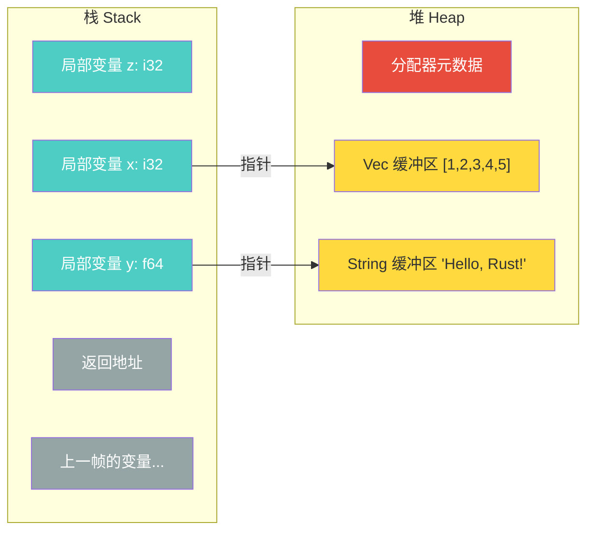
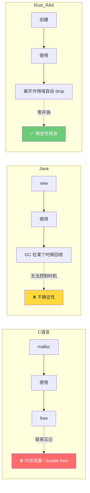
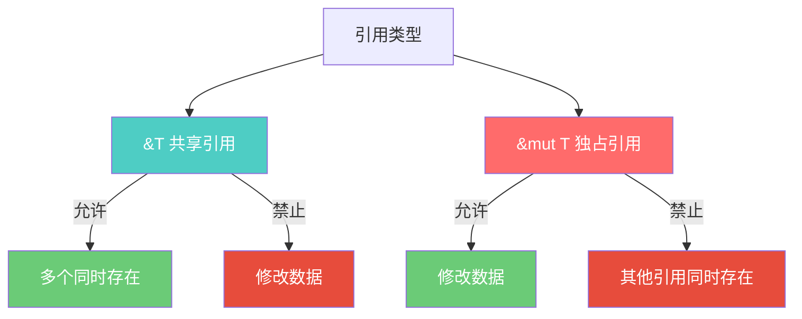
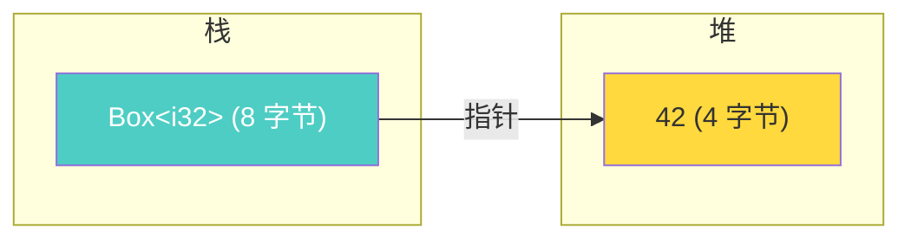

Rust 的智能指针是行为类似指针的数据结构，附带额外的元数据和能力。与普通引用 `&T` 不同，智能指针通常**拥有**它所指向的数据。本文将从内存基础出发，逐一剖析标准库中的各类智能指针，深入理解其原理、内存布局与实战选型。

## 目录

1. [基础概念：内存、所有权与 RAII](#1-基础概念内存所有权与-raii)
2. [Box\<T\>：最简单的智能指针](#2-boxt最简单的智能指针)
3. [Deref 与 Drop：智能指针的两大支柱](#3-deref-与-drop智能指针的两大支柱)
4. [Rc\<T\> 与 Arc\<T\>：共享所有权](#4-rct-与-arct共享所有权)
5. [内部可变性：Cell、RefCell 与线程安全对应物](#5-内部可变性cellrefcell-与线程安全对应物)
6. [Cow\<T\>：写时克隆](#6-cowt写时克隆)
7. [Pin\<T\>：固定内存位置](#7-pint固定内存位置)
8. [胖指针、vtable 与分发策略](#8-胖指针vtable-与分发策略)
9. [组合模式与选型决策](#9-组合模式与选型决策)

---

## 1. 基础概念：内存、所有权与 RAII

本节建立理解智能指针所需的全部前置知识：栈与堆的区别、RAII 资源管理范式、以及 Rust 借用规则的本质。

### 1.1 栈与堆



- **栈**：指针偏移分配，极快；编译时必须知道大小；主线程约 8 MB，子线程约 2 MB
- **堆**：分配器查找空闲块，较慢；受限于可用内存，几乎无上限

**何时必须使用堆分配：**

| 场景 | 原因 | 示例 |
|------|------|------|
| 编译时大小未知 | 栈要求编译时确定大小 | `Vec<T>`、`String` |
| 大数据 | 避免栈溢出 | `Box<[i32; 1_000_000]>` |
| 递归类型 | 需要指针间接层打破无限大小 | `enum List { Cons(i32, Box<List>), Nil }` |
| 数据需要超越作用域 | 转移所有权、跨线程传递 | `thread::spawn(move \|\| ...)` |
| trait 对象 | 运行时多态 | `Box<dyn Trait>` |

**堆分配的性能开销不在"堆"本身，而在于：**

1. **分配/回收**：分配器簿记开销
2. **指针间接访问**：随机跳转导致缓存未命中
3. **内存碎片**：大量小分配降低局部性

优化手段：`Vec::with_capacity(n)` 预分配、`SmallVec` 先栈后堆、arena 分配器批量管理短生命周期对象。

### 1.2 RAII 与 Rust 的 OBRM

**RAII（Resource Acquisition Is Initialization）** 将资源生命周期绑定到对象生命周期：



Rust 在 RAII 基础上进一步演化为 **OBRM（Ownership-Based Resource Management）**：

- **RAII** 解决"何时释放"（确定性析构）
- **OBRM** 额外解决"谁能访问"（所有权 + 借用检查，编译期消灭悬垂指针和数据竞争）

```rust
struct DatabaseConnection { conn: RawConnection }

impl DatabaseConnection {
    fn new(url: &str) -> Self {
        Self { conn: RawConnection::connect(url) }  // 资源获取 = 初始化
    }
}

impl Drop for DatabaseConnection {
    fn drop(&mut self) {
        self.conn.disconnect();  // 离开作用域自动断开，即使 panic 也会执行
    }
}
```

标准库中的 RAII 实例：`MutexGuard`（自动释放锁）、`File`（自动关闭文件描述符）、`Box<T>`（自动释放堆内存）。

### 1.3 借用规则：别名与可变性不共存

在任意时刻，要么存在**任意数量的 `&T`**（共享读取），要么存在**恰好一个 `&mut T`**（独占修改），二者不能共存。

这条规则直接消灭数据竞争——数据竞争需要"多指针 + 至少一个写入 + 无同步"三个条件同时成立，而 `&mut T` 的独占性在编译期就打破了这个组合。



**NLL（非词法生命周期）**：引用的作用域从创建延伸到**最后一次使用**，而非到块末尾：

```rust
let mut s = String::from("hello");
let r1 = &s;
let r2 = &s;
println!("{} {}", r1, r2);  // r1, r2 最后一次使用，借用到此结束

let r3 = &mut s;            // OK，此时无活跃的不可变借用
r3.push_str(" world");
```

### 1.4 智能指针的定义

智能指针是行为类似指针的数据结构，附带额外的**元数据**和**能力**。与普通引用 `&T` 不同，智能指针通常**拥有**它所指向的数据。一个类型要成为智能指针，通常需要实现：

- **`Deref`**：允许像引用一样使用（`*ptr`、自动解引用）
- **`Drop`**：离开作用域时自动执行清理逻辑

`String` 和 `Vec<T>` 也是智能指针——它们拥有堆上的数据，实现了 `Deref` 和 `Drop`。

**标准库智能指针一览：**

| 类型 | 用途 | 所有权 | 线程安全 |
|------|------|--------|----------|
| `Box<T>` | 堆分配 | 单一所有者 | 取决于 T |
| `Rc<T>` | 引用计数 | 多所有者 | 否 |
| `Arc<T>` | 原子引用计数 | 多所有者 | 是 |
| `Cell<T>` | 内部可变性（Copy 类型） | 单一所有者 | 否 |
| `RefCell<T>` | 内部可变性（运行时检查） | 单一所有者 | 否 |
| `Cow<T>` | 写时克隆 | 按需 | 取决于 T |
| `Pin<T>` | 固定内存位置 | 取决于内部指针 | 取决于 T |
| `Weak<T>` | 弱引用 | 非所有者 | 与 Rc/Arc 对应 |

---

## 2. Box\<T\>：最简单的智能指针

### 2.1 实现原理

`Box<T>` 在堆上分配数据，在栈上存储指向该数据的指针。编译后就是一个裸指针，**零额外开销**。移动 `Box<T>` 只复制指针（一个 `usize`），不复制堆上的数据。



### 2.2 三大业务场景

**场景一：递归类型——打破无限大小**

编译器需要在编译时知道每个类型的大小。没有 `Box`，`List` 的大小是 `i32 + List` = `i32 + i32 + List` = ... 无穷。加了 `Box` 后，大小变成 `i32 + pointer`，是确定的。

```rust
enum List {
    Cons(i32, Box<List>),  // 大小 = i32 + 一个指针，确定
    Nil,
}

// 同理：二叉树
struct TreeNode {
    value: i32,
    left: Option<Box<TreeNode>>,
    right: Option<Box<TreeNode>>,
}
```

**场景二：大数据避免栈溢出**

```rust
// 栈上分配 4 MB → 可能栈溢出
// let huge_on_stack: [i32; 1_000_000] = [0; 1_000_000];

// 堆上分配 → 安全，栈上只有 8 字节指针
let huge_on_heap: Box<[i32; 1_000_000]> = Box::new([0; 1_000_000]);
```

**场景三：trait 对象（动态分发）**

```rust
trait Animal {
    fn speak(&self);
}
struct Dog;
impl Animal for Dog { fn speak(&self) { println!("Woof!"); } }
struct Cat;
impl Animal for Cat { fn speak(&self) { println!("Meow!"); } }

// 异构集合：不同类型放在同一个 Vec 里
let animals: Vec<Box<dyn Animal>> = vec![Box::new(Dog), Box::new(Cat)];
for animal in &animals {
    animal.speak();  // 通过 vtable 动态分发
}
```

### 2.3 技术选型

- 需要堆分配 + 单一所有权 → `Box<T>`
- 需要共享所有权 → 考虑 `Rc<T>` / `Arc<T>`（见第 4 节）
- 热路径上的 trait 对象 → 优先考虑泛型静态分发（见第 8 节）

---

## 3. Deref 与 Drop：智能指针的两大支柱

`Deref` 和 `Drop` 是所有智能指针的共同基础。理解它们的实现原理，就理解了智能指针"智能"在哪里。

### 3.1 Deref：自动解引用

**trait 定义：**

```rust
pub trait Deref {
    type Target: ?Sized;
    fn deref(&self) -> &Self::Target;
}

pub trait DerefMut: Deref {
    fn deref_mut(&mut self) -> &mut Self::Target;
}
```

当你写 `*v` 时，编译器实际执行 `*(v.deref())`。`deref()` 返回**引用**而非值本身，避免将数据从 `self` 中移出。

**解引用强制转换（Deref Coercion）** 是编译器的关键机制——当类型不匹配时，编译器自动、反复调用 `Deref`，直到类型匹配：


三条转换规则：

1. `&T` → `&U`，当 `T: Deref<Target=U>`（不可变到不可变）
2. `&mut T` → `&mut U`，当 `T: DerefMut<Target=U>`（可变到可变）
3. `&mut T` → `&U`，当 `T: Deref<Target=U>`（可变到不可变，安全降级）

反方向不允许：`&T` 永远不能转成 `&mut T`。

```rust
fn hello(name: &str) { println!("Hello, {}!", name); }

let m = Box::new(String::from("Rust"));
hello(&m);  // &Box<String> → &String → &str，自动 Deref 链
// 没有 Deref Coercion 你需要写：hello(&(*m)[..]);
```

**标准库 Deref 实现：**

| 类型 | Target | 效果 |
|------|--------|------|
| `String` | `str` | `&String` → `&str` |
| `Vec<T>` | `[T]` | `&Vec<T>` → `&[T]` |
| `Box<T>` / `Rc<T>` / `Arc<T>` | `T` | 透明访问内部值 |

整个 Deref Coercion 在**编译时完成**，零运行时开销。只在类型**透明包装**另一个类型时实现 `Deref`，不要当作通用类型转换工具。
